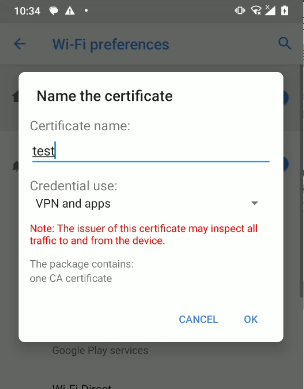
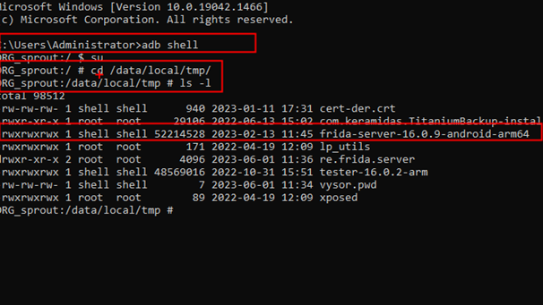
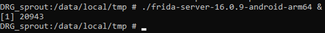

# Mobile Application Security with AndroGoat


Have you ever wondered about the vulnerabilities hidden beneath the surface of your favorite mobile apps? I certainly did, which is why I dove headfirst into the deep end of mobile application training and found a mobile application that I can train with. [AndroGOAT](https://github.com/satishpatnayak/AndroGoat) is an app filled with secrets, each one is a teachable moment in mobile application security. With this article, I’m opening up my diary of discoveries, sharing all the technical moments from my AndroGOAT journey. So feel free to follow along as we explore security flaws of this vulnerable mobile app together!

## Installation

For this walkthrough, I am using a physical Android phone and a VM (Genymotion). You don't have to use my exact method of setup; you can place platform tools and the APK file in the same location or provide the full path of their location in order to install the AndroGOAT application to run the Android virtual machine.


You can either drag and drop the APK file of AndroGoat onto the Android VM or install it with Android Debug Bridge (adb).

### Installation with ADB:

1. Open Command Prompt and navigate to the location of the AndroGoat APK file.


2. Run the following command to check the status of any Android device running on your system:
   ```bash
   adb devices
   ```


3. Now, install the AndroGoat application by running:
   ```bash
   adb install AndroGoat.apk
   ```

You will get success status printed on command line:


Icon of AndroGoat app will also appear on your VM as shown below:

 

5. Tap (Click) on the AndroGoat app icon to launch the application.

  

---

## Network Interception Setup

### 1. HTTP

Set up a proxy on your mobile phone like this:

  

The IP address `192.168.18.231` is the IP address of my computer, which is connected to the internet.

  

Start BurpSuite and enter the proxy details in the Proxy Listener section:

  

Then open the AndroGoat application and click on HTTP, and the traffic will be intercepted in BurpSuite:

  

### 2. Intercepting HTTPS

For task 2, we need to export Burpsuite SSL certificate to mobile phone, so that HTTPs based traffic can be intercepted. Certificate exporting option is shown below.

 

Enter the file name with the `.cer` extension:

  

Transfer `burp.cer` to the mobile phone’s files folder, and go to the certificate option in your mobile phone settings.

  

Phone types and menus vary but if you are having issues finding the certificate menu then try to search for “certificate”:

 

After installing the certificate on the mobile phone, navigate to the folder where the certificate is stored.

  

Click on the certificate and install it. Select the option “VPN and Apps” using any preferred name and press OK:

  

Now, go to the application and click on HTTPS. After 5–10 seconds, [**https://owasp.org**](https://owasp.org/) will be intercepted by BurpSuite:

  

### 3. Certificate Pinning

To bypass certificate pinning, install Frida Server and send the server file to the rooted Android phone's location `/data/local/tmp`.

  

Install Frida tools on your Windows/Linux system:

  

Now go to android phone location and run the command:

```bash
chmod +x frida-server-16.0.9-android-arm64
```

After running this, type the following command to start the Frida server:

 

Run the following command on your host PC to check if Frida is installed correctly:

  

Now install the [Objection framework](https://github.com/sensepost/objection) and run it on your host system.

  

Run the following command to bypass SSL/Certificate pinning on the AndroGoat Application:

```bash
objection --g owasp.sat.agoat explore --s "android sslpinning disable"
```
  

Click on the "Certificate Pinning" activity in AndroGoat:

 

---

## Unprotected Android Components

According to the code, if the correct pin is inserted, the `AccessControl1ViewActivity` will be called:


Instead of providing the correct pin, you can directly jump to the `AccessControl1ViewActivity` by using the following command:

```bash
adb shell am start -n owasp.sat.agoat/.AccessControl1ViewActivity
```


After running the command successfully, the following activity will be shown:


---

## Insecure Data Storage

### 1. Shared Preferences (Part 1)

In this task, input the username and password, then click on "Save."


Go into android shell by typing the following commands

```bash
adb shell > su > cd /data/data/owasp.sat.agoat/shared_prefs
```

Then type ls command to list all files and you should see interesting files including users.xml. :)

Show the content of the xml files with cat or nano:

```bash
cat users.xml
```


### 2. Shared Preferences (Part 2)

Click on “Shared Preferences — Part 2” to open a scorecard.


Navigate to `/data/data/owasp.sat.agoat/shared_prefs`

Type the ls command and there will be new file present there named score.xml`score.xml`.


Now edit the score.xml file either by exporting it or by editing it in the location and values will be reflected on the activity page as shown below:


---
**3. SQLite**

Next in the Insecure Data Storage section, go to SQLite and enter any username and password and click on Save option.


Now go to **cd /data/data/owasp.sat.agoat/databases** and type **ls –l** to list databases.  
After that type **sqlite3 \<database_name\>** , list tables using the command, **.tables**, and enumerate the table contents by typing **select \* from users**;


**4. Temp File**

The temp file is created when a user enters username and password.


After the temp file is created in the application container, go to the application container by **cd /data/data/owasp.sat.agoat/** and then type **ls –l.**

Display the contents of the file **users\*tmp** and it will list the sensitive contents (i.e. username/password) in plaintext.


**5. External Storage — SDCard**


For this one, ensure that you have granted permissions to the mobile application as shown here:


Now to take a look at the code, open the .apk AndroGoat file in jadx tool and go to **InsecureStorageSDCardActivit**y.


As shown in the red box, the data is going to be stored in SDCARD (external storage) with name “**users”** prefix **“tmp”** as postfix and **input userinfo** will be stored there.

Now access the device with **adb shell \> su \> cd /sdcard/** and type **ls –l** and cat users\*tmp.


**Input Validations**

1.  **Cross-Site Scripting (XSS)**

XSS (Cross Site Scripting) attacks are a type of injection, in which malicious scripts are injected into otherwise benign and trusted websites. In this case due to lack of input validation any simple/ complex script written in the input text field will be reflected back to user. Like for example write a javascript line i.e \<script\>alert(‘hello’)\</script\>


**2. SQL Injection (SQLi)**

SQL Injection (SQLi) is a common attack vector that uses malicious SQL code for backend database manipulation to access information that was not intended to be displayed.

Following is the screenshot of the code running behind this SQLIActivity, as depicted in the code, there is no input validation on username and if any person enters special chars, then it will get reflected into database or data will be retrieved from database.


As shown below input **‘ or 1=1 —** it will fetch data from database because of lack of input validation whilst fetching data from database. It will enumerate all values from database (aGoat) and list all users.


**3. WebView**

In web view activity, due to lack of input validations and lack of **setAllowFileAccess** parameter and javascript is enabled, so it will display user sensitive info from application container, if exact path is entered.


Enter exact path of any sensitive resource with prefix **file:///,** as shown in following application screenshot.


**Side Channel Data Leakage**

1.  **Keyboard Cache**

Keystrokes are logged in a particular location of application context as shown:


Open the keyboard cache and type in some simple phrases in the username and password fields.


Go the shell of android phone and navigate to user history by using the below location:

adb shell  
su  
cd /data/data/com.google.android.inputmethod.latin/files/personal/userhistory

Now cat out the contents of **UserHistory.en_GB.dict** as shown in subsequent pictures. (However, if your keyboard input language is different then it will show with different name here.)


In the contents of userhistory.en_GB.dict you will see the keystrokes strokes input by the user, which was me in this case:


**2. Insecure Logging**

First inspect the code by going into **InsecureLoggingActivity** in Jadx and study the code as shown below.


As shown in the picture figure, **Log.e** is logging username and password into log of the application.

Now just type **adb logcat** and enter any credentials in GUI of application as shown below and keep the adb logcat running.

In the logcat activity logs, the details of usernames and passwords will be displayed in text.


**3. Clipboard — Copy and Paste**

Insert some test numbers for a credit card like this:


For the security flaw in this area, the sensitive data is wrongfully being displayed in plaintext (ClipboardActivity).


**Hardcode Issue**

Inspect the relevant activity **HardCodeActivity** class and notice the hardcoded promocode as shown:


Now insert the discovered value **NEW2019** into the application:


After clicking on verify, the price will go to zero:


**RootDetection**


Inspect the **IsRooted** activity as shown below:


There are number of ways to bypass these checks, like using RootCloak, Frida scripts and Magisk. However, we will use the Objection Framework tool already used by us in the **Certificate Pinning activity**. Now, run the Frida server as already shown and type the following command to bypass the root detection:

objection –g owasp.sat.agoat explore –s "android root disable"

The command above is only different from the objection certificate pinning command at the string “**root”.**


After successfully running the command, go to the root activity and it will now get successfully bypassed:


**Emulator Detection**

While reviewing the emulator detection code and you will find that the **isEmulator()** function code contains the logic to check for detection of an emulator.


Now, open objection framework and the application:

objection -g owasp.sat.agoat explore


You should be able to list all the class methods with the following command:

android hooking list class_methods owasp.sat.agoat.EmulatorDetectionActivity


In the above mentioned you will see to that all class methods of **EmulatorDetectionActivity** are listed in the figure. Now, hook the method isEmulator using following command:

android hooking set return_value owasp.sat.agoat.EmulatorDetectionActivity.isEmulator false


Now click on check emulator activity and it will display that the device is not an emulator:


**Binary Patching**


Inspect the activity of Binary Patching and understand the logic. Here we want to patch the function **isAdmin()** so that it to returns true.


To decompile this, run apktool with following command:

java -jar apktool.jar d -r "C:\\Users\\Administrator\\Downloads\\AndroGoat.apk" -f

Successfully running the command on Windows should look like this:


*File location may vary, depending on the stored location of AndroGoat.apk*

Now, view the smali files and navigate to the **BinaryPatchingActivity.smali**


Now take a look at the line 16 and notice that the **if-ne** (if not equal) is looking for the **isAdminText condition.**


Change **if-ne** to **if-eq** so that **isAdmin** results into always true as shown below:


Now save the file and build the application folder (AndroGoat) with apktool using this command:

java -jar apktool.jar b -r AndroGoat/ -o test.apk

Download and run [**uber-apk-signer**](https://github.com/patrickfav/uber-apk-signer) with following command in order to properly sign and zipalign the output file test.apk:

java -jar uber-apk-signer-1.3.0.jar --apks test.apk

*Note: The above version 1.3.0 may vary depending on when you do this*

Now install the output application, **test-aligned-debugSigned.apk** in the android phone.

Now open the application and go to binary patching and you will see “You are admin now”, signifying that application is successfully patched.


I hope you were able to follow along and learn something new from this walkthrough!

