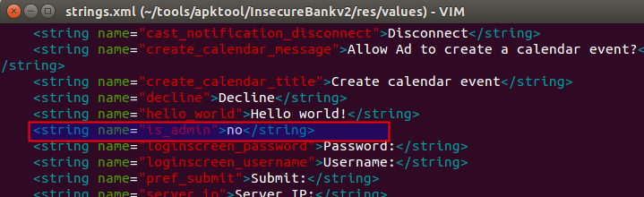
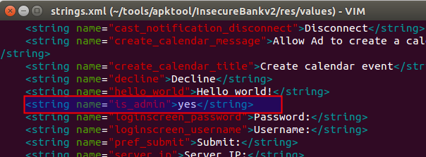
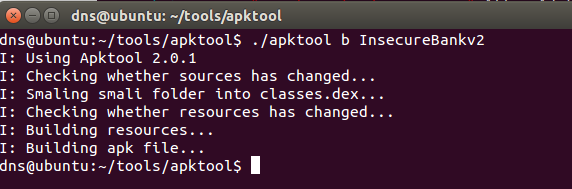
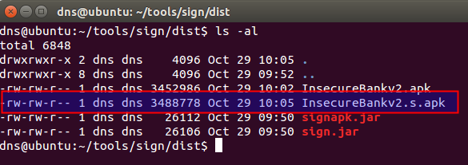
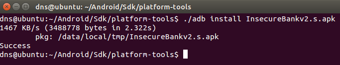
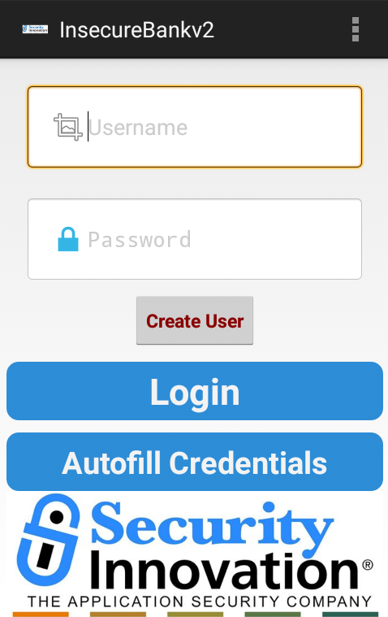

**BOSTON \| SEATTLE**

**187 Ballardvale St. Suite A195 ●Wilmington, MA 01887● Ph: +1.978.694.1008**

[**getsecure@securityinnovation.com**](mailto:getsecure@securityinnovation.com)**●** [**www.securityinnovation.com**](http://www.securityinnovation.com)

**BOSTON \| SEATTLE**

**187 Ballardvale St. Suite A195 ●Wilmington, MA 01887● Ph: +1.978.694.1008**

[**getsecure@securityinnovation.com**](mailto:getsecure@securityinnovation.com)**●** [**www.securityinnovation.com**](http://www.securityinnovation.com)

| **Document name:** | Patching Android Application |
|--------------------|------------------------------|
| **Author(s):**     | Dinesh Shetty                |

# Contact Information

### Technical Contact

Dinesh Shetty

Senior Security Engineer

Email: [dinezh.shetty@gmail.com](mailto:dinezh.shetty@gmail.com)

# Test Configuration

The following is required to verify this issue:

-   Download the latest version of the Android-InsecureBankv2 apk from <https://github.com/dineshshetty/Android-InsecureBankv2>
-   Download Android SDK from <http://developer.android.com/sdk/index.html>.
-   Download the latest version of apktool from <http://ibotpeaches.github.io/Apktool/>. The installation guide can be found at <http://ibotpeaches.github.io/Apktool/install/>
-   Download the latest version of SignApk from <https://github.com/appium/sign>

# Test Steps

1.  Copy the InsecureBankv2.apk file to the “platform-tools” folder in the Android SDK and then use the below command to push the downloaded Android-InsecureBankv2 application to the emulator.

    ./adb install InsecureBankv2.apk

2.  Launch the installed InsecureBankv2 application on the Emulator. The following screenshot shows the default screen available to a normal user after login.
1.  Copy the InsecureBankv2.apk into the “apktool” folder and enter the below command to decompile the application:

    ./apktool d InsecureBankv2.apk

    

2.  Navigate to the folder \~/apktool/InsecureBankv2/res/values and open the file *strings.xml* for editing. Modify the value of “is_admin” from “no” to “yes”.

    

    

3.  Navigate back to the base apktool folder and enter the below command to re-compile the application:

    ./apktool b InsecureBankv2

    

4.  Copy the InsecureBankv2.apk file generate above into the “dist” folder of SignApk and enter the below command to sign the apk file generated in the previous test.

    java -jar sign.jar InsecureBankv2.apk

    A new sign apk file called InsecureBankv2.s.apk is generated in the same “dist” folder.

    

5.  Copy the new generated InsecureBankv2.s.apk file into the “platform-tools” folder in the Android SDK and then use the below command to push the newly signed Android-InsecureBankv2 application to the emulator.

    ./adb install InsecureBankv2.s.apk

    

6.  Launch the newly installed InsecureBankv2 application in the Android Emulator. Following screen shows that the user is provided with an additional “Create User” button that is otherwise only available only for the admin user. This button was previously not visible.

    

7.  Clicking on the “Create User” redirects the user to the user creation module.
