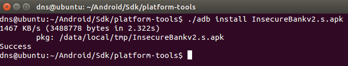

**BOSTON \| SEATTLE**

**187 Ballardvale St. Suite A195 ●Wilmington, MA 01887● Ph: +1.978.694.1008**

[**getsecure@securityinnovation.com**](mailto:getsecure@securityinnovation.com)**●** [**www.securityinnovation.com**](http://www.securityinnovation.com)

**BOSTON \| SEATTLE**

**187 Ballardvale St. Suite A195 ●Wilmington, MA 01887● Ph: +1.978.694.1008**

[**getsecure@securityinnovation.com**](mailto:getsecure@securityinnovation.com)**●** [**www.securityinnovation.com**](http://www.securityinnovation.com)

| **Document name:** | Bypass Android Root Detection |
|--------------------|-------------------------------|
| **Author(s):**     | Dinesh Shetty                 |

# Contact Information

### Technical Contact

Dinesh Shetty

Senior Security Engineer

Email: [dinezh.shetty@gmail.com](mailto:dinezh.shetty@gmail.com)

# Test Configuration

The following is required to verify this issue:

-   Download the latest version of the Android-InsecureBankv2 apk from <https://github.com/dineshshetty/Android-InsecureBankv2>
-   Download Android SDK from <http://developer.android.com/sdk/index.html>
-   Download the latest version of apktool from <http://ibotpeaches.github.io/Apktool/>. The installation guide can be found at <http://ibotpeaches.github.io/Apktool/install/>
-   Download the latest version of SignApk from <https://github.com/appium/sign>
-   Download the latest version of JADX decompiler from <https://github.com/skylot/jadx>
-   A rooted Android device

# Test Steps

1.  With the rooted Android device attached, copy the InsecureBankv2.apk file to the “platform-tools” folder in the Android SDK and then use the below command to push the downloaded Android-InsecureBankv2 application to the device.

    ./adb install InsecureBankv2.apk

2.  Launch the installed InsecureBankv2 application on the device.
3.  Log in to the application as a normal user (dinesh/Dinesh@123\$). Following screenshot shows that the device is reported to be rooted.

    

1.  Unzip the contents of the InsecureBankv2.apk file using the below command:

    unzip InsecureBankv2.apk

    

1.  Copy the classes.dex file to the dex2jar folder. Make the d2j-dex2jar.sh and d2j_invoke.sh files executable by running the below commands.

    chmod +x d2j-dex2jar.sh

    chmod +x d2j_invoke.sh

2.  Use the below command to convert the dex file into a jar file:

    sh d2j-dex2jar.sh classes.dex

3.  Open the generated classes-dex2jar.jar file in JADX-GUI decompiler using the below command:

    ./jadx-gui \<path to classes-dex2jar.jar\>

    

1.  The following screenshots shows the decompiled code with the reference to the root detection code in the application:

    

2.  Copy the InsecureBankv2.apk into the “apktool” folder and enter the below command to decompile the application:

    ./apktool d InsecureBankv2.apk

    

3.  In the dex files generated by apktool, search for the declaration of the function “showRootStatus()”. Following screenshot shows the reference that was found.

    

4.  The following screenshot shows that when if-ne (if-not-equal) jump to the “Device Not Rooted!!” tag. Mapping this to the previously decompiled .java files, this is loop where if “obj==1” jump to “Rooted Device!!” else jump to “Device not Rooted!!”.

    

5.  To force a jump to always at “Device not Rooted!!”, change the conditional loop into a goto loop as shown in the following screenshot.

    

6.  Rebuild the application using the below command:

    ./apktool b InsecureBankv2

    

7.  Copy the InsecureBankv2.apk file generate above into the “dist” folder of SignApk and enter the below command to sign the apk file generated in the previous test.

    java -jar sign.jar InsecureBankv2.apk

8.  A new sign apk file called InsecureBankv2.s.apk is generated in the same “dist” folder.

    

9.  Copy the new generated InsecureBankv2.s.apk file into the “platform-tools” folder in the Android SDK and then use the below command to push the newly signed Android-InsecureBankv2 application to the device.

    ./adb install InsecureBankv2.s.apk

    

10. Launch the newly uploaded InsecureBankv2 application on the Android device. Following screen shows that the application no longer detects the device as a rooted device and thus the root detection process was bypass.

    
