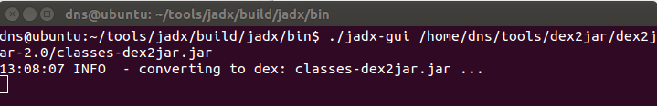

**BOSTON \| SEATTLE**

**187 Ballardvale St. Suite A195 ●Wilmington, MA 01887● Ph: +1.978.694.1008**

[**getsecure@securityinnovation.com**](mailto:getsecure@securityinnovation.com)**●** [**www.securityinnovation.com**](http://www.securityinnovation.com)

**BOSTON \| SEATTLE**

**187 Ballardvale St. Suite A195 ●Wilmington, MA 01887● Ph: +1.978.694.1008**

[**getsecure@securityinnovation.com**](mailto:getsecure@securityinnovation.com)**●** [**www.securityinnovation.com**](http://www.securityinnovation.com)

| **Document name:** | Developer Backdoors |
|--------------------|---------------------|
| **Author(s):**     | Dinesh Shetty       |

# Contact Information

### Technical Contact

Dinesh Shetty

Senior Security Engineer

Email: [dinezh.shetty@gmail.com](mailto:dinezh.shetty@gmail.com)

# Test Configuration

The following is required to verify this issue:

-   Download the latest version of the Android-InsecureBankv2 apk from <https://github.com/dineshshetty/Android-InsecureBankv2>
-   Download the latest version of JADX decompiler from <https://github.com/skylot/jadx>
-   Download latest version of dex2jar from <https://bitbucket.org/pxb1988/dex2jar/downloads>

# Test Steps

1.  Unzip the contents of the originally downloaded InsecureBankv2.apk file using the below command:

    unzip InsecureBankv2.apk

    

2.  Copy the classes.dex file to the dex2jar folder. Make the d2j-dex2jar.sh and d2j_invoke.sh files executable by running the below commands.

    chmod +x d2j-dex2jar.sh

    chmod +x d2j_invoke.sh

3.  Use the below command to convert the dex file into a jar file:

    sh d2j-dex2jar.sh classes.dex

    

4.  Open the generated classes-dex2jar.jar file in JADX-GUI decompiler using the below command:

    ./jadx-gui \<path to classes-dex2jar.jar\>

    

5.  The following screenshot shows the decompiled code for a developer backdoor that is present in the Android-InsecureBankv2 application that allows a user with username as “devadmin” to reach a different endpoint compared to all of the other users.

    

    It was found that any user could use the account username “devadmin” and log in to the application with any password irrespective of the password validity.
