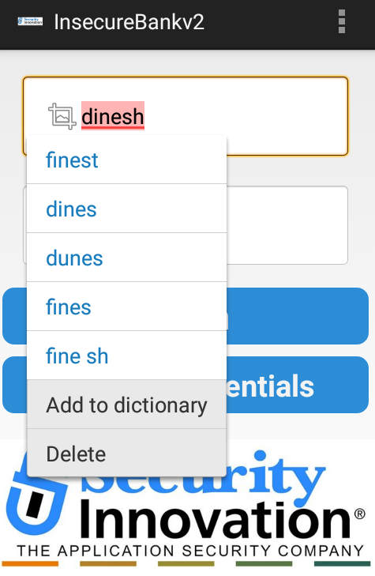
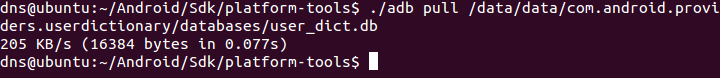
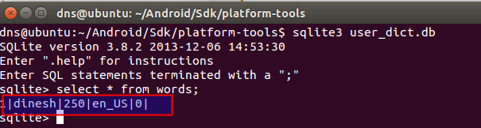

**BOSTON \| SEATTLE**

**187 Ballardvale St. Suite A195 ●Wilmington, MA 01887● Ph: +1.978.694.1008**

[**getsecure@securityinnovation.com**](mailto:getsecure@securityinnovation.com)**●** [**www.securityinnovation.com**](http://www.securityinnovation.com)

**BOSTON \| SEATTLE**

**187 Ballardvale St. Suite A195 ●Wilmington, MA 01887● Ph: +1.978.694.1008**

[**getsecure@securityinnovation.com**](mailto:getsecure@securityinnovation.com)**●** [**www.securityinnovation.com**](http://www.securityinnovation.com)

| **Document name:** | Exploiting Android Keyboard Cache |
|--------------------|-----------------------------------|
| **Author(s):**     | Dinesh Shetty                     |

# Contact Information

### Technical Contact

Dinesh Shetty

Senior Security Engineer

Email: [dinezh.shetty@gmail.com](mailto:dinezh.shetty@gmail.com)

# Test Configuration

The following is required to verify this issue:

-   Download the latest version of the Android-InsecureBankv2 apk from <https://github.com/dineshshetty/Android-InsecureBankv2>
-   Download Android SDK from <http://developer.android.com/sdk/index.html>
-   Install sqlite3 using “sudo apt-get install sqlite3”

# Test Steps

1.  Copy the InsecureBankv2.apk file to the “platform-tools” folder in the Android SDK and then use the below command to push the downloaded Android-InsecureBankv2 application to the emulator.

    ./adb install InsecureBankv2.apk

2.  Enter any set of credentials.
3.  Select the username field and select the “Add to dictionary” option.

    

4.  Now, back on the terminal, enter the below command to pull the user dictionary from the emulator.

    ./adb pull /data/data/com.android.providers.userdictionary/databases/user_dict.db

    

5.  Enter the below command to read the downloaded user dictionary.

    sqlite3 user_dict.db

6.  Enter the below command to read the words cached by the Android OS.

    select \* from words;

7.  The following screenshot shows that the content cached by the keyboard are stored in plaintext by the Android OS locally.

    
