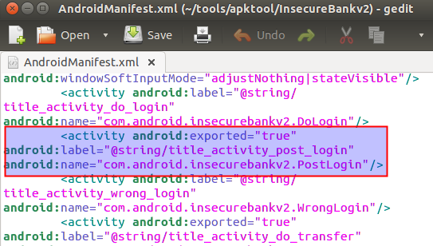
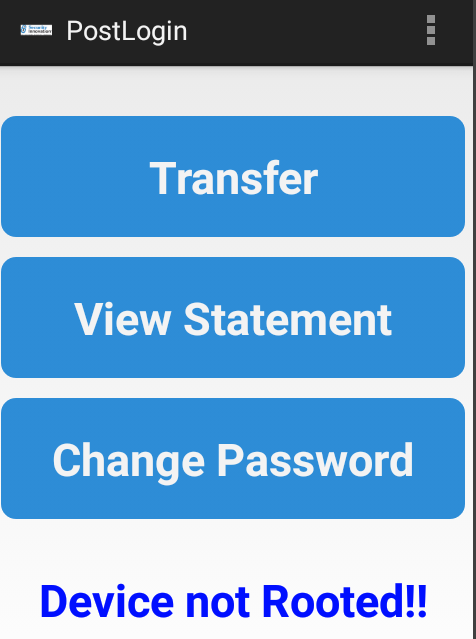

**BOSTON \| SEATTLE**

**187 Ballardvale St. Suite A195 ●Wilmington, MA 01887● Ph: +1.978.694.1008**

[**getsecure@securityinnovation.com**](mailto:getsecure@securityinnovation.com)**●** [**www.securityinnovation.com**](http://www.securityinnovation.com)

**BOSTON \| SEATTLE**

**187 Ballardvale St. Suite A195 ●Wilmington, MA 01887● Ph: +1.978.694.1008**

[**getsecure@securityinnovation.com**](mailto:getsecure@securityinnovation.com)**●** [**www.securityinnovation.com**](http://www.securityinnovation.com)

| **Document name:** | Exploiting Android Activities |
|--------------------|-------------------------------|
| **Author(s):**     | Dinesh Shetty                 |

# Contact Information

### Technical Contact

Dinesh Shetty

Senior Security Engineer

Email: [dinezh.shetty@gmail.com](mailto:dinezh.shetty@gmail.com)

# Test Configuration

The following is required to verify this issue:

-   Download the latest version of the Android-InsecureBankv2 apk from <https://github.com/dineshshetty/Android-InsecureBankv2>
-   Download Android SDK from <http://developer.android.com/sdk/index.html>
-   Download the latest version of apktool from <http://ibotpeaches.github.io/Apktool/>
    -   The installation guide can be found at <http://ibotpeaches.github.io/Apktool/install/>
-   Download the latest version of JADX decompiler from <https://github.com/skylot/jadx>
-   Download latest version of dex2jar from <https://bitbucket.org/pxb1988/dex2jar/downloads>

# Test Steps

1.  Copy the InsecureBankv2.apk file to the “platform-tools” folder in the Android SDK and then use the below command to push the downloaded Android-InsecureBankv2 application to the emulator.

    ./adb install InsecureBankv2.apk

2.  Launch the installed InsecureBank application on the Emulator. Following screenshot shows the default screen available to a normal user after login. No pages can be accessed without authentication.

    

3.  Copy the InsecureBankv2.apk into the “apktool” folder and enter the below command to decompile the application:

    ./apktool d InsecureBankv2.apk

    

4.  Open the decrypted *AndroidManifest.xml* file. The following screenshot shows the Activity which is to be exploited is set to be exported.

    

5.  With the Android Emulator running, copy the InsecureBankv2.apk file to the “platform-tools” folder in the Android SDK and then use the below command to push the downloaded Android-InsecureBankv2 application to the emulator.

    ./adb install InsecureBankv2.apk

6.  Launch the installed InsecureBankv2 application on the Emulator.
7.  Navigate back to the “platform-tools” folder and enter the below mentioned command:

    ./adb shell

8.  Enter the following command in the shell:

    am start -n com.android.insecurebankv2/.PostLogin

9.  Back on the emulator, notice that the login page has been bypassed.

    
