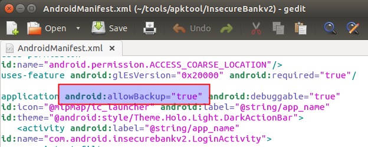
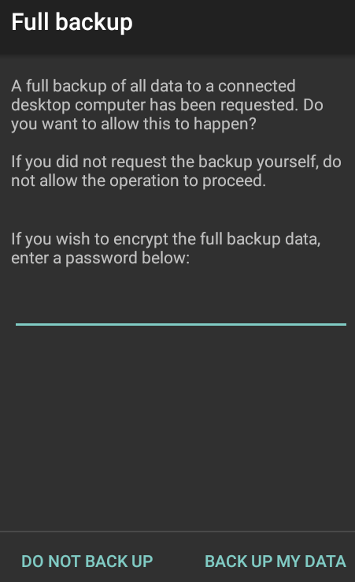
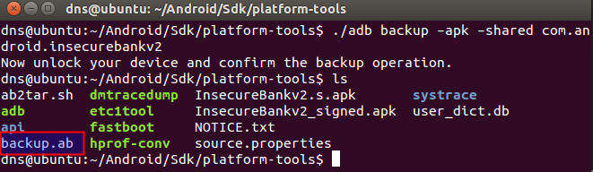
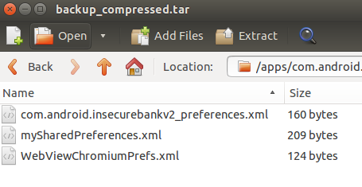

**BOSTON \| SEATTLE**

**187 Ballardvale St. Suite A195 ●Wilmington, MA 01887● Ph: +1.978.694.1008**

[**getsecure@securityinnovation.com**](mailto:getsecure@securityinnovation.com)**●** [**www.securityinnovation.com**](http://www.securityinnovation.com)

**BOSTON \| SEATTLE**

**187 Ballardvale St. Suite A195 ●Wilmington, MA 01887● Ph: +1.978.694.1008**

[**getsecure@securityinnovation.com**](mailto:getsecure@securityinnovation.com)**●** [**www.securityinnovation.com**](http://www.securityinnovation.com)

| **Document name:** | Exploiting Android Backup Functionality |
|--------------------|-----------------------------------------|
| **Author(s):**     | Dinesh Shetty                           |

# Contact Information

### Technical Contact

Dinesh Shetty

Senior Security Engineer

Email: [dinezh.shetty@gmail.com](mailto:dinezh.shetty@gmail.com)

# Test Configuration

The following is required to verify this issue:

-   Download the latest version of the Android-InsecureBankv2 apk from <https://github.com/dineshshetty/Android-InsecureBankv2>
-   Download Android SDK from <http://developer.android.com/sdk/index.html>
-   Download the latest version of apktool from <http://ibotpeaches.github.io/Apktool/>. The installation guide can be found at <http://ibotpeaches.github.io/Apktool/install/>
-   Download the latest version of SignApk from <https://github.com/appium/sign>
-   Download the latest version of JADX decompiler from <https://github.com/skylot/jadx>

# Test Steps

1.  Copy the InsecureBankv2.apk into the “apktool” folder and enter the below command to decompile the application:

    ./apktool d InsecureBankv2.apk

    

2.  Open the decrypted *AndroidManifest.xml* file. The following screenshot shows the Android application allowed backup.

    

3.  With the Android Emulator running, copy the InsecureBankv2.apk file to the “platform-tools” folder in the Android SDK and then use the below command to push the downloaded Android-InsecureBankv2 application to the emulator.

    ./adb install InsecureBankv2.apk

4.  Launch the installed InsecureBankv2 application in the Emulator.
5.  Navigate back to the “platform-tools” folder and enter the below mentioned command:

    ./adb shell

6.  Log in to the application as a normal user (dinesh/Dinesh@123\$).
7.  In the “platform-tools” folder, enter the below command to take a backup of the InsecureBankv2 application.

    ./adb backup –apk –shared com.android.insecurebankv2

8.  When prompted on the emulator, click on the “Back Up my Data” option.

    

9.  Following screenshot shows the file where the backup was successful.

    

10. Enter the below command to convert the backup file into readable format.

    cat backup.ab \| (dd bs=24 count=0 skip=1; cat) \| zlib-flate -uncompress \> backup_compressed.tar

    

11. The files were found to store the credentials, login history and the transaction logs.
