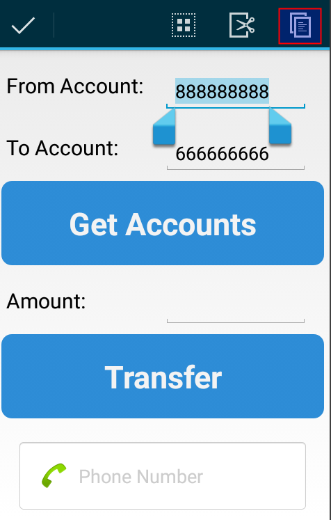
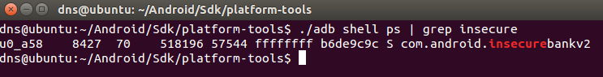
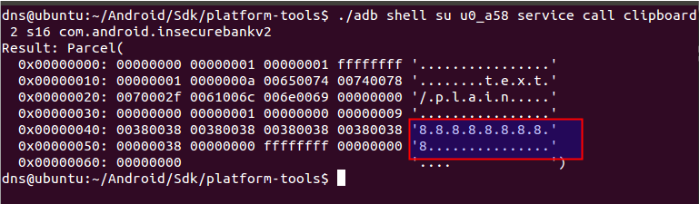

**BOSTON \| SEATTLE**

**187 Ballardvale St. Suite A195 ●Wilmington, MA 01887● Ph: +1.978.694.1008**

[**getsecure@securityinnovation.com**](mailto:getsecure@securityinnovation.com)**●** [**www.securityinnovation.com**](http://www.securityinnovation.com)

**BOSTON \| SEATTLE**

**187 Ballardvale St. Suite A195 ●Wilmington, MA 01887● Ph: +1.978.694.1008**

[**getsecure@securityinnovation.com**](mailto:getsecure@securityinnovation.com)**●** [**www.securityinnovation.com**](http://www.securityinnovation.com)

| **Document name:** | Exploiting Android Pasteboard |
|--------------------|-------------------------------|
| **Author(s):**     | Dinesh Shetty                 |

# Contact Information

### Technical Contact

Dinesh Shetty

Senior Security Engineer

Email: [dinezh.shetty@gmail.com](mailto:dinezh.shetty@gmail.com)

# Test Configuration

The following is required to verify this issue:

-   Download the latest version of the Android-InsecureBankv2 apk from <https://github.com/dineshshetty/Android-InsecureBankv2>
-   Download Android SDK from <http://developer.android.com/sdk/index.html>

# Test Steps

1.  Copy the InsecureBankv2.apk file to the “platform-tools” folder in the Android SDK and then use the below command to push the downloaded Android-InsecureBankv2 application to the emulator.

    ./adb install InsecureBankv2.apk

2.  Log in to the application using valid credentials([dinesh/Dinesh@123](mailto:dinesh/Dinesh@123)!). Click on the Transfer option.
3.  Select the account number field and select the copy option.

    

1.  Now, back on the terminal, enter the below command to find out process details of the running InsecureBankv2 application. Note the user and the packagename of the InsecureBankv2 application.

    ./adb shell ps \| grep insecure

    

2.  Enter the below command to view the account number that was copied from the application.

    ./adb shell su u0_a58 service call clipboard 2 s16 com.android.insecurebankv2

    
