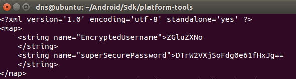
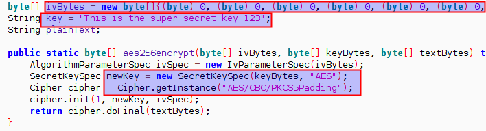
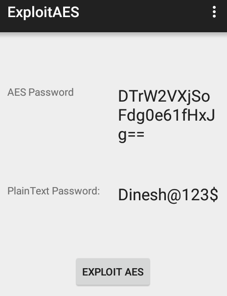

**BOSTON \| SEATTLE**

**187 Ballardvale St. Suite A195 ●Wilmington, MA 01887● Ph: +1.978.694.1008**

[**getsecure@securityinnovation.com**](mailto:getsecure@securityinnovation.com)**●** [**www.securityinnovation.com**](http://www.securityinnovation.com)

**BOSTON \| SEATTLE**

**187 Ballardvale St. Suite A195 ●Wilmington, MA 01887● Ph: +1.978.694.1008**

[**getsecure@securityinnovation.com**](mailto:getsecure@securityinnovation.com)**●** [**www.securityinnovation.com**](http://www.securityinnovation.com)

| **Document name:** | Exploiting Weak Cryptogtaphy |
|--------------------|------------------------------|
| **Author(s):**     | Dinesh Shetty                |

# Contact Information

### Technical Contact

Dinesh Shetty

Senior Security Engineer

Email: [dinezh.shetty@gmail.com](mailto:dinezh.shetty@gmail.com)

# Test Configuration

The following is required to verify this issue:

-   Download the latest version of the Android-InsecureBankv2 apk from <https://github.com/dineshshetty/Android-InsecureBankv2>
-   Download Android SDK from <http://developer.android.com/sdk/index.html>
-   Download the latest version of apktool from <http://ibotpeaches.github.io/Apktool/>. The installation guide can be found at <http://ibotpeaches.github.io/Apktool/install/>
-   Download the latest version of JADX decompiler from <https://github.com/skylot/jadx>
-   Download latest version of dex2jar from <https://bitbucket.org/pxb1988/dex2jar/downloads>

# Test Steps

1.  Copy the InsecureBankv2.apk file to the “platform-tools” folder in the Android SDK and then use the below command to push the downloaded Android-InsecureBankv2 application to the emulator.

    ./adb install InsecureBankv2.apk

2.  Launch the installed InsecureBankv2 application on the Emulator. The following screenshot shows the default screen available to a normal user after login with credentials - (dinesh/Dinesh@123\$).

    

3.  In the “platform-tools” folder, enter the below command:

    ./adb shell

4.  Navigate to the application sandbox:

    cd /data/data/com.android.insecurebankv2/shared_prefs/

5.  Open the file mySharedPreferences.xml. The following screenshot shows that the username and the password was stored in encrypted format in the file. Note the value of the “superSecurePassword”.

    

6.  Unzip the contents of the InsecureBankv2.apk file using the below command:

    unzip InsecureBankv2.apk

    

7.  The *AESExploit* application from the “wip-attackercode” folder on GitHub can be used to exploit this bug. It makes use of the known key, IV and the ciphertext to reverse the encryption process – providing the plaintext password as shown in the following screenshot.

    
