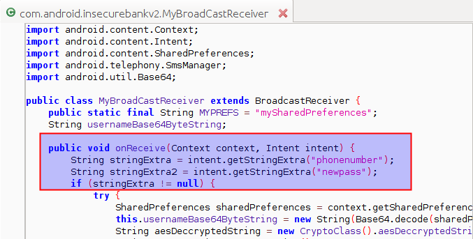

**BOSTON \| SEATTLE**

**187 Ballardvale St. Suite A195 ●Wilmington, MA 01887● Ph: +1.978.694.1008**

[**getsecure@securityinnovation.com**](mailto:getsecure@securityinnovation.com)**●** [**www.securityinnovation.com**](http://www.securityinnovation.com)

**BOSTON \| SEATTLE**

**187 Ballardvale St. Suite A195 ●Wilmington, MA 01887● Ph: +1.978.694.1008**

[**getsecure@securityinnovation.com**](mailto:getsecure@securityinnovation.com)**●** [**www.securityinnovation.com**](http://www.securityinnovation.com)

| **Document name:** | Intent Sniffing |
|--------------------|-----------------|
| **Author(s):**     | Dinesh Shetty   |

# Contact Information

### Technical Contact

Dinesh Shetty

Senior Security Engineer

Email: [dinezh.shetty@gmail.com](mailto:dinezh.shetty@gmail.com)

# Test Configuration

The following is required to verify this issue:

-   Download the latest version of the Android-InsecureBankv2 apk from <https://github.com/dineshshetty/Android-InsecureBankv2>
-   Download Android SDK from <http://developer.android.com/sdk/index.html>
-   Download the latest version of apktool from <http://ibotpeaches.github.io/Apktool/>. The installation guide can be found at <http://ibotpeaches.github.io/Apktool/install/>
-   Download the latest version of JADX decompiler from <https://github.com/skylot/jadx>
-   Download latest version of dex2jar from <https://bitbucket.org/pxb1988/dex2jar/downloads>

# Test Steps

1.  Copy the InsecureBankv2.apk file to the “platform-tools” folder in the Android SDK and then use the below command to push the downloaded Android-InsecureBankv2 application to the emulator.

    ./adb install InsecureBankv2.apk

2.  Launch the installed InsecureBankv2 application on the Emulator. Following screenshot shows the default screen available to a normal user after login.

    

3.  Copy the InsecureBankv2.apk into the “apktool” folder and enter the below command to decompile the application:

    ./apktool d InsecureBankv2.apk

    

4.  Open the decrypted AndroidManifest.xml file. The following screenshot shows the Broadcast receiver declared in the application.

    

5.  Unzip the contents of the originally downloaded InsecureBankv2.apk file using the below command:

    unzip InsecureBankv2.apk

    

6.  Copy the classes.dex file to the dex2jar folder. Make the d2j-dex2jar.sh and d2j_invoke.sh files executable by running the below commands.

    chmod +x d2j-dex2jar.sh

    chmod +x d2j_invoke.sh

1.  Use the below command to convert the dex file into a jar file:

    sh d2j-dex2jar.sh classes.dex

    

2.  Open the generated classes-dex2jar.jar file in JADX-GUI decompiler using the below command:

    ./jadx-gui \<path to classes-dex2jar.jar\>

    

3.  The following screenshots shows the parameters that are passed to the Broadcast Receiver declared in the application that was shown previously.

    

    

4.  Install the application “Sniff Intents” from the InsecureBankv2 GitHub page on to the Android Emulator and launch it.
5.  With the Android Emulator running, copy the InsecureBankv2.apk file to the “platform-tools” folder in the Android SDK and then use the below command to push the downloaded Android-InsecureBankv2 application to the emulator.

    ./adb install InsecureBankv2.apk

6.  On the Android Emulator, send the Sniff Intent application to the background by clicking the home button. Then, launch the installed InsecureBankv2 application.
7.  Log in to the application using valid credentials. The credentials used were dinesh/Dinesh@123\$
8.  Navigate to the “Change Password” page and enter new set of Credentials.

    

9.  The Sniff Intents application is automatically brought to the foreground and the following screenshot shows that the content transmitted via the Intents by the InsecureBankv2 application were captured by SniffIntents application.

    
