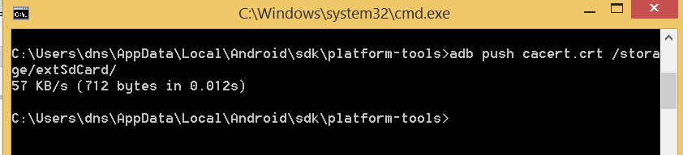

**BOSTON \| SEATTLE**

**187 Ballardvale St. Suite A195 ●Wilmington, MA 01887● Ph: +1.978.694.1008**

[**getsecure@securityinnovation.com**](mailto:getsecure@securityinnovation.com)**●** [**www.securityinnovation.com**](http://www.securityinnovation.com)

**BOSTON \| SEATTLE**

**187 Ballardvale St. Suite A195 ●Wilmington, MA 01887● Ph: +1.978.694.1008**

[**getsecure@securityinnovation.com**](mailto:getsecure@securityinnovation.com)**●** [**www.securityinnovation.com**](http://www.securityinnovation.com)

| **Document name:** | Proxying Android Traffic on a Device |
|--------------------|--------------------------------------|
| **Author(s):**     | Dinesh Shetty                        |

# Contact Information

### Technical Contact

Dinesh Shetty

Senior Security Engineer

Email: [dinezh.shetty@gmail.com](mailto:dinezh.shetty@gmail.com)

# Test Configuration

The following is required to verify this issue:

-   A rooted Android device
    -   A rooted Android device (In our case, Galaxy S4 running Android v4.4.2 was used)
-   ProxyDroid installed on the device
    -   The application can be Installed via Google Play from the following location: <https://play.google.com/store/apps/details?id=org.proxydroid&hl=en>
-   Burp Suite installed on the laptop
    -   The application can be download from the following location:

        <http://portswigger.net/burp/download.html>

# Test Steps

1.  Launch Burp Suite and set it up to intercept all the traffic sent on port 9999 on all interfaces as shown in the following screenshot.

    

2.  Enable “**Support invisible proxying**” from the Request handling tab.

    

3.  Launch the browser of your choice and set it up to proxy all web traffic via port 9999 of the machine that is running the Burp Suite.

    

4.  In the browser, navigate to the below address:
    -   [*http://burp*](http://burp/)

        

5.  Download the Burp certificate by clicking on the “**CA Certificate**” link on the page and save it as a **.crt** file on your machine.

    

6.  Enable “**USB debugging**” on your Android device and connect it to the laptop.

    

7.  Using the “**adb**” tool from the Android SDK, push the Burp certificate to the device.

    

8.  On the Android device, navigate to the security settings page and select “**Install from device storage**”.

    

9.  Select the location to which the Burp certificate was pushed.

    

10. Set a name for the certificate and click “**OK**”.

    

11. When prompted to set a screen unlock pattern, set a sufficiently complex pattern for the device.

    

12. Once the burp certificate is successfully installed, launch ProxyDroid. Click “Grant” when requested to grant it superuser permissions on the device.

    

13. In ProxyDroid, enter the Host and Port of the machine that is running Burp Suite.

    

14. Enable proxying by turning the “**Proxy Switch**” to ON.
15. Launch the Android InsecureBankv2 application with interception enabled on Burp Suite. Observe that the traffic is now intercepted in Burp Suite.
16. Launch the InsecureBank application
17. Login to app using credentials : dinesh/Dinesh@123\$ or jack/Jack@123\$ or jack/Jack!1
18. In Burp, go to the Proxy Intercept tab. You should see your app request(Login Request) displayed for you to view and edit.

    

19. Click the "Forward" button to send the request to the server. In most cases, app will make more than one request in order to display the page (for Images, etc.). Look at each subsequent request and then forward it to the server. When there are no more requests to forward, app should have finished loading the URL you requested.
20. Choose "Send to Repeater", and go to the Repeater tab. You will see the selected request has been copied into the Repeater tool, for further testing where the request can be modified and response can be observed.
21. Now Let’s change the password of logged in User which is legitimated.
22. Here you can also modify the change password request and forward the request through Repeater and observe the response. E.G. User name and password whatever you would like to update it.
1.  Request is found vulnerable, as it’s not asking old password and allowing user to set new password. This way attacker can change the password of valid user without even knowing actual password.

