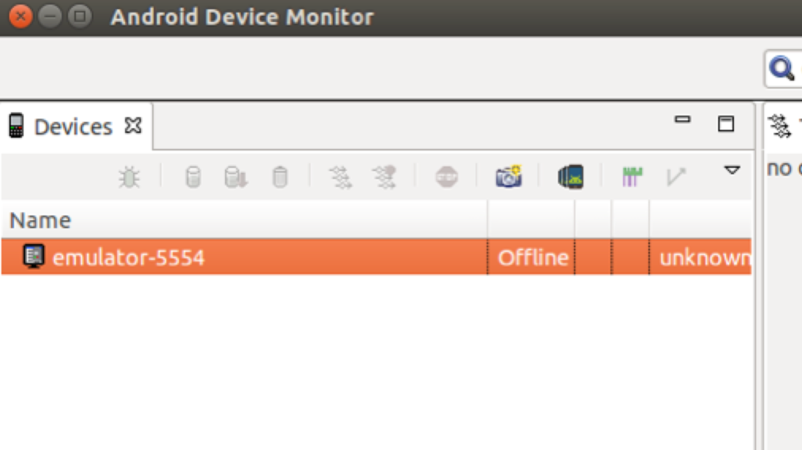
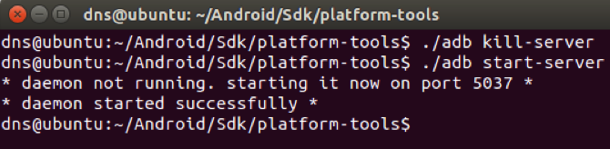
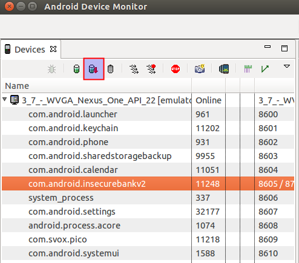
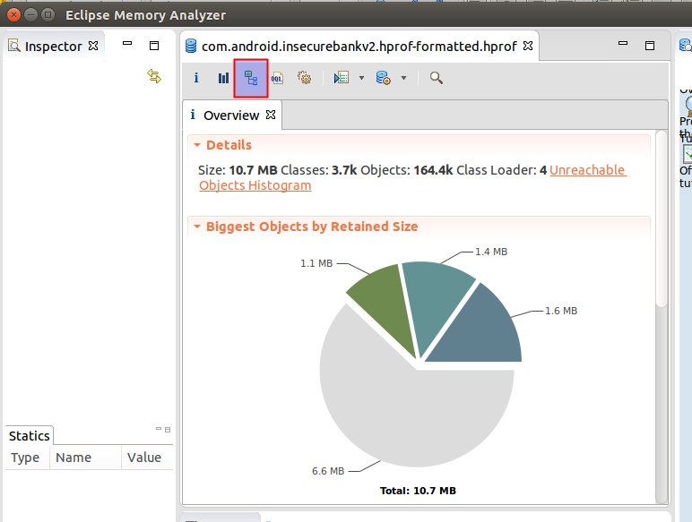
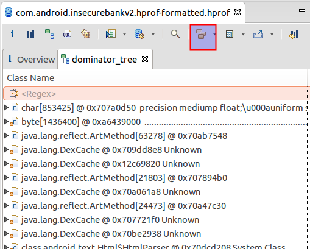
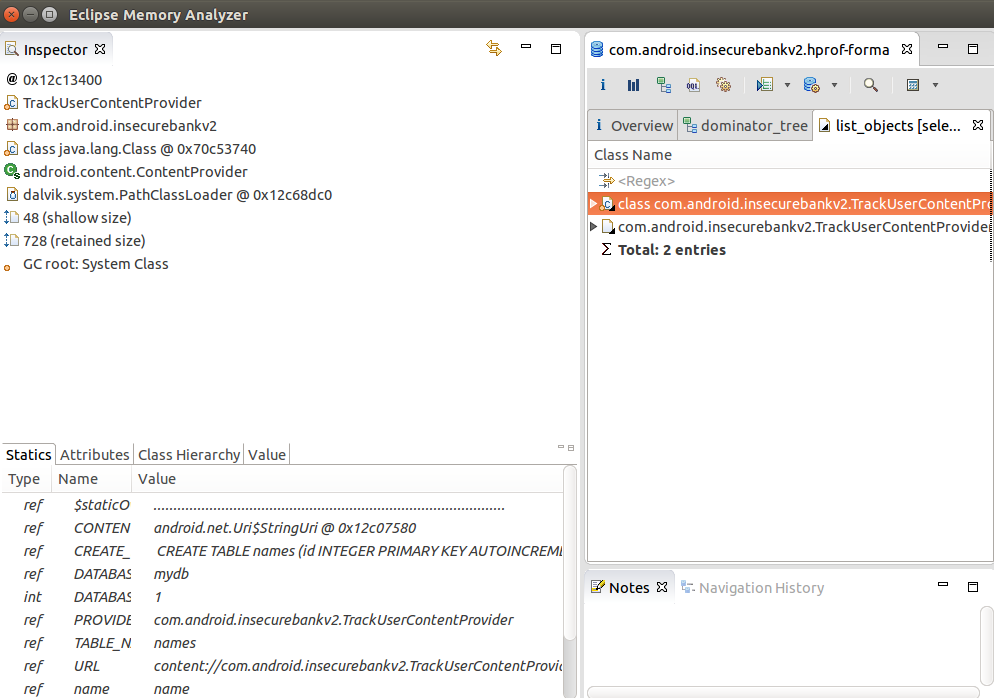

**BOSTON \| SEATTLE**

**187 Ballardvale St. Suite A195 ●Wilmington, MA 01887● Ph: +1.978.694.1008**

[**getsecure@securityinnovation.com**](mailto:getsecure@securityinnovation.com)**●** [**www.securityinnovation.com**](http://www.securityinnovation.com)

**BOSTON \| SEATTLE**

**187 Ballardvale St. Suite A195 ●Wilmington, MA 01887● Ph: +1.978.694.1008**

[**getsecure@securityinnovation.com**](mailto:getsecure@securityinnovation.com)**●** [**www.securityinnovation.com**](http://www.securityinnovation.com)

| **Document name:** | Reading Android Memory |
|--------------------|------------------------|
| **Author(s):**     | Dinesh Shetty          |

# Contact Information

### Technical Contact

Dinesh Shetty

Senior Security Engineer

Email: [dinezh.shetty@gmail.com](mailto:dinezh.shetty@gmail.com)

# Test Configuration

The following is required to verify this issue:

-   Download the latest version of Android SDK from <https://developer.android.com/sdk/index.html>
-   Download the latest version of Memory Analyzer 1.5.0 from <http://www.eclipse.org/mat/downloads.php>

# Test Steps

1.  In the Android Studio IDE go to Tool → Android → Android Device Monitor

    

2.  In the “platform-tools” folder in Android SDK enter the below commands to reset the ADB shell.

    ./adb kill-server

    ./adb start-server

    

3.  Back on Android Studio, select the installed InsecureBankv2 package – com.android.insecurebankv2 and select the below shown button to dump the hprof file and save it on to the desktop

    

4.  Back in the platform-tools folder in the Android SDK enter the following command:

    ./hprof-conv \~/Desktop/com.android.insecurebankv2.hprof \~/Desktop/com.android.insecurebankv2.hprof-formatted.hprof

5.  Open the newly generated file in Eclipse Memory Analyzer. In the following screenshot click on the denomination tree button as highlighted below.

    

6.  Select the group by package option by clicking on the highlighted button.

    

7.  Navigate to the path com.android.insecurebankv2 and right click on any of the class. Select “List objects with outgoing references” to see the data referenced in the memory.

    
