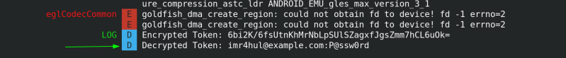
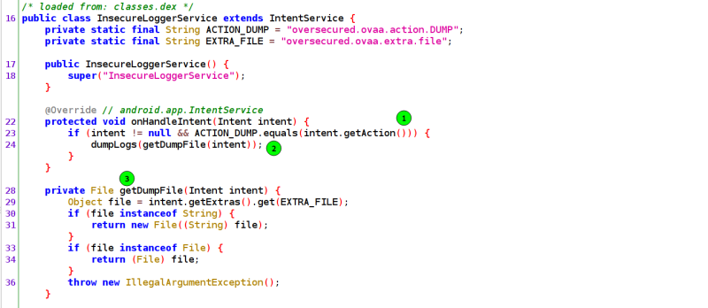

Introduction

OVAA (Oversecured Vulnerable Android App) is a vulnerable android application that aggregates all the platform’s known and popular security vulnerabilities.

Table of Contents

-   [Introduction](https://payatu.com/blog/oversecured-ovaa-walkthrough-part2/#Introduction)
    -   [1. File Theft Via Picker](https://payatu.com/blog/oversecured-ovaa-walkthrough-part2/#1_File_Theft_Via_Picker)
        -   [Understanding the flow](https://payatu.com/blog/oversecured-ovaa-walkthrough-part2/#Understanding_the_flow)
        -   [Exploit Application](https://payatu.com/blog/oversecured-ovaa-walkthrough-part2/#Exploit_Application)
    -   [2. Unprotected Activity Launch](https://payatu.com/blog/oversecured-ovaa-walkthrough-part2/#2_Unprotected_Activity_Launch)
        -   [Understanding the flow](https://payatu.com/blog/oversecured-ovaa-walkthrough-part2/#Understanding_the_flow-2)
        -   [Exploit Application](https://payatu.com/blog/oversecured-ovaa-walkthrough-part2/#Exploit_Application-2)
    -   [3. Weak Crypto](https://payatu.com/blog/oversecured-ovaa-walkthrough-part2/#3_Weak_Crypto)
        -   [Understanding the Cryptographic Algo](https://payatu.com/blog/oversecured-ovaa-walkthrough-part2/#Understanding_the_Cryptographic_Algo)
        -   [Exploit Application](https://payatu.com/blog/oversecured-ovaa-walkthrough-part2/#Exploit_Application-3)
    -   [3. Insecure Logger Service](https://payatu.com/blog/oversecured-ovaa-walkthrough-part2/#3_Insecure_Logger_Service)
        -   [Understanding the flow](https://payatu.com/blog/oversecured-ovaa-walkthrough-part2/#Understanding_the_flow-3)
        -   [Exploit Application](https://payatu.com/blog/oversecured-ovaa-walkthrough-part2/#Exploit_Application-4)
    -   [5. Hardcoded Credentials](https://payatu.com/blog/oversecured-ovaa-walkthrough-part2/#5_Hardcoded_Credentials)

In my last post, I discussed five vulnerabilities. This is the second part of the OVAA(Oversecured Vulnerable Android Application), in which we will discuss the next five challenges. We will also create an exploit application to exploit the vulnerabilities.

Before starting, check out my first blog “[A Detailed Approach to Solving Oversecured (OVAA) Vulnerable App](https://payatu.com/blog/rahul.kumar/oversecured-ovaa-walkthrough-part1)“.

Below are the list of challenges that we have covered in this blog:

1.  **File Theft Via Picker**
2.  **Unprotected Activity Launch**
3.  **Weak Crypto**
4.  **Insecure Logger Service**
5.  **Hardcoded Credentials**

Without any further delay, let’s get started:

1\. File Theft Via Picker

After logging in to the oversecured application, we are presented with three buttons that are as follows:

When we click on the FILE THEFT VIA PICKER button, it will show an app chooser to select an application to pick an image.

After selecting the image, it doesn’t display anything or pops up anything that will let us know what it has done with our chosen image. To understand what is being done with our selected image, let us decompile ovaa.apk file with jadx-gui and analyze the code for better understanding.

**Understanding the flow**

1.  Launch jadx-gui and select ovaa.apk file.
2.  Open MainActivity class from AndroidManifest.xml
3.  Now in MainActivity class, there are three onclick methods defined. When the user clicks a button, the button object receives an on-click event, and that onclick method will be called. Below is the snippet of our onclick method for File Theft via Picker button.
-   In this method, first, the application is calling checkPermissions() method in which it is checking if the application has READ_EXTERNAL_STORAGE and WRITE_EXTERNAL_STORAGE permissions.
-   Next, the application creates an intent named pickerIntent with action android.intent.action.PICK. ACTION_PICK is used to pick an item from the data storage. It outputs the URI of the item that was picked.
-   A MIME type of image/\* has been set to the pickerIntent that represents the MIME type data the application wants to get in return from firing intent.
-   The startActivityForResult() method is called with pickerIntent and 1001 as its arguments. startActivityForResult allows us to start activity and get some data back. In our case, the URI of the image will be returned to the startActivityForResult method. The second argument, 1001, is the requestCode that identifies which app returned these results. When we are done with the subsequent activity to select the image and returns, the system calls MainActivity’s onActivityResult() method. This method includes three arguments:

@The request code you passed to startActivityForResult(). @A result code specified by the second activity. This would be either RESULT_OK if the operation were successful or RESULT_CANCELED if the operation failed. @An Intent that carries the result data.

1.  At this point we know that the application lets the user choose an app to select an image. Now let us understand how the oversecured application handles the URI data of the image that is returned by the choosen application to select the image. Yes, you guessed it correctly, we need to investigate the onActivityResult method of the MainActivity’s class.
2.  It is calling a method named FileUtils.copyToCache. Double click on the copyToCache in jadx-gui and it will open the method for you and you do not need to waste your time searching where the function is located manually. Here, it is passing the URI of the data received as an argument to copyToCache method.
-   getExternalCacheDir returns an absolute path to the application-specific directory on the primary shared/external storage device where the application can place cache files it owns. Then it creates a file with the name as the current milliseconds. In short, this method is copying the file the user selected to a cache folder located at /storage/emulated/0/Android/data/oversecured.ovaa/cache.

Now that we know how the oversecured application is processing the selected image, we can create an exploit application to steal files. What we are going to do is that we will create an application that will return the Uri of the file that we intend to steal. And then we can read the file’s data from the cache directory of the oversecured application.

**Exploit Application**

1.  Create a new Project with EmptyActivity in the android studio.
2.  Now in the AndroidManifest.xml file, add a new activity named PickerActivity with the following intent filters.
-   Our PickerActivity will be exported true so that oversecured application can call this activity and the priority must be an integer that represents the order in which all the resolved application will be displayed that can pick an image. Higher numbers have a higher priority. The action and MIME type are set to be android.intent.action.pick and image/\* respectively.
1.  Create a new class named PickerActivity that will contain the following code.
-   Here, we are creating a new intent that will be received by the oversecured application with the URI set to the location of the login_data.xml.
-   SetResult(Result, Intent) sets the result that our activity will return to its caller.
-   finish() method is used to destroy the current activity and returns.
1.  Launch the application and select our exploit app to choose the image.
2.  Now go into /storage/emulated/0/Android/data/oversecured.ovaa/cache directory, you will see the login_data.xml file saved.

2\. Unprotected Activity Launch

In this challenge, the oversecured application sends the base64 encoded credentials to a website example.com. We could obtain the encoded token by setting a proxy in the device and intercepting the request. But we are going to get the token another way. Before that, we will learn how we can detect vulnerability in the first place.

**Understanding the flow**

1.  Launch jadx-gui and select ovaa.apk file.
2.  Open MainActivity class from AndroidManifest.xml
3.  As we have discussed the onclick method in the above challenge, we will directly find the onclick method defined for the unprotected activity launch button.
-   In the onclick method, the application first fetches the login credentials using the getLoginData method.
-   Next, it is encrypts the loginData using some cryptography algorithm. Don’t worry; we will talk about this in the next challenge.
-   Another method named protectActivityIntent is called in which intent i is being passed as an argument.
-   This method is iterating through the list of all activities that can resolve the passed intent. That means all the activities with action are oversecured.ovaa.action.WEBVIEW. For now, there is only one activity in the oversecured application that can resolve the intent, so it is setting the package and classname of the intent to ovaa.oversecured and ovaa.oversecured.activities.WebViewActivity respectively in the intent.
-   After that it starts the activity using the method startActivity(intent) method.

Now that you have understood how the application is working behind the scenes, what if we can create an exploit application with an activity that can resolve that intent? So that the token will directly be obtained from us. Would that not be hacking!!!! Let us do this.

**Exploit Application**

1.  Create a new Project with EmptyActivity in the android studio as shown in the previous challenge.
2.  Now in the AndroidManifest.xml file, add a new activity named ExploitActivity with the following intent filters.
-   It will have exported set to true so that oversecured application can resolve this activity.
-   The action will be set to oversecured.ovaa.action.WEBVIEW, as we saw earlier, the intent has this action.
1.  Create a new class named ExploitActivity that will contain the following code:
-   As you can see, we are just logging out the token in the logs. We will further explain how to decrypt the token in next challenge.
-   Save the code and then install the Exploit Application on the device.
1.  To see the token in the logs of the exploit application, we will use pidcat. Run pidcat com.exploit.unprotectedactivitylaunch in your terminal.
2.  Now open oversecured application and click on the Unprotected Activity Launch. In the logs, you will get the token.
3.  Save the token somewhere safely in your notes, as we will need that in our next challenge.

3\. Weak Crypto

So now is the time to discuss how we can decrypt the oversecured token to get the credentials. But first, as usual, we will analyze the decompiled source code of the oversecured application. If you remember, the application was using method WeakCrypto.encrypt(loginData.toString()) to encrypt the credentials. We will start by understanding this method and then further implement the previous exploit app to decrypt the token.

**Understanding the Cryptographic Algo**

1.  Launch jadx-gui and select ovaa.apk file.
2.  Open oversecured.ovaa.utils.WeakCrypto class.
3.  And I do not need to tell you what evil you can do here with the secret key exposed in the oversecured application. An application must not store the secret key in hardcoded form that can be easily obtained by decompiling the application.
4.  The exploit will be straightforward, we will grab the secret key and the encrypted token as well.

We will write small code to decrypt the token in our exploit application that we created in our previous challenge to steal the token.

**Exploit Application**

1.  Below is what the code will look like.
2.  After getting the encrypted token string, we are storing the secret key in a variable named KEY.
3.  Then we createan instance of AES which was used during the encryption. After that,we are using the opmode = 2 that is used for decryption.
4.  After decrypting the token, we log the decrypted data in the exploit application logs.
5.  Build the apk again and install in the device.
6.  Run pidcat com.example.unprotectedactivitylaunch before clicking on the unprotected activity launch button.
7.  You will get the decrypted data in the logs, as shown below.

3\. Insecure Logger Service

The oversecured application has one logging service that is exported. Understanding the decompile code will help us in understanding how that service is implemented and after that we will take a look at how we can exploit that service. We will also try to grab some sensitive data from this service.

**Understanding the flow**

1.  Launch jadx-gui and select ovaa.apk file.
2.  In AndroidManifest.xml file, you can see the InsecureLoggerService as show below.
3.  Open that InsecureLoggerService class, and before reading below, try to understand by yourself.
-   In line 23, the application is checking if the action of the intent is equals to oversecured.ovaa.action.DUMP.
-   Then it is calling the dumpLogs(getDumpFile(intent)) method with the intent as an argument.
-   In getDumpFile() method, the application is storing the value of extra oversecured.ovaa.extra.file if any to file object and returning that file object.
-   This file object is then passed as an argument to dumpLogs() method in which logs will be dump into the file.

Since the service is exported then any application can start this service and dump the application logs. Let’s create an exploit application to do so.

**Exploit Application**

1.  Create a new Project with EmptyActivity in the android studio as shown in the first challenge above.
2.  Now add the following code into the MainActivity class of exploit application.
-   First we created an intent with action equals oversecured.ovaa.action.DUMP otherwise we won’t be able to pass that if statement in InsecureLoggerService class.
-   Second, we use putExtra method to pass the location of the file where we wants the logs to be dumped.
-   Next, we used setClassName() method to set the explicit package name and class name of InsecureLoggerService.
-   Finally, startService() method was used to start that InsecureLoggerService service from an activity or other application component by passing an Intent to startService().
1.  Build the apk and install in the device. After launching the apk, you will notice a file named logs.txt has been saved in the external storage directory.
2.  Open logs.txt and see if you can spot any sensitive info.
3.  Yes, the oversecured application is leaking. credentials also in the logs.

If you face any error, try checking if the oversecured application has storage permission given or not.

5\. Hardcoded Credentials

Many a times, developer ended up storing credentials in the application itself. The oversecured application has also one hardcoded credentials stored in the strings.xml file. This file contains all the strings which is used frequently in Android project.

1.  Decompile the ovaa.apk file using jadx-gui.
2.  Open strings.xml and you will get the credentials stored in xml format.

This is all for the second part of the oversecured application(OVAA) and I will see you in the next part very soon.

Happy Learning.
