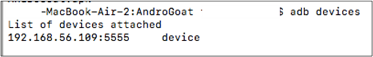
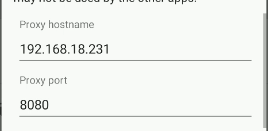
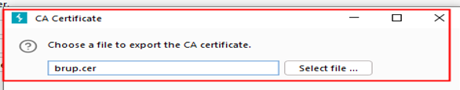
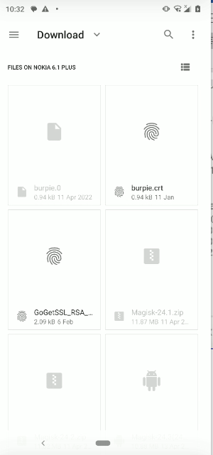

**Have you ever wondered about the vulnerabilities hidden beneath the surface of your favorite mobile apps? I certainly did, which is why I dove headfirst into the deep end of mobile application training and found a mobile application that I can train with. [AndroGOAT](https://github.com/satishpatnayak/AndroGoat) is an app filled with secrets, each one is a teachable moment in mobile application security. With this article, I’m opening up my diary of discoveries, sharing all the technical moments from my AndroGOAT journey. So feel free to follow along as we explore security flaws of this vulnerable mobile app together!**

**Installation**

For this walkthrough I am using a physical android phone and a VM (Genymotion).

You dont have to use my exact method of setup, you can place platform tools and apk file in the same location or provide full path of their location in order to install the AndroGOAT application to run the Android virtual machine.

Either you can Drag and Drop the APK file of AndroGoat on Android VM or you can install it with Android Debug Bridge (adb).

**Installation with ADB:**

Open Command Prompt and Navigate to the location of AndroGoat APK file.

Now run following command:

adb devices

This command will show us status of any android device running on our system

As VM which we started earlier is running, now it’s time to install AndroGoat application. Run command given below and shown in figure

adb install AndroGoat.apk

You will get success status printed on command line:

Icon of AndroGoat app will also appear on your VM as shown below:

Tap (Click) on the AndroGoat app Icon to launch the application.

**Network Interception Setup**

**1. HTTP**

Setup a proxy on mobile phone like this:

192.168.18.231 is the IP address of my computer which is connected with internet.

Start Burpsuite and enter the proxy details in proxy listener section:

Then open the AndroGoat application and click on HTTP and the traffic will be intercepted in Burpsuite:

**2. Intercepting HTTPS**

For task 2, we need to export Burpsuite SSL certificate to mobile phone, so that HTTPs based traffic can be intercepted. Certificate exporting option is shown below.

Enter the name of file with extension of .cer:

Transfer burp.cer to the mobile phone files folder and then Go to certificate option in mobile phone settings.

Phone types and menus vary but if you are having issues finding the certificate menu then try to search for “certificate”:

After the certificate is installed on the mobile phone, navigate to the folder where the certificate is stored.

Click on certificate and install it, select the option “VPN and Apps” using any preferred name and press OK:

Now go to the application and click on https. Wait about 5–10 seconds and [**https://owasp.org**](https://owasp.org/) will be intercepted by Burpsuite:

**3. Certificate Pinning**

What we want to do here is install Frida Server and send the server file to the rooted android phone location **/data/local/tmp**.

Install Frida tools on windows/ linux system as shown below:

Now go to android phone location and run the command:

chmod +x frida-server-16.0.9-android-arm64

After running the above command, type the following command to run Frida server.

Run the following command on windows/linux system to check if Frida is installed correctly.

Now install the [objection framework](https://github.com/sensepost/objection) and run it on the host PC system.

Run the following command to bypass SSL/ Certificate pinning on AndroGOAT Application.

objection –g owasp.sat.agoat explore –s “android sslpinning disable”

Now click on certificate pinning in AndroGOAT:

**Unprotected Android Components**

According to this code, if the correct pin is inserted then **AccessControl1ViewActivity** will be called:

Instead of providing the correct pin, the user can directly jump to the **AccessControl1ViewActivity** by using the following command:

adb shell am start -n owasp.sat.agoat/.AccessControl1ViewActivity

After running the command successfully, the following activity will be shown:

**Insecure Data Storage**

1.  **Shared Preferences(Part 1)**

In this task, input the username and password of activity and then click on save.

Go into android shell by typing the following commands

adb shell > su > cd /data/data/owasp.sat.agoat/shared_prefs

Then type ls command to list all files and you should see interesting files including users.xml. :)

Show the content of the xml files with cat or nano:

cat users.xml

**2. Shared Preferences (Part 2)**

Click on “shared preferences — Part 2” to open a score card.

Now go to **/data/data/owasp.sat.agoat/shared_prefs**

Type the **ls** command and there will be new file present there named **score.xml**.

Now edit the score.xml file either by exporting it or by editing it in the location and values will be reflected on the activity page as shown below:

**3. SQLite**

Next in the Insecure Data Storage section, go to SQLite and enter any username and password and click on Save option.

Now go to **cd /data/data/owasp.sat.agoat/databases** and type **ls –l** to list databases.  
After that type **sqlite3 \<database_name\>** , list tables using the command, **.tables**, and enumerate the table contents by typing **select \* from users**;

**4. Temp File**

The temp file is created when a user enters username and password.

After the temp file is created in the application container, go to the application container by **cd /data/data/owasp.sat.agoat/** and then type **ls –l.**

Display the contents of the file **users\*tmp** and it will list the sensitive contents (i.e. username/password) in plaintext.

**5. External Storage — SDCard**

For this one, ensure that you have granted permissions to the mobile application as shown here:

Now to take a look at the code, open the .apk AndroGoat file in jadx tool and go to **InsecureStorageSDCardActivit**y.

As shown in the red box, the data is going to be stored in SDCARD (external storage) with name “**users**” prefix **“tmp”** as postfix and **input userinfo** will be stored there.

Now access the device with **adb shell > su > cd /sdcard/** and type **ls –l** and cat users\*tmp.

---

Let me know if you need further adjustments!
