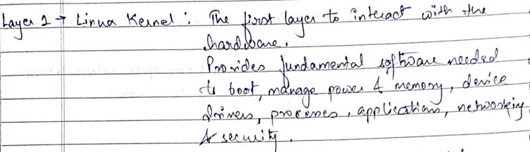
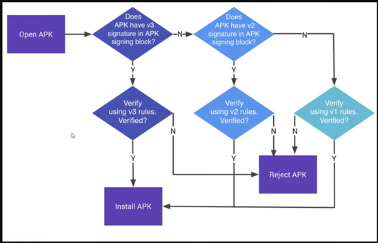
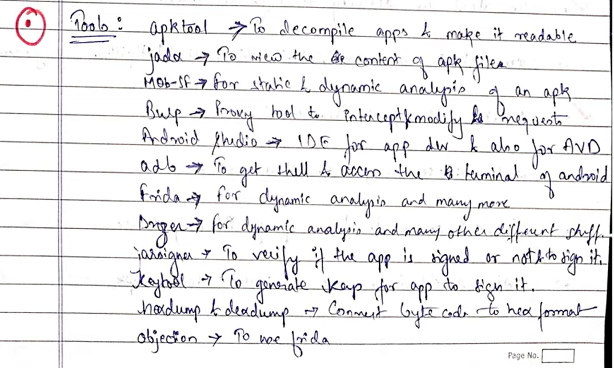

Android architecture. So, before we can actually proceed into mobile application hunting, you should know the architecture of an Android system, right?

So, in the architecture having 4 main components such as **application, application framework, libraries and art and Linux kernel.**

**Linux kernel.** It have written is the first layer to direct **interact with the hardware.**

It provides fundamental software needed to **boot, manage power and memory,** managed device drivers, manage **processes**, manage applications, manage networking and manage security.

As you can understand from that that our whole Android is based upon the kernel of Linux. it's based upon this Linux environment. So, what this Linux kernel do Linux kernel directly communicate or interact with the hardware layer. And it provides fundamental software’s or for other functionalities and actually manages the power manages, power the system, manages the drivers, provide necessary function to the to the drivers. so, it works on the hardware level.

So, the so the core responsibility of Linux kernel is to manage the core functionalities of an Android.

**2. libraries.**

what are libraries? Libraries consist of C and C++ code which I**nstructions for kernel to perform the given tasks.**.

libraries are the **transaction layer between the kernel and the application** for framework. By providing some of the common services available for app and other **programs, libraries are instructions for kernel to perform the given tasks.** Task to the to the Linux kernel to perform some task into the hardware level. OK, these consists of some instructions and all and it also behaves as a **bridge or as a communication. Medium between the application framework and the Linux kernel.** Then we have the **Android runtim**e where actually our Android application runs. So what is Android runtime.

So Android runtime consists of DVM, also known as Dalvik VM, or also known as Dalvik Virtual Machine. So what is it? with that **interacts with the app and runs the app.** The libraries and DVM combines to become an art., So what is a DVM.

Picture if we are writing a normal Java code, the normal Java code gets compiled into Java byte code by the Java compiler and then the Java Byte code runs on JVM, also known as Java VM, right? But in case of Android application there is a Java code or a **Kotlin code** and. Through the. Compiler it is. It gets compiled into Java bytecode or a Kotlin bytecode OK and then byte the Dex compiler it changes into Dalvik byte code, right? And then the D**alvik byte code runs into a Dalvik VM,** also known as DVM. OK, so, so this is how our application gets compiled. As well as to run in the Android operating system.

**Application framework** what is that application framework contains the code compiled for the DVM and running on the DVM. OK, so it consists of the code that is compiled for the DVM. So whatever code is required for the DVM to run, it consists of that particular code. Also, the code that the DBM will run is present in the application framework.

**Application layer** where you can see home, contact, phone browser, all those things. So what are application layer, the top layer where actually our apps are installed? OK, so this is where our apps installed. Whenever you turn on your phone, you can see the pre-installed applications are already present over there, so it is present on the application.

**Basic Terms:**

**Activity,** what is an activity? The screen of the app, the web page and website is same as an activity to an app.

That means what in the Android application, whenever you turn on an application or whenever you click an app, the page that you see or the pages that you see. Are known as activity or activities, right? For example, in the Internet, when you visit a website, you get to see a web page and. Click of a button or a link you are you see a different web page, right. So, what a web page to an website is equivalent, but an activity is to an application, right?

**services**, so services are long running task that requires no user interface and has to explicitly stopped by the user, so background tasks like **GPS i**s an example of it, right? So services are the **background tasks** that requires no such user interface and to explicitly stop it means to stop it. We have to explicitly stop it.

**broadcast receivers: it sends messages to the phone are called br oadcast,** also known as **notifications**, so notifications or messages that are sent to the phone are called **broadcasts**. So the component that listens for these notifications are for broadcast receiver.

So let me give an example to you. For example, you are charging your phone right when you change your phone, there's a notification that thumbs up, right? That your phone is getting charged and 20% charged available right? So that is a notification that notification is known as broadcast and the component that searches or that **receives these notifications are known as broadcast receiver.**

**Content provider**:

For example, there are 2 applications, WhatsApp, and Facebook, now **WhatsApp is requesting a certain amount of data from Facebook.** OK, so the application WhatsApp will asks for data. OK will ask for data from Facebook through the help of content resolver and Facebook will provide. Data to WhatsApp through the help of content. Provided OK, so what is the content resolver, **content resolver requests for data from another application and content provider provides the data from the requested application.**

So from the diagram that I have shown over there, you can easily understand and by the way you should know that in our Android operating system whenever. Applications run, they do not communicate with each other. Every application runs in its separate sandbox in its separate virtual machines. So no application has the permission to communicate with another application. If they need to do, they will require this content provider and resolver. And Each and every application has their process ID has their user ID. so each and every application are known or are recognized by their user ID by the by the operating system on the Android operating system.

**Intent: what are intent? intent are required to communicate between activities. You go to our website. you click on the link and on click of the link you are shifted to another website**. OK you are shifted to another web page I would say OK you see a change on the web page, OK for example is the home button. There's a about section. Contact us. You click on about the web page change into another web page.

Similarly in the Android application there is a button for example. So whenever you whenever you turn on an application, a activity shows up right and there's a button for example that click me if you click that button the activity changes and another activity loads. So that is happening because of the. Intense. OK, so **because the intents are present, activities gets switched.**

We have types of intent. There are 2 types of intent, explicit and implicit right.

1\. explicit intent. **What intent that communicate between 2 or more activities of similar application.** OK for example there's a shopping website. you are clicking on buy now when you are clicking on buy Now the **activity is switched into a payment activity of that same application. So there is no involvement of second application or a 3rd application. Everything is happening inside a inside of one particular application** that is being done through the through the explicit intent.

2\. Implicit intent, OK for example I have sent you a mail telling that.

Please click on this particular hyperlink in your Gmail. OK so you have turned on your Gmail. You have opened up your Gmail application. You are seeing my mail over there when you **click on my mail.** OK, you say a hyperlink when you click on that link, a browser comes. So in this implicit. **What happens is there is an involvement of a second application or a 3rd Apple. OK,** so so this is being done through the implicit intent.

**So there are basically 2 types of intent, explicit and implicit in the explicit intent that communication between the activities or the switch of activities OK happens within the same application and in the implicit it requires another application. OK.**

**Intent resolution:** It is the process which checks which implicit content needs to call which activity. OK, so in the implicit intent there has to be some checks and processes which will tell that I need that particular second application to to pop up.

For example, I if I go back to the hyperlink example over there, I said you that in the Gmail, OK, in the Gmail I have sent you a hyperlink. When you click on that hyperlink, the browser will come up and show up OK now the intent resolution will make sure that whenever you click on that link. **The browser will show up and not like for example your phone book or something else**, so that is being checked by the intent resolution.

**Inside of an APK:**

APK stands for. Android package kit fine. Now what that Android package kit means APK is kind of similar to a zip file. You can also extract an APK but what you will get you will get. Compiled version of Android manifested XML classes Dex, Res folder, meta INF folder. Fine, now we have to decompile it, buy some tools that we can use to decompile the apk.So what we get inside of an APK inside of an app, we get Android manifest dot XML.

what is **Android manifest XML:** the file Android manifest XML is a file is an XML file OK, which is often an extensible markup language XML file which has all the permissions listed which will be needed by the application to run.

so the application that requires the permission so whatever permission required by the application or whatever activities that are required to show the content providers services that will run intent, intent filters and resolutions each and everything will be listed in that Android manifest.xml Right. Understandable. So it is the main file that will present in each and every application, be it a very high application like Facebook or whatsapp or very cheap application.

Each and every application that you build will contain this Android manifest that XML. OK, so it contains all the permissions, all the permissions. All the activities, all the services that are required by the application tool, run and function properly will be listed in the xml file.

**classes Dex,** Dex, also known as Dalvik executables. OK, so those dex format files contains the Java bytecode. What is the Java bytecode? whenever a Java source code gets compiled by a Java compiler, it changed into Java byte code OK, so it contains Java byte code in DEX format. OK so this dex file can be decompiled and the application source code can be read OK. So each and **every application will have a one particular classes DEX file.**

**RES**. A **folder** which has device configurations, bitmaps and layouts. What are layouts? How our application will look like? OK, those are known as layouts so that folders will contains all the bitmaps, layouts and device configured.

**Resources arsc.** So what this file has is the file contains the binaries of compiled component which might include images, strings or other data used by an application. So an application which requires some images or string strings means I hope you can understand since we have a programming background. Trained for other data that is required by an application, all the binaries of of those compiled component will be present into these resources arsc.

res: all the resource which are not compiled will be in res directory.

resource.arsc: all the resource which are compiled will be in resource.arsc directory.

**Meta INF** So that folder contains the manifest information and other metadata about the Java packages carried by the jar file. OK, it contains files like manifest.MF, Cert.fF and Cert RSA, so it will be containing all the hashes. All the algorithms that are needed of the application to sign in. OK, it will contain all the metadata of the Java packages and the jar files.

**Pentest Methodology:**

The first thing that we can see over here is **Recon**.

**Recon:** Recon stands for reconnaissance or gathering information. Whenever you install an application in a play store. Search it on the Internet.

-   Who is the author but is the Android SDK version
-   the minimum Android version required the maximum things. Required. You basically check all things right who has made this,
-   what is their background?
-   Is it using native Android application development thing or a hybrid thing?
-   Is it totally made on Java or is it using any kind of different languages like DART or? React native, right?

This is known as Recon. OK, if there is any website to load their Android applications.

**Static analysis:** What is static analysis?

-   You are basically searching for bugs or hunting or doing penetration testing. Without actually running the app by reviewing the source code
-   by seeing the source code by seeing the files, by seeing the meta data’s,
-   by seeing all the things that that is present inside an apk, as I said app is just like a zip file that has all the several files and folders present.
-   By seeing or by reviewing those things that is known as static analysis.
-   You are statically analysing code your application without even running it actively.

What is **dynamic analysis**: You are running the application. You are checking that on click of this button what request is being sent. You are intercepting the traffic you are actively. Interacting with the application to find bugs in static application you are not interacting so much with the applications. It does not matter the application is running or not but in dynamic analysis to find work, we need to actively interact with the Android application that works.

**Reporting:** it is what differentiates or separates ethical hacker and a Black Hat hacker that is reporting you need to report your bugs as well.

**Owasp Mobile Top 10:**

what is OWASP? OWASP stands for Open web application security project. If it is open web application via mobile application is there, OWASP is the open-source community where hackers all around the world. Make their top 10 vulnerability listing about a particular domain. If it is a web application, the top 10 vulnerabilities that you can search for you can earn for is present in list.

OWASP top 10 consist of all the domains of all vulnerabilities that could be present. All the top 10 vulnerabilities. Uh, so we will be looking about the mobile or mobile top 10.

**M1 Weak server side controls:** compromising application servers that forms the backbone of this application must be secured on their own so vulnerabilities like injection idor insecure communication may lead to complete compromise of it and attackers who have gained control over the compromise server can push malicious content to all the application users and compromise user devices as well.

So what does weak server-side control mean? For example, you are having an Android application and that is communicating with the server. so the server is the backbone of that particular **Android application and now due to some injection attack or IDOR attack you are able to hijack or give some malicious input or perform some malicious activity in the server. And because server is compromised, your application is compromised as well. So this is known as weak server-side controls.**

**M2 Insecure data storage:** that is storing sensitive information into log files, XML files, databases in an unsecured manner. What does it mean? For example, your Android application is asking you for your credentials right for your important credentials, for your PII, also known as personal identification information. OK, if it is asking if your Android application is asking for your sensitive information and after you give that information, if it is storing into an Android phone.

If the information is stored by the application in your phone in an **insecure manner** that anyone can actually access it through the log files for the XML files or it is being hardcoded string it is known as insecure data storage, which means the data is stored in an insecure manner.

**M3 insufficient transport layer protection:** Since most of the data are prone to tampering, so SSL or TLS SSL means secure socket layer Controls**, which enforces confidentiality and integrity of data, must be verified for correct implementation.** That means when an application is using SSL or TLS control and since SSL or TLS ensures the confidentiality and integrity of data, if anyhow the attacker messes up. Compromises the controls, compromises that transportation, or rather the traffic of it. It could be disastrous. The application could malfunction, your data could be leaked. And this is what known as insufficient transport layer protection.

**M4: Unintended data leakage (Extra functionalities data leak):** Certain functionalities which are unintentionally placed for better performance and user experience might leak data or the data might be accessible to all or via or via malware.

What does it mean? For example, in an Android application, if the developer has set up some functionality to look at the UI, much more fascinating to the user. To make the user experience much more good. If that experience might lead to a leak of data, for example, let me give a brief example. If there is a button, OK and the user wants, that does not matter. It is an online app or an offline app, does not matter. You are connected to the Internet or not. If you click on that. And your picture will be shown here private pictures. Your sensitive data will be shown to you.

**Now what will happen if the data is not stored in a perfect manner?** OK and only you have the authorization only you are only authorized to see your private data, or you see your sensitive data and that is why the developer has stored into your phone and secure manner.

What an attacker can do then attacker can take the advantage of that particular thing and can normally access. Data. OK, so this is what known as unintended data leakage where actually the data is leaking, not because of intentional act, but because of an unintentional activity. due to an unintentional activity, the data is leaking due to make an application much more fascinating, some settings are getting changed. Some function is getting changed and due to the. Due to the what the modification the data is getting leaked, that is known as an intended data leakage.

**M5 Poor authorization and authentication:** Since mobile devices are personal devices, so developers. Tend to give sensitive data in the phone itself via some safety mechanisms, and only authorized users could access it if that mechanism is poorly built, then all the authorized will data will be available with the non-authorized adversary.

What it means? It means that the data the sensitive data that is meant for you and stored in your phone only meant for you. That means what the developer is thinking that only you will be having the access. But if an attacker any harm tend to get your data and **if there is a check verification.** That only the authorized user has the access to see their private data. If that mechanism is anyhow tampered anyhow. Gets, poorly built or is malicious? Is uh, you know, anyhow. Breaks or if the attacker is able to break that check facility, then this will be lead to poor authorization and authentication.

**M6: broken cryptography:** Algorithms that are meant to keep the data protected if they are not implemented properly or if the public or private care not managed carefully, then anyone could access the keys and could access the data.

What does it mean if your data is stored in your phone in an encrypted manner? By with the help of certain algorithms like SHA, 256, CHA 512, some hashing algorithms like MD 5 and all those. Means OK if the algorithms are not protected in a perfect manner. If their public key and private key are not kept safely, anyone who get access to that key or any attacker who get access to those keys, or if that algorithm is not perfectly managed.

They could bypass the cryptography algorithm. They put simply decrypt the data and could access the files and could access the data. This is known as broken cryptography.

**M7: Client-side injections:** What is client-side client means us OK if we are giving some user input values and that values are not being verified by the applications that is known as client-side injection. For example injecting queries of SQL or commands of bash or any other programming-based command to alter Read, read, delete, or access data and compromise. It is known as client-side injections.

Basically, there is a form. For example, there is a form and it is asking me to enter my user name or password and if I anyhow bypass it for example it is being verified by a database OK by a SQL database and if I give a SQL command over there and if that command gets executed in the database it can lead to a disaster. I can basically bypass by giving my SQL command so if the application is not verifying is not validating that what type of. Input I am giving this is known as client-side injection and over there I can like give anything I can write a Python code I can write. I can write a bash code; OK I can write any SQL queries OK based upon what are the technology that is used in building the application. I can write that code over there to basically bypass it and if. My application is not verifying what my input is. Then I can simply bypass or anyhow alter fetch or read or delete the data I can literally compromise that particular application.

**M8 Security decision via untrusted input:** the implementation of certain functionalities such as hidden variables to check the authorization status can be bypassed by tampering them during transit via web service calls for interprocess communication calls. This may lead to privilege escalation or unintended behaviour of an application.

That means what security decisions via untrusted input. This means if I if I do not have the. Privilege to manage the security decisions that has been taken by the application and if anyhow I give some code I tamper with the application and if the application gets modified because of my tampering, this might lead for me for the attacker to gain high level access which is also known as privileged. Escalation and after I get high level access, I can manage the security policy. For example user one is there and user 2 is there, user one has the high-level privilege, User 2 is not having that high level privilege. if the. User 2 anyhow. Modifies or tampers with the application or OK anyhow, intercept with it does some modifications, does some hacking activity is right and if anyhow the application, if it is vulnerable to that particular bug, if that application gives user to the high.

Level privilege similar to user one, user 2 can simply remove user one from its data, can get user one 's data, can perform some security decision, can make user one goes to lower privilege and make user 2 into a higher privilege. All these things can be done so this is one. Known as checking security decisions. Via untrusted input.

**M9 improper session handling:** obtaining session tokens that are active for longer time, mail it to account takeover as stolen.

What does it mean? For example, you are signing into your Facebook application or WhatsApp, or rather Instagram, and there is a session token. There are some cookies or CSRF token that is being. passing or as it is being transferred from your application to a server for checking that only you. And your phone and your application have the authority to access that application, and if that session cookie, I mean the **session token is active for very long time, any person or any malicious user could get that particular session token via either man in the middle. Back or for example by cross site scripting or for example by a phishing attack.** Anyhow, if that session token is, if the attacker gets access to the session token, their account can be takeover, right.

It can write account take over the user that the victims account could be hijacked. OK because the session token is active, and the server is syncing that yes, the. Attacker, since the attacker is using the victimization token, which means the attackers device is a legitimate device. OK, so let us give that access to the attacker as well.

**M10 lack of binary protection** since mobile application can be reverse engineered. So if an attacker inserts malicious code and shifts to the user, then the phone can be compromised.

**So when building an application, if the signing and checksum is not done correctly,** then the above, above, or above disaster could occur. What does it mean? It means since we know that mobile application is .apk we can simply reverse engineer or decompile an apk we can fetch the normal files **normal source code right and if the checksum if the signing if. Various the certificate authorization is not done correctly. It is known as lack of binary protection, right?**

**Signing of an application:**

So what is signing of an application whenever you build an application and publish. Over somewhere, right. You need to build that application and after building the application after you make that .apk and before you publish into Play Store or App Store over here, I'll take the app example of Play Store because I'm talking about Android application paint testing. Whenever you upload into Play Store there will be a signing of an application. So the **signing means that it is ensuring that who is the author of that particular application.** What are the algorithms and hashes that are required for the application.

signing of an app meaning so code signing is used on Windows and macOS. It's fine to authenticate software on first run, ensuring that the software has not been maliciously tampered by a 3rd party distributor or download site.

so when an Android app gets signed you can see Android requires all that to be digitally signed the certificate before they can be installed. so this ensured that a 3rd party hasn't tampered with that particular application. This is this is what known as signing of an application.

**Android App Signing Mechanism:** basically the android operating system does it’s security In such a way that if an application is not properly signed, that application will not be installed on your device.

OK, so that means that is the main purpose of application signing. It is a kind of a security check or security verification. And here I have a proper flow chart which describes the proper signing methods.

So here is an application and an application has 3 types of checkups. That is V3 signature and V2 signature and V1 signature right. So what does the Android operating system does? The Android operating system opens the APK.

It is the main purpose of the operating system is to check that whether the APK is V3 signed or not,

OK, if the application is V3 signed then check for the V 3 rules and regulations. Verify it. If it is yes, then go for installation else rejected. now if the application is not V3 signed.

Then it will see if the application is V2 signed. If it is V 2 signed, then it will check whether it that will basically verify using the V2 rules. If it is, yes, if it is a green signal, then install the apk. If it is not being verified, whether V2 rules then it will reject the application.

Now if it is not. Even signed by the V2 signature. OK if it is not V2 signed then it will check whether it is V1e signed. If it is V one signed, then then it will check whether it is it will verify whether it is matching with the V1e rules or not. If it is matching with the V1 rules, then it will install the app. If not, then reject the app. This is the whole theoretical perspective of application signing.

**Application signing:** Build the application apk

Verify the apk file is signed or not now it is not singed

**Signing the apk to generate the keys**

Our keys has to be generated with this particular keys we can sing an application

Signed an application

Server Side Vulnerabilities

