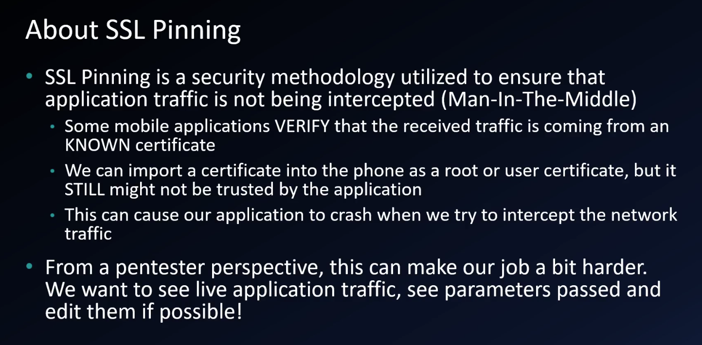
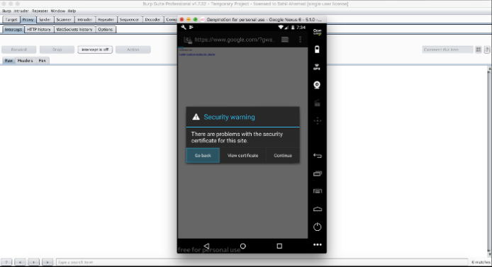

**This tutorial was taken from:** [**https://medium.com/@ehsahil/basic-android-security-testing-lab-part-1-a2b87e667533**](https://medium.com/@ehsahil/basic-android-security-testing-lab-part-1-a2b87e667533)

**Add a proxy in Burp Suite to listen.**

Address: **192.168.56.1** & Port: **1337**

Choose **All Interfaces** option.

**Adding listener in Android device.**

Setting → Wifi →WiredSSID (Long press)

Choose Modify network → Check Advance options.

Select Proxy to the manual

Or

Testing connection over http and https using devices browser.

1.  http:// (working) tested — <http://ehsahil.com>

2\. https:// certificate error — <https://google.com>

**Installing burp certificate in android device.**

Download burp certificate. — Use your desktop machine to download the certificate.

[https://burp](http://burp)

Click on **CA certificate download the certificate.**

The downloaded certificate is in cacert.der extension and Android 5.\* does not recognise it as certificate file.

You can download the cacert file using your desktop machine and rename it from cacert.der to cacert.crt and drop it on Android device and certificate will be automatically added into [**file:///sd_card/downloads**](file:///\\sd_card\downloads)**.**

**Installing the downloaded certificate.**

Settings →Security →Install certificate from SD cards

Now, goto: sdcard →Downloads → Select cacert.crt

Now, Name it as anything “portswigger”

You also need to setup the PIN before adding certificate. Verifying the installed certificate using trusted certificates.

Trusted certificates →Users

After installing Certificate SSL endpoints also working fine tested using → <https://google.com>

After installing the certificate this way Firefox for Android won't use it (based on my tests), so use a different browser.

Another way

**Installing the downloaded certificate.**

Settings →Security →Install certificate from SD cards

Now, goto: sdcard →Downloads → Select cacert.crt

