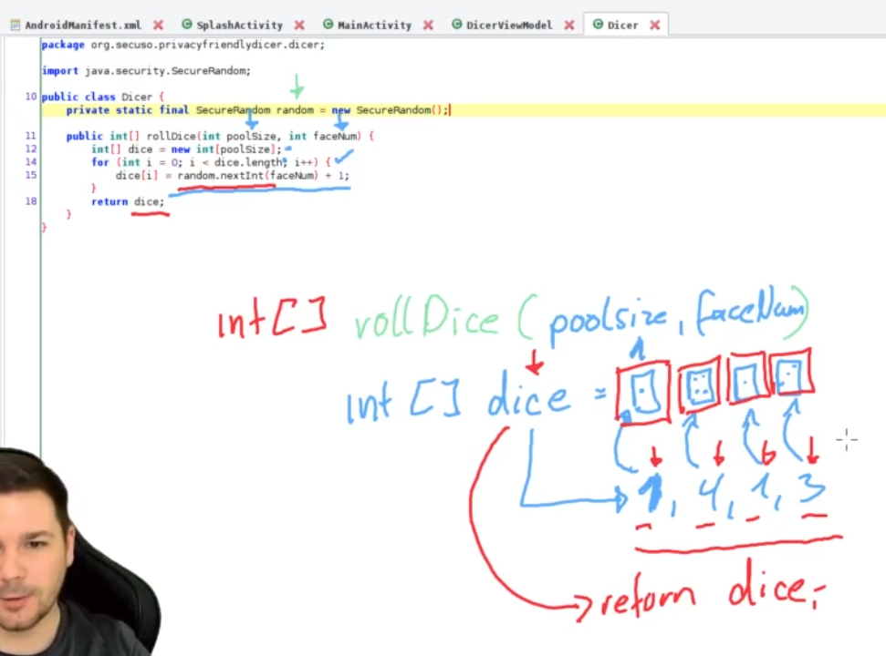
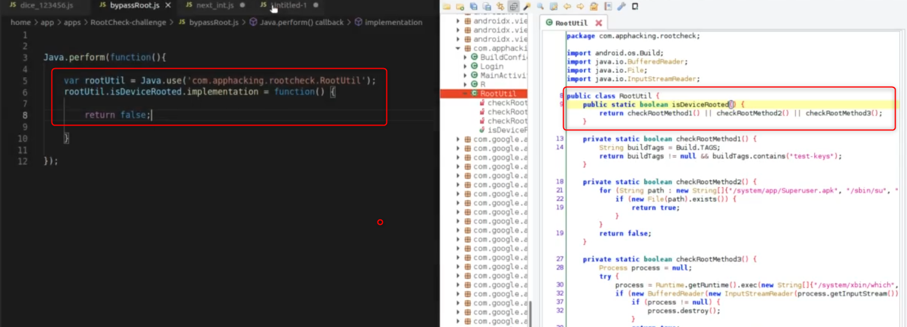
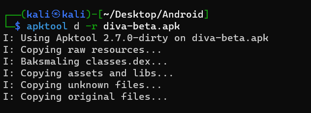
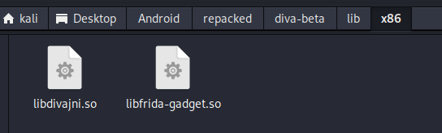
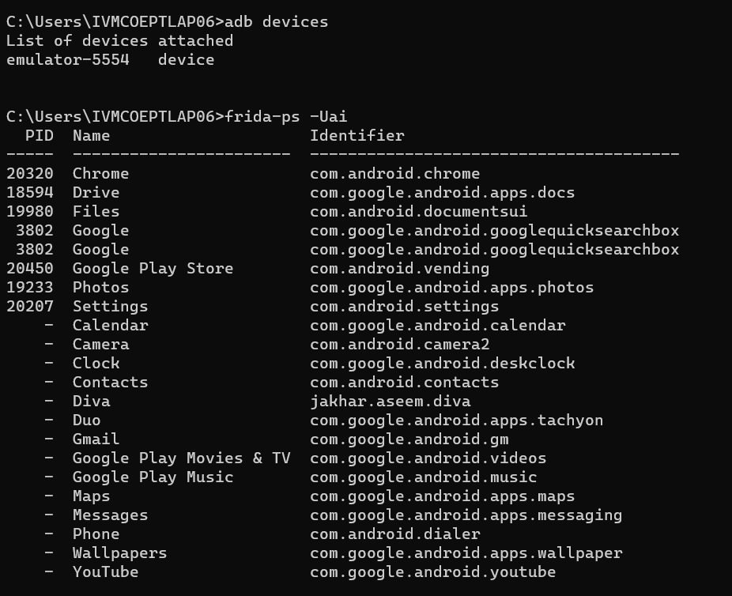
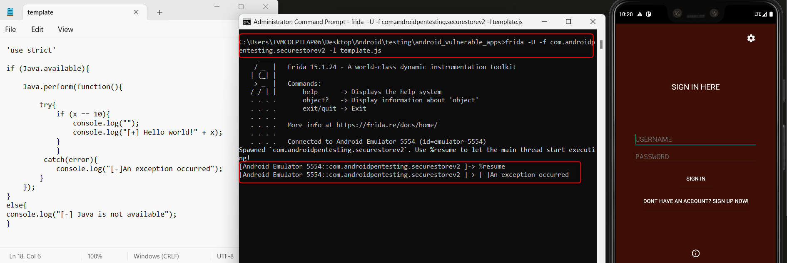

Frida is a great toolkit by @oleavr, used to build tools for dynamic instrumentation of apps in userspace. It is often used, like Substrate, Xposed and similar frameworks, during security reviews of mobile applications.

Root Detection Bypass:

Certificate Pinning:

Typically rooted Android devices are used during such reviews. There are several reasons for this, but the most important is that the frida-server binary, which executes on the device, requires root privileges to attach to (ptrace) the target application, in order to inject the Frida gadget library into the memory space of the process.

However, testing on a rooted device is not the only way! I am not sure why this technique is not more widely publicized, but Frida can also be used on non-rooted Android devices and non-jailbroken iPhones, without running frida-server at all. In this post I will focus on Android, however things are pretty similar on iOS - frida can also be used on jailed Apple devices.

A few advantages of using Frida on a non-rooted device:

Enables testing on devices you cannot or do not want to root (obviously).

Avoids some sideeffects due to application checks for ptracing/debugging or checks for tampered environment.

Adding frida-gadget to an Android application

The technique is simple, it can be described in short as “adding a shared library & repackaging the Android application”. Here it is, step by step:

1\. Get the the APK binary of te application you want to test, e.g. myapp.apk.

2\. Use apktool to decode the APK into it’s contents. Preferably its latest version.

\$ apktool d myapp.apk -o extractedFolder

3\. Add the frida native libraries (frida-gadget) into the APK’s /lib folder. The gadget libraries for each architecture can be found in Frida’s release page. Make sure to add the libraries for the correct architecture in a suitable folder under /lib, e.g. /lib/armeabi for 32bit ARM devices.

\$ apktool --version

2.2.2

\$ apktool d -o out_dir original.apk

I: Using Apktool 2.2.2 on original.apk

I: Loading resource table...

I: Decoding AndroidManifest.xml with resources...

I: Loading resource table from file: \~/.local/share/apktool/framework/1.apk

I: Regular manifest package...

I: Decoding file-resources...

I: Decoding values XMLs...

I: Baksmaling classes.dex...

I: Copying assets and libs...

I: Copying unknown files...

I: Copying original files...

\# download frida gadget - for 32bit ARM in this case

\$ wget <https://github.com/frida/frida/releases/download/9.1.26/frida-gadget-9.1.26-android-arm.so.xz>

2017-04-11 10:48:45 (3.29 MB/s) - ‘frida-gadget-9.1.26-android-arm.so.xz’ saved [3680748/3680748]

\# extract the compressed archive

\$ unxz frida-gadget-9.1.26-android-arm.so.xz

\$ ls

frida-gadget-9.1.26-android-arm.so

\# copy frida gadget library in armeabi directory under lib

\$ cp frida_libs/armeabi/frida-gadget-9.1.26-android-arm.so out_dir/lib/armeabi/libfrida-gadget.so

Inject a System.loadLibrary("frida-gadget") call into the bytecode of the app, ideally before any other bytecode executes or any native code is loaded. A suitable place is typically the static initializer of the entry point classes of the app, e.g. the main application Activity, found via the manifest.

An easy way to do this is to add the following smali code in a suitable function:

const-string v0, "frida-gadget"

invoke-static {v0}, Ljava/lang/System;-\>loadLibrary(Ljava/lang/String;)V

Alternatively someone could create a script that injects the library into the process via ptrace; but this script would need to be packaged with the application (just like gdbserver).

Add the Internet permission to the manifest if it’s not there already, so that Frida gadget can open a socket.

\<uses-permission android:name="android.permission.INTERNET" /\>

6\. Repackage the application:

\$ apktool b -o repackaged.apk out_dir/

I: Using Apktool 2.2.2

I: Checking whether sources has changed...

I: Smaling smali folder into classes.dex...

I: Checking whether resources has changed...

I: Building resources...

I: Copying libs... (/lib)

I: Building apk file...

I: Copying unknown files/dir...

7\. Sign the updated APK using your own keys and zipalign.

\# if you dont have a keystore already, here's how to create one

\$ keytool -genkey -v -keystore custom.keystore -alias mykeyaliasname -keyalg RSA -keysize 2048 -validity 10000

\# sign the APK

\$ jarsigner -sigalg SHA1withRSA -digestalg SHA1 -keystore mycustom.keystore -storepass mystorepass repackaged.apk mykeyaliasname

\# verify the signature you just created

\$ jarsigner -verify repackaged.apk

\# zipalign the APK

\$ zipalign 4 repackaged.apk repackaged-final.apk

8\. Install the updated APK to a device.

If this process seems complicated, the good news is that it can be automated. As part of the appmon hooking framework (based on Frida) @dpnishant released apk_builder, a script automating most of the above steps!

Using frida gadget

When you next start the application you are going to see an empty screen: The injected libfrida-gadget.so library has opened a tcp socket and waits for a connection from frida.

You should see a message similar to the following in logcat:

Frida: Listening on TCP port 27042

Running nestat on the device confirms the listening socket:

shell@flo:/ \$ netstat -ln

Active Internet connections (only servers)

Proto Recv-Q Send-Q Local Address Foreign Address State

tcp 0 0 127.0.0.1:27042 0.0.0.0:\*

As you might expect, the next step is connecting to the listening socket: Most frida tools work as expected although there are a few issues that can be handled better, e.g. connecting to the library after initialization, not just during loading.

There is just one thing to keep in mind: The process name you are going to use in Frida tooling should be “Gadget” instead of the normal package name.

\$ frida-ps -U

Waiting for USB device to appear...

PID Name

\----- ------

16071 Gadget

\$ frida -U Gadget

\___\_

/ \_ \| Frida 9.1.26 - A world-class dynamic instrumentation framework

\| (_\| \|

\> \_ \| Commands:

/_/ \|_\| help -\> Displays the help system

. . . . object? -\> Display information about 'object'

. . . . exit/quit -\> Exit

. . . .

. . . . More info at <http://www.frida.re/docs/home/>

Waiting for USB device to appear...

[USB::Samsung SM-G925F::Gadget]-\> Java.available

true

[USB::Samsung SM-G925F::Gadget]-\>

\$ frida-trace -U -i open Gadget

Instrumenting functions...

open: Auto-generated handler at "/tmp/test/__handlers__/libc.so/open.js"

Started tracing 1 function. Press Ctrl+C to stop.

/\* TID 0x2df7 \*/

4870 ms open(pathname=0xa280b100, flags=0x241)

4873 ms open(pathname=0xb6d69df3, flags=0x2)

/\* TID 0x33d2 \*/

115198 ms open(pathname=0xb6d69df3, flags=0x2)

115227 ms open(pathname=0xb6d69df3, flags=0x2)

Enjoy!

Downloading Frida-server for x86

Put the environment variable

Checking Frida is running or not

if the apk is patched with the objection: first we have to setup few things which are unable the developer options and enable usb debugging.

Root Detection Bypass:

To know which classes are loaded

android hooking list classes

List the methods from the class

End to end encryption

android hooking watch class com.androidpentesting.securestorev2.UserMainActivity

android hooking list classes \> classes.txt

android hooking list class_methods com.androidpentesting.securestorev2.UserMainActivity

android hooking list class_methods com.androidpentesting.securestorev2.UserMainActivity

android hooking set return_value com.androidpentesting.securestorev2.UserMainActivity.isDeviceRooted false

\-s "android hooking set return_value com.androidpentesting.securestorev2.UserMainActivity.isDeviceRooted false"

objection --gadget com.androidpentesting.securestorev2 explore -s "android hooking set return_value com.androidpentesting.securestorev2.UserMainActivity.isDeviceRooted false"

objection --gadget com.androidpentesting.securestorev2 explore -s "android root disable"

<https://payatu.com/blog/setup-frida-on-android-application/>

<https://infosecwriteups.com/hail-frida-the-universal-ssl-pinning-bypass-for-android-e9e1d733d29>

Frida-CLI:

Custom scripting:

