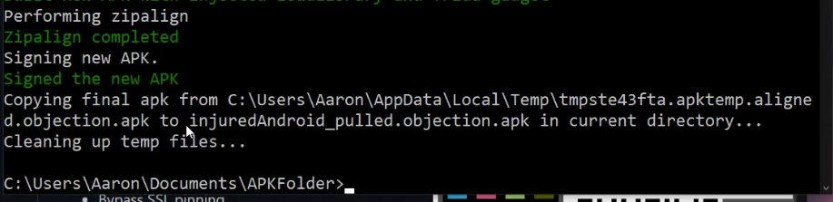
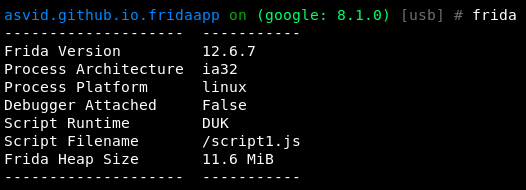

**Introduction**

**objection - Runtime Mobile Exploration**

objection is a runtime mobile exploration toolkit, powered by [Frida](https://www.frida.re). It was built with the aim of helping assess mobile applications and their security posture without the need for a jailbroken or rooted mobile device.

Note: This is not some form of jailbreak / root bypass. By using objection, you are still limited by all of the restrictions imposed by the applicable sandbox you are facing.

The **goal** of **objection** is let the user call the **main actions that offers Frida**. **Otherwise**, the user will need to create a **single script for every application** that he wants to test.

**Tutorial**

For this tutorial I am going to use the APK that you can download here:

\<\<app-release.zip\>\>

Or from its [original repository](https://github.com/asvid/FridaApp) (download app-release.apk)

**Installation**

pip3 install objection

**Connection**

Make a **regular ADB conection** and **start** the **frida** server in the device (and check that frida is working in both the client and the server).

If you are using a **rooted device** it is needed to select the application that you want to test inside the **--gadget** option. in this case:

objection --gadget asvid.github.io.fridaapp explore

**Basic Actions**

Not all possible commands of objections are going to be listed in this tutorial, only the ones that I have found more useful.

**Environment**

Some interesting information (like passwords or paths) could be find inside the environment.

Env

![asvid .github_io.fridaapp on (google:  8.1.0) (usbJ  env  Name  cacheDirectory  codeCacheDi rectory  exte rnaICacheDirectory  filesDirectory  obbDi r  packageCodePath  Path  'data/ user/ß/asvld. gi thub. 10. frldaapp/cache  / data/ user/ O/asvid. gi thub. io. fri daapp/ code_cache  / storage/emul ated/O/Android/ data/ asvid. github. 10. tridaapp/ cache  / data/ user/ O/asvld. gi thub. 10. fridaapp/files  / storage/emu1ated/0/Android/ obb/asvid. github. io. fridaapp  /data/app/asvid.github.io. fridaapp-PPCLqZ81j54Nrwsv jiQJg=/base. apk ](media/33a8fcf3e7c6770d78448e8d93e07ff9.png)

**Frida Information**

Frida

**Upload/Download**

file download \<remote path\> [\<local path\>]

file upload \<local path\> [\<remote path\>]

**Import frida script**

import \<local path frida-script\>

**SSLPinning**

android sslpinning disable \#Attempts to disable SSL Pinning on Android devices.

**Root detection**

android root disable \#Attempts to disable root detection on Android devices.

android root simulate \#Attempts to simulate a rooted Android environment.

**Exec Command**

android shell_exec whoami

**Screenshots**

android ui screenshot /tmp/screenshot

android ui FLAG_SECURE false \#This may enable you to take screenshots using the hardware keys

**Static analysis made Dynamic**

In a real application we should know all of the information discovered in this part before using objection thanks to **static analysis**. Anyway, this way maybe you can see **something new** as here you will only have a complete list of classes, methods and exported objects.

This is also usefull if somehow you are **unable to get some readable source code** of the app.

**List activities, receivers and services**

android hooking list activities

android hooking list services

android hooking list receivers

Frida will launch an error if none is found.

**Getting current activity**

android hooking get current_activity

**Search Classes**

Lets start looking for classes inside our application

android hooking search classes asvid.github.io.fridaapp

![asvid.github_io.fridaapp  on (google: 8.1.0) (usb] \# android hooking search classes fridaapp  asvid . github . io. fridaapp . Logger  asvid . github . io. fridaapp . MainActivity  as vid. github. io. fridaapp. MainActivi ty\$initViews\$1  asvid . github .10. fridaapp . MainActivi tySinitViewsS2  as vid . github . io. fridaapp . MainAc tivi ty\$runEverySecond\$I  as vid. github. fridaapp. MainActivi tySshowToastS1  asvid . github . io. fridaapp . RSid  asvid. github. io. fridaapp. Security  Found  8 classes ](media/01c37f24db9fa006b7b428cc82fea94c.png)

**Search Methods of a class**

Now lets extract the methods inside the class *MainActivity:*

android hooking search methods asvid.github.io.fridaapp MainActivity

![asvid.github.ío.fridaapp on (google: 8.1. o) [usbl \#  android hooking search methods asvid.gíthub.io. fridaapp MaínActívity  as vid . github . io . fridaapp . MainActivi ty . getsecurity  asvid. github. io. fridaapp. MainActivity. setSecurity  Found 5383 classes, searching methods  Filtering classes with MainActivity  (this may take some time)  asvid . github . io . fridaapp . MainActivÍ ty . initViews  asvid. github. io. fridaapp. MainActivity. runEverySecond  asvid . github . io . fridaapp . MainActivity . \_\$_clearFindviewByIdCache  asvid. github. io. fridaapp. MainActivity. \_\$_findCachedViewById  asvid . github . io . fridaapp . MainActivity . checkPin  asvid. github. io. fridaapp. MainActivity. getString  asvid . github . io . fridaapp . MainActiví ty  . onc reate  asvid . github . io . fridaapp . MainActivity . showToast  asvid . github . io . fridaapp . MainActivity . sum  as vid. github. io. fridaapp. MainActivitySini tViewsS1 .afterTextChanged  asvid . github . io . fridaapp . MainActiví tySinitviewsS1. beforeTextchanged  as vid. github. io. fridaapp. MainActivity\$ini tViews\$1. onTextChanged  asvid . github . io . fridaapp . MainActivi tySinitViewsS2. afterTextChanged  as vid . github . io . fridaapp . MainActivi ty\$ini tViews\$2. beforeTextChanged  asvid. github. 10. fridaapp. MainActivitySini tViewsS2. onTextChanged  asvid . github . io . fridaapp . MainActÍvÍ tySrunEvetySecond\$I . run  asvid. github. io. fridaapp. MainActivity\$showToast\$1. run ](media/e1e1bc88c8479a1aa45b80f17106d5c2.png)

**List declared Methods of a class with their parameters**

Lets figure out wich parameters does the methods of the class need:

android hooking list class_methods asvid.github.io.fridaapp.MainActivity

![asvid.github.io. fridaapp on (google: 8.1.6) [usbl \#  android hooking list class_methods asvid. github.lo. fridaapp  . MainActivity  private final void asvid.github.io.fridaapp .MainActivity.initViews()  private final Void asvid.github.io. fridaapp.MainActivity. runEverySecond()  protected Void asvid. fridaapp. MainActivity. Bundle)  public  public  public  public  public  public  public  public  android.view.view asvid.github.io. fridaapp.MainActivity._S findCachedviewById(int)  final asvid.github. Security asvid.github.io. fridaapp. MainActivity. getSecurity()  final boolean asvid.github.io.fridaapp.MainActivity. checkPin(java. lang.Strfng)  final java. lang.String asvid.github.io. fridaapp.MainActivity.getString()  final Void  asvid. github. i o. fri daapp. ty. setSecurity( asvid. github. i o. fri daapp. Security)  final void  asvid . github . io . fridaapp.MainActivity . showToast( )  final Void  asvid. github. io. fridaapp. MainActivity. Sum (int , int)  . github . io. fridaapp . MainActivïty . \_\$_c1earFindViewByIdCache ( )  void asvid ](media/da0c2178ed8d3bd8e514f9eb59495522.png)

**List classes**

You could also list all the classes that were loaded inside the current applicatoin:

android hooking list classes \#List all loaded classes, As the target application gets usedmore, this command will return more classes.

This is very useful if you want to **hook the method of a class and you only know the name of the class**. You coul use this function to **search which module owns the class** and then hook its method.

**Hooking being easy**

**Hooking (watching) a method**

From the [source code](https://github.com/asvid/FridaApp/blob/master/app/src/main/java/asvid/github/io/fridaapp/MainActivity.kt) of the application we know that the **function sum() from MainActivity** is being run **every second**. Lets try to **dump all possible information** each time the function is called (arguments, return value and backtrace):

android hooking watch class_method asvid.github.io.fridaapp.MainActivity.sum --dump-args --dump-backtrace --dump-return

![android hooking watch ctass_method asvid.github.io.fridaapp  on (google: 8. 1.0) [usb] \#  .MainActivIty. sum - -dump-args  - -dump-backtrace - return  (agent) Attempting to watch class  asvid.github. tridaapp.MainActivity and method sum.  (agent) Hooking  (agent) Registering job vIjysym068s. Type: watch-method for: asvid.github.  ( agent)  [ v1jysyrr06Bsl  caned  asvid. github . io. tridaapp . . sum(  asvid. github.io. fridaapp on (google: 8. 1.0) [usb] \# (agent)  [v 1. jysym0685]  Backtrace :  asvid. github. io. f ridaapp. MainActivity. sum(Native Method)  asvid . glthub. io . f ridaapp . MalnAct1vity\$runEverysecond\$1. run(mainActivity . kt : 69)  android. 05. Handler. handl I back( Handler. j ava : 790 )  android. os. Handler. di spatchMessage (Handler. j ava: 99 )  android. os. Looper. loop(Looper. java: 164)  android. app. Activ1tyTh read. main (ActivityTh read. j ava : 6494)  java. lang. reflect. Method. invoke (Native Method)  com.and roid. internal. os . RuntimeInitSMethodAndArgsCaI ler. run (Runtimernit. j ava :438  com.android.internal.os.Zygotelnit.main(Zygotelnit.java : 807)  ( agent)  [vIjysyrn068sl  asvLd.github. 10. frLdaapp.MainActivity.sum(SO, 3D)  Arguments  ( agent)  tvIjysyrn06Bsl  Return Value: ](media/d310bb006dd4114331f1a690f782f4ba.png)

**Hooking (watching) an entire class**

Actually I find all the methods of the class MainActivity really interesting, lets **hook them all**. Be careful, this could **crash** an application.

android hooking watch class asvid.github.io.fridaapp.MainActivity --dump-args --dump-return

If you play with the application while the class is hooked you will see when **each function is being called**, its **arguments** and the **return** value.

![asvid.qithub.io. fridaapp on (google: 8.1  asvid . github . io . tridaapp MainActivity . initViews()  asvid . github\_ fridaapp  asvid . qithub. io. fridaapp MainActivity . getstrlng()  asvid . github. io. fridaapp MainActivity . ShowToast()  1/1  .0) [usbl \#  android hooking watch class asvid.github.io. fridaapp .MainAc  tivity  ( agent)  ( agent)  (agent)  (agent)  (agent)  ( agent)  (agent)  ( agent)  ( agent)  (agent)  ( agent)  (agent)  - -dump-args  dump- return  Hooking  Hooking  Hooking  Hooking  Hooking  Hooking  Hooking  Hooking  Hooking  Hooking  Hooking  asvid . github . io. fridaapp MainActivity . runEve rySecond()  MainAct ty . \_ \$ \_ clea rFindViewByIdCache ( )  asvid .github. io. fridaapp MainActivity .  \$ findCachedviewById(  asvid . github. io. fridaapp MainActivity . checkpin(  asvid . github . tridaapp MainActiviTy . getSecurity( )  asvid . github \_ io. fridaapp MainActivity onCreate( 'android o G . Band L e)  asvid .github. io. tridaapp MainActivity . setsecurity(asoid github. io, f ridaapp sccurity)  . github-io.fridaapp MainActivity. inn  asvid  Registering job 2x6toac71t4. Type: watch-class for: asvid.github.io.fridaapp.MainActivity  asvid.github\_ io.fridaapp on (google: 8. 1.0) (usbJ \# (agent) 12x6t@ac7tt4J  Called asvid.github.io.fridaapp.MainA  ctivity.sum(vmt,  (agent)  [2x6toac71141  ( agent)  t2x6tOac71t41  (agent)  [2x6toac71t41  (agent)  [2x6toac71t41  (agent)  [2x6toac71t41  ( agent)  t2x6tOac71t41  (agent)  [2x6toac71t41  (agent)  [2x6toac71t41  ( agent)  (agent)  [2x6toac71t41  ( agent)  [2x6tOac71t41  (agent)  [2x6toac71t41  (agent)  [2x6toac71t41  ( agent)  [2x6Toac71t41  (agent)  t41  ( agent)  [2x6tOac71t41  ( agent)  [2xotoac71t41  (agent)  caned  Called  caned  Cat led  caned  Called  caned  Cal led  Cat led  caned  Cal led  caned  caned  Cal led  caned  Cal led  caned  caned  asvid . github .10. fridaapp . MainActivity. sum( L,  asvid. github to. fridaapp \_ ,  asvid. github . io. fridaapp . MainActivity. sum(i n t ,  asvid. github . to. tridaapp . MainActivity. sum( int ,  asvid . github .10. fridaapp . MainActIvitV. L,  asvid.  asvid. github . io. fridaapp . MainActivity . sum( c ,  . github fridaapp \_ MainActivity. sum(  asvid. github . to. fridaapp \_ ,  . github .10. fridaapp \_ MainActivity. sum(  int)  asvid . github . . f ridaapp . MainActivity. getSecurIty( )  asvid . github . to. tridaapp . MainActivity. getSecurity()  asvid . github . io. f ridaapp . MainActivity . getsecurlty(  asvid  asvid . github . to. t ridaapp . MainActivity . getSecurity( )  asvid . github . . f ridaapp . MainActivity. getSecurIty( )  asvid.github.io. fridaapp.MainActivity.sum(int,  asvid  asvid. github . to. tridaapp . MainActivity. checkPin( 1 f' ring)  gi  S findcachedvLew8y1d( ](media/bbdd3880fafab830e35a73849905a224.png)

**Changing boolean return value of a function**

From the source code you can see that the function *checkPin* gets a *String* as argument and returns a *boolean*. Lets make the function **always return true**:

Now, If you write anything in the text box for the PIN code you will see tat anything is valid:

**Class instances**

Search for and print **live instances of a specific Java class**, specified by a fully qualified class name. Out is the result of an attempt at getting a string value for a discovered objection which would typically **contain property values for the object**.

android heap print_instances \<class\>

**Keystore/Intents**

You can play with the keystore and intents using:

android keystore list

android intents launch_activity

android intent launch_service

**Memory**

**Dump**

memory dump all \<local destination\> \#Dump all memory

memory dump from_base \<base_address\> \<size_to_dump\> \<local_destination\> \#Dump a part

**List**

memory list modules

![asuid.github .10. fridaapp on  Save the output  Name  app_process32  by  adding  (google: 8. 1.0) [usbl \#  memory list  -- j son modules.json• to this command  Base  øxeef66eee  ßxeac830ee  øxea74coee  oxec911eee  ßxeae880ee  øxeb29aoee  ßxea6d30ee  Size  28672  modules  (28.0 KiB)  libandroid runtime. so  libbinder. so  libcutils . so  I i bhwbi SO  tiblog.so  Iibnativeloader. so  1929216 (1.8 Mia)  626688 (612.0 KiB)  77824 (76.0  KIB)  172032 (168.0 KiB)  102400 (100.6 KiB)  28672 (28.0  Kia)  Path  'system/bin/app_process32  'system,'lib/libandroid runtime.so  'system/lib/libcutils.so  / SYS tern/ lib/ Iibhwbinder . SO  'system/lib/libtog.so  / SYS oader. so ](media/31156a7070a58c4b3b491f0f635ab545.png)

At the bottom os the list you can see frida:

Lets checks what is frida exporting:

**Search/Write**

You can alse search and write inside memory with objection:

memory search "\<pattern eg: 41 41 41 ?? 41\>" (--string) (--offsets-only)

memory write "\<address\>" "\<pattern eg: 41 41 41 41\>" (--string)

**SQLite**

You cals can use the command sqlite to interact with sqlite databases.

**Exit**

exit

**What I miss in Objection**

-   The hooking methods sometimes crashes the application (this is also because of Frida).
-   You can't use the instaces of the classes to call functions of the instance. And you can't create new instances of classes and use them to call functions.
-   There isn't a shortcut (like the one for sslpinnin) to hook all the common crypto methods being used by the application to see cyphered text, plain text, keys, IVs and algorithms used.
