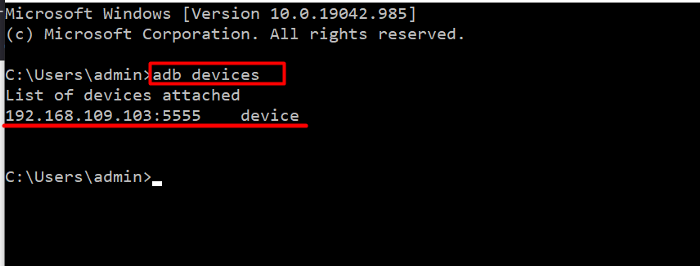
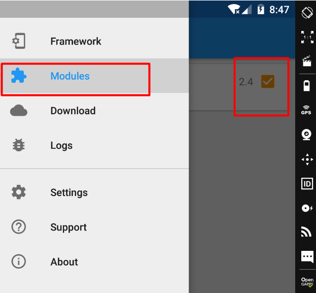
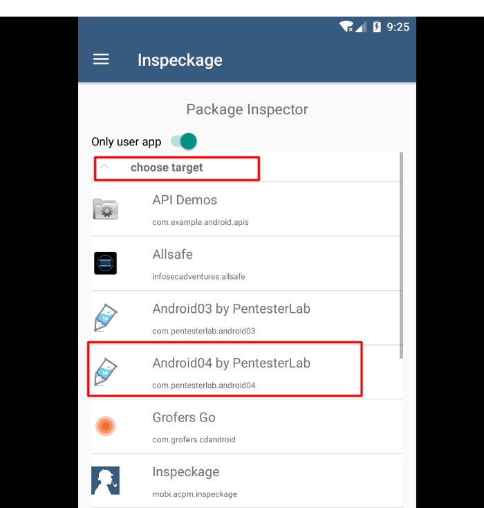

**Tutorial copied from** [**https://infosecwriteups.com/genymotion-xposed-inspeckage-89f0c8decba7**](https://infosecwriteups.com/genymotion-xposed-inspeckage-89f0c8decba7)

**Install Xposed Framework**

1.  Download Xposed Installer APK from [here](https://forum.xda-developers.com/attachments/xposedinstaller_3-1-5-apk.4393082/)
2.  Download Xposed Framework zip from [here](https://dl-xda.xposed.info/framework/sdk25/x86/xposed-v89-sdk25-x86.zip)
3.  Download Inspeckage v2.4 APK from the github repo [here](https://github.com/ac-pm/Inspeckage/releases)

Start the Virtual Device from the menu

Make sure the device is online for adb

Drag and drop the Xposed framework zip file (xposed-vXX-sdkXX-x86.zip) to your virtual device display to flash the device.

Drag and drop Xposed Installer APK (XposedInstaller_\*.apk). This should install and launch *Xposed Installer* application. At this stage, it will display that the Xposed framework is installed but disabled:

Reboot the device with adb reboot command. **Do not reboot from \_Xposed Installer**\_\*\* as this will freeze the device.\*\*

Launch *Xposed installer*. It should display “Xposed Framework version XX is active”

Drag and drop the Inspeackage APK (app-release.apk) to your virtual device display to install the app.

After installing, Go to Xposed Installer → Modules→ Activate the Module → reboot via adb

**Dynamic Analysis with Inspeckage**

After, Successful installing of Inspeckage and Xposed Installer. Now we can hook any application with Inspeackage. To do this follow the below steps

1.  Launch the Inspeckage Application from the application drawer
2.  Click on the “Choose target” text and select the target application

3\. Then forward VD local-host port to main machine using adb

adb forward tcp:8008 tcp:8008

4\. Now click on the “**LAUNCH APP**” Button and then visit <http://127.0.0.1:8008>

5\. Now click Turn On the button to Inspect the app. (make sure App is running: status should be **True** before you “Turn On”

**Tutorial copied from** [**https://infosecwriteups.com/genymotion-xposed-inspeckage-89f0c8decba7**](https://infosecwriteups.com/genymotion-xposed-inspeckage-89f0c8decba7)

**Install Xposed Framework**

1.  Download Xposed Installer APK from [here](https://forum.xda-developers.com/attachments/xposedinstaller_3-1-5-apk.4393082/)
2.  Download Xposed Framework zip from [here](https://dl-xda.xposed.info/framework/sdk25/x86/xposed-v89-sdk25-x86.zip)
3.  Download Inspeckage v2.4 APK from the github repo [here](https://github.com/ac-pm/Inspeckage/releases)

Start the Virtual Device from the menu

Make sure the device is online for adb

Drag and drop the Xposed framework zip file (xposed-vXX-sdkXX-x86.zip) to your virtual device display to flash the device.

Drag and drop Xposed Installer APK (XposedInstaller_\*.apk). This should install and launch *Xposed Installer* application. At this stage, it will display that the Xposed framework is installed but disabled:

Reboot the device with adb reboot command. **Do not reboot from \_Xposed Installer**\_\*\* as this will freeze the device.\*\*

Launch *Xposed installer*. It should display “Xposed Framework version XX is active”

Drag and drop the Inspeackage APK (app-release.apk) to your virtual device display to install the app.

After installing, Go to Xposed Installer → Modules→ Activate the Module → reboot via adb

**Dynamic Analysis with Inspeckage**

After, Successful installing of Inspeckage and Xposed Installer. Now we can hook any application with Inspeackage. To do this follow the below steps

1.  Launch the Inspeckage Application from the application drawer
2.  Click on the “Choose target” text and select the target application

3\. Then forward VD local-host port to main machine using adb

adb forward tcp:8008 tcp:8008

4\. Now click on the “**LAUNCH APP**” Button and then visit <http://127.0.0.1:8008>

5\. Now click Turn On the button to Inspect the app. (make sure App is running: status should be **True** before you “Turn On”
