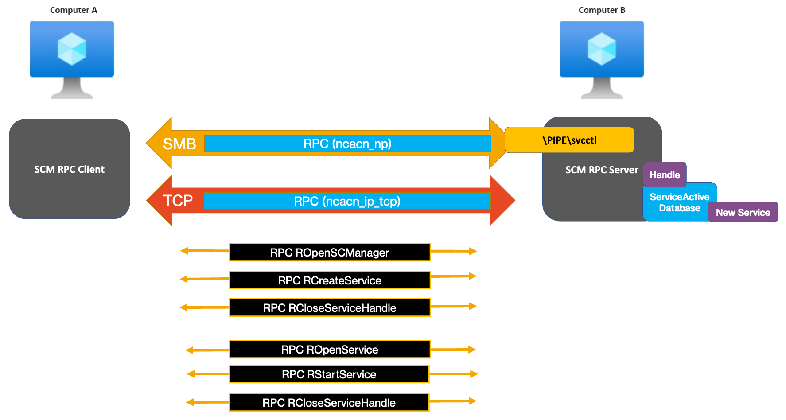
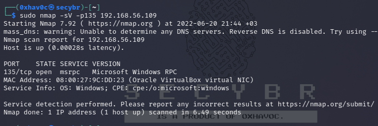
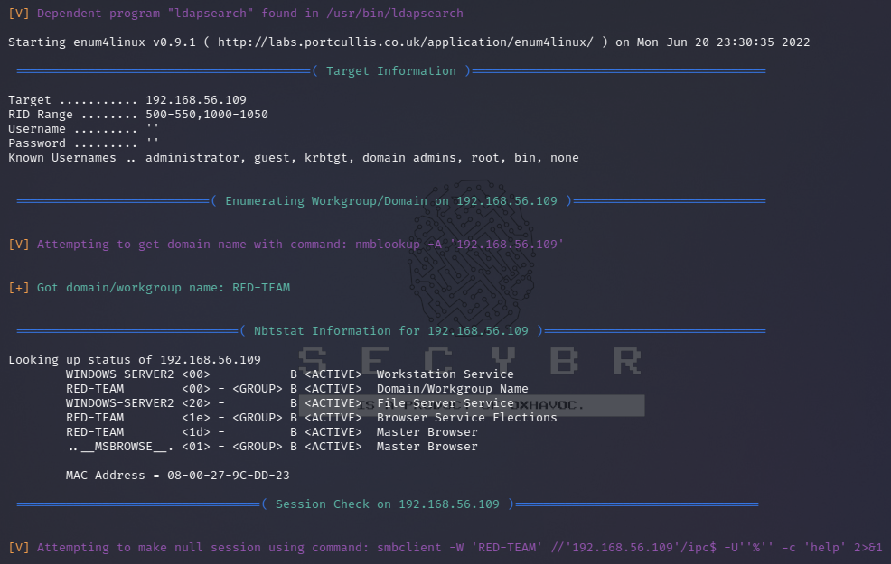
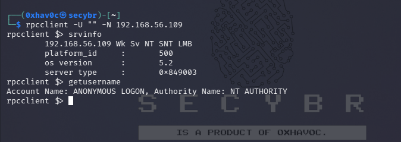
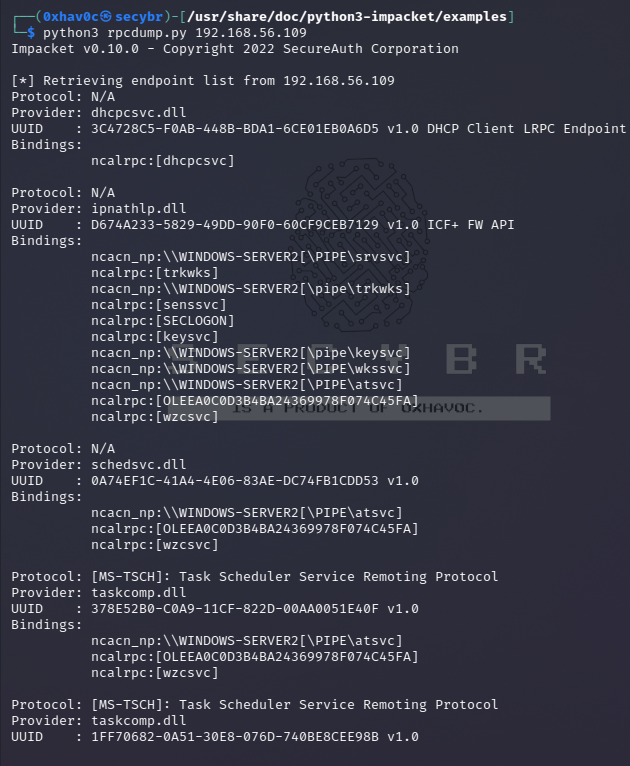
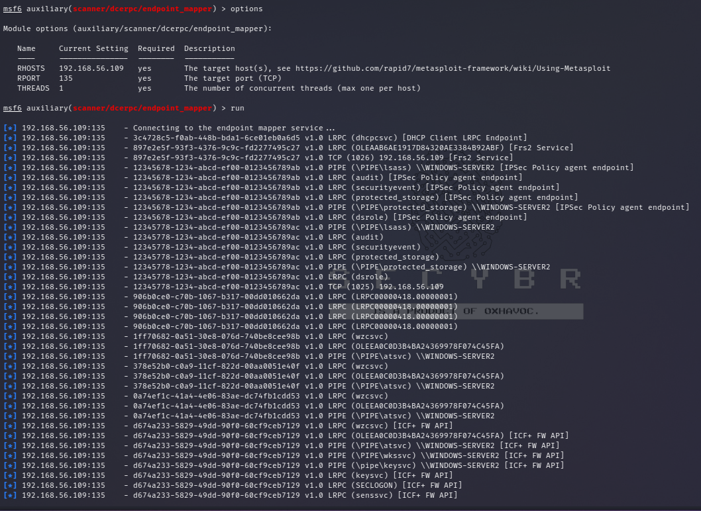
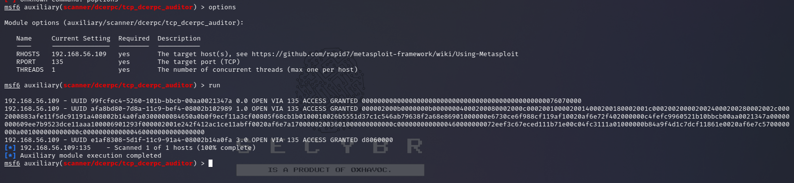
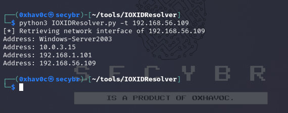

## MSRPC

* **Ports:** MSRPC typically uses ports 135 and 593.

* **What is MSRPC?** 
    * Microsoft Remote Procedure Call (MSRPC) is a protocol that enables communication between programs on different computers. 
    * It allows one program to request services from another program on a different machine without requiring in-depth knowledge of the target computer's network.
    * MSRPC originated from open-source software but has been further developed and copyrighted by Microsoft.

* **Endpoint Mapper:**
    * The RPC endpoint mapper can be accessed through:
        * TCP and UDP port 135
        * SMB with a null or authenticated session (TCP 139 and 445)
        * As a web service listening on TCP port 593

* **Supported Operating Systems:**
    * Windows Server 2003
    * Windows Server 2003 R2
    * Windows Server 2003 with SP1
    * Windows Server 2003 with SP2

* **Example:**

    ```
    PORT   STATE  SERVICE       VERSION
    135/tcp open   msrpc        Microsoft Windows RPC 
    ```
# **How does MSRPC work?:**

[The MSRPC process begins on the client side](https://technet.microsoft.com/en-us/library/cc738291.aspx), with the client application calling a local stub procedure instead of code implementing the procedure. The client stub code retrieves the required parameters from the client address space and delivers them to the client runtime library, which then translates the parameters into a standard Network Data Representation format to transmit to the server.

The client stub then calls functions in the RPC client runtime library to send the request and parameters to the server. If the server is located remotely, the runtime library specifies an appropriate transport protocol and engine and passes the RPC to the network stack for transport to the server. For more details, please check [this](https://blog.openthreatresearch.com/ntobjectmanager_rpc_smb_scm) link.



Pentesting MSRPC

** Shodan search query :**
port:135,593,445

Banner Grabbing
```
nmap -sV -p135 10.10.x.x 
nmap -p135 --script=msrpc-enum 10.10.x.x
```


Some Useful RPC Enumeration Tools and Commands

## Useful RPC Enumeration Tools and Commands

This table provides a reference of commonly used RPC enumeration tools and commands for gathering information about a target system.

**enum4linux**

| Command | Description |
|---|---|
| `enum4linux -v 192.168.x.x` | Executes `enum4linux` in verbose mode, providing detailed output. |
| `enum4linux -a 192.168.x.x` | Performs all available enumeration tasks on the target system. |
| `enum4linux -U 192.168.x.x` | Enumerates users on the target system. |
| `enum4linux -u administrator -p password -U 192.168.x.x` (Credentials Required) | Enumerates users on the target system, using provided credentials to bypass potential restrictions. |
| `enum4linux -r 192.168.x.x` | Attempts to identify usernames within a default RID range. |
| `enum4linux -R 600-660 192.168.x.x` | Attempts to identify usernames within a custom RID range. |
| `enum4linux -G 192.168.x.x` | Enumerates groups on the target system. |
| `enum4linux -S 192.168.x.x` | Lists available shares on the target system. |
| `enum4linux -s shares.txt 192.168.x.x` | Performs a dictionary-based share name attack using the provided wordlist file. |
| `enum4linux -o target-ip` | Attempts to gather OS information using `smbclient`. |
| `enum4linux -i target-ip` | Retrieves information about printers known to the target device. |

**enum4linux-ng**

* `enum4linux-ng` is a Python-based rewrite of `enum4linux` offering additional features like colored output and parsing capabilities. Refer to the project's GitHub repository (https://github.com/cddmp/enum4linux-ng) for more details.

**rpcclient**

| Command | Description |
|---|---|
| `rpcclient -U "" -N 192.168.x.x` | Establishes an anonymous connection to the target system. |
| `rpcclient -U "user" 192.168.x.x` | Establishes a connection to the target system using the specified username. |
| `srvinfo` | Retrieves information about the domain controller. |
| `enumdomains enumdomgroups enumalsgroups builtin` | Enumerates various objects like domains, domain groups, local groups, and built-in groups. |
| `getdompwinfo` (Limited Availability) | Attempts to retrieve domain password policy (may not be available on all systems). |
| `dsr_enumtrustdom` | Attempts to enumerate trusted domains. |
| `getusername` | Retrieves the username for a specified user ID (RID). |
| `queryuser RID querygroupmem519 queryaliasmem builtin 0x220` | Queries information about users, group memberships, and aliases. |
| `lsaquery` | Queries local security policy information. |
| `lookupsids SID` | Converts a Security Identifier (SID) to a human-readable name. 

**RPCinfo**

| Command | Description |
|---|---|
| `rpcinfo -p 192.168.x.x` | Queries RPC portmapper for registered services on the target system. |




Identifying Exposed RPC Services

You can query the RPC locator service and individual RPC endpoints to catalog interesting services running over TCP, UDP, HTTP, and SMB (via named pipes). Each IFID value gathered through this process denotes an RPC service (e.g., 5a7b91f8-ff00-11d0-a9b2-00c04fb6e6fc is the Messenger interface).

Todd Sabin’s rpcdump and ifids Windows utilities query both the RPC locator and specific RPC endpoints to list IFID values. The rpcdump syntax is as follows:

```python3 /usr/share/doc/python3-impacket/examples/rpcdump.py 192.168.x.x```



You can access the RPC locator service by using four protocol sequences:

-   ncacn_ip_tcp and ncadg_ip_udp (TCP and UDP port 135)
-   ncacn_np (the \\pipe\\epmapper named pipe via SMB)
-   ncacn_http (RPC over HTTP via TCP port 80, 593, and others)

## Metasploit Commands

* `msf6 > use auxiliary/scanner/dcerpc/endpoint_mapper` 
    * This command selects the `endpoint_mapper` module, which scans for available Distributed Computing Environment (DCE)/Remote Procedure Call (RPC) endpoints on the target system.

* `msf6 > use auxiliary/scanner/dcerpc/hidden` 
    * This command selects the `hidden` module, which attempts to discover hidden shares on the target system.

* `msf6 > use auxiliary/scanner/dcerpc/management` 
    * This command selects the `management` module, which scans for available Windows Management Instrumentation (WMI) services on the target system.

* `msf6 > use auxiliary/scanner/dcerpc/tcp_dcerpc_auditor`
    * This command selects the `tcp_dcerpc_auditor` module, which performs general auditing of Distributed Computing Environment/Remote Procedure Call (DCE/RPC) services on the target system.





Note that from the mentioned options all except of tcp_dcerpc_auditor can only be executed against msrpc in port 135.

Notable RPC interfaces

| **IFID value**                       | **Named pipe**   | **Description**                                                                                                                                                       |
|--------------------------------------|------------------|-----------------------------------------------------------------------------------------------------------------------------------------------------------------------|
| 12345778-1234-abcd-ef00-0123456789ab | \\pipe\\lsarpc   | LSA interface, used to enumerate users                                                                                                                                |
| 3919286a-b10c-11d0-9ba8-00c04fd92ef5 | \\pipe\\lsarpc   | LSA Directory Services (DS) interface, used to enumerate domains and trust relationships                                                                              |
| 12345778-1234-abcd-ef00-0123456789ac | \\pipe\\samr     | LSA SAMR interface, used to access public SAM database elements (e.g., usernames) and brute-force user passwords regardless of account lockout policy Oreilly library​ |
| 1ff70682-0a51-30e8-076d-740be8cee98b | \\pipe\\atsvc    | Task scheduler, used to remotely execute commands                                                                                                                     |
| 338cd001-2244-31f1-aaaa-900038001003 | \\pipe\\winreg   | Remote registry service, used to access the system registry                                                                                                           |
| 367abb81-9844-35f1-ad32-98f038001003 | \\pipe\\svcctl   | Service control manager and server services, used to remotely start and stop services and execute commands                                                            |
| 4b324fc8-1670-01d3-1278-5a47bf6ee188 | \\pipe\\srvsvc   | Service control manager and server services, used to remotely start and stop services and execute commands                                                            |
| 4d9f4ab8-7d1c-11cf-861e-0020af6e7c57 | \\pipe\\epmapper | DCOM interface, supporting WMI                                                                                                                                        |

Identifying IP addresses

Using <https://github.com/mubix/IOXIDResolver>, comes from [Airbus research](https://airbus-cyber-security.com/the-oxid-resolver-part-1-remote-enumeration-of-network-interfaces-without-any-authentication/) is possible to abuse the **ServerAlive2** method inside the **IOXIDResolver** interface.

This method has been used to get interface information as **IPv6** address from the HTB box *APT*. See [here](https://0xdf.gitlab.io/2021/04/10/htb-apt.html) for 0xdf APT writeup, it includes an alternative method using rpcmap.py from Impacket with *stringbinding* (see above).



[pentesting protocols](https://secybr.com/categories/pentesting-protocols/), msrpc
