# **What is DHCP?**

DHCP (Dynamic Host Configuration Protocol) is the standard way to automatically assign IP addresses to devices on a network. 
```
PORT STATE SERVICE VERSION
68/udp open dhcp
```
* **Why is it important?** Every device on a network needs a unique IP address to communicate. 
* **How it works:**
    * When a device joins a network (like your laptop connecting to Wi-Fi), it sends a request to a DHCP server.
    * The server then assigns an available IP address to the device.
    * This process simplifies IP address management, saving time and resources.

**DHCP in Action:**

* **Home Networks:** Your router usually acts as the DHCP server, assigning addresses to your phones, laptops, smart home devices, etc.
* **Businesses:** Larger organizations use dedicated servers for DHCP, ensuring efficient and secure IP address management.

**Key Concepts:**

* **Dynamic Addressing:** DHCP allows for flexible IP address assignment, making it easier to add or remove devices from the network.
* **Communication Protocol:** DHCP uses a specific set of rules (UDP port 68) to communicate between clients and servers.

This version:

* **Uses simpler language:** Avoids technical jargon where possible.
* **Focuses on key takeaways:** Highlights the core benefits and how DHCP works in everyday scenarios.
* **Uses bullet points:** Improves readability and makes information easier to scan.
* **Provides a concise overview:** Summarizes the key concepts without going into excessive detail.

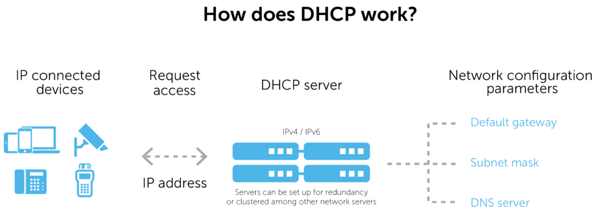

The server will quickly and automatically assign an IP address and some related network configuration parameters. Once the device has accepted the assignment, it can communicate with both the internal network and the public internet.

Relevant parameters

In addition to assigning IP addresses, these servers also provide relevant parameters, known as DHCP options. The Internet Assigned Numbers Authority (IANA), the global coordinator of IP addresses, defines [available DHCP parameters](https://www.iana.org/assignments/bootp-dhcp-parameters/bootp-dhcp-parameters.xhtml).

Options number in the hundreds. Key among them is how long the IP address can be used—known as the lease time. They also include the default gateway, its subnet mask, and its DNS server.

**Some additional definitions**

To clarify, let’s quickly define some of these terms we just mentioned:

-   A default gateway transfers data back and forth between the local network and the internet, or between local subnets.
-   IP networking uses a subnet mask to separate the host address and the network address portions of an IP address.
-   A DNS server resolves names to IP addresses, translating domain names that we easily remember, like secybr.com, into IP addresses like 185.199.108.153.

# Dynamic IP addressing with DHCP

The assignment of IP addresses happens dynamically within a given address range. As a result, a device connected to the network doesn’t have a forever address. The IP address can periodically change as its lease time expires unless the lease is successfully renewed.

For services that always need to be on, a static IP address is often a better option. Corporate enterprises commonly use static IP addresses for hardware like mail servers. Certainly, a DHCP server should have a static IP address.

However, there are drawbacks to dedicating a specific IP address to a device or service. A network administrator must manually assign, configure, and track the IP address. It’s a time-consuming task. Oftentimes, it requires the admin to physically be with the device.

Meanwhile, dynamic IP addresses are usually the preferred choice because they:

-   Cost less to manage than static IP addresses;
-   May offer more privacy and security with a constantly changing IP address; and
-   Don’t require manual administration when a device roams from one subnet to another.

# DHCP communications protocol

Communications to fulfill a DHCP request involves both the server and client. Furthermore, a relay agent or IP helper often facilitates communication between the two. Relay agents receive broadcast DHCP messages from clients and then re-send those messages with configuration information to servers.

Communication happens via small units of data, called packets, that are routed through a network. Networking protocols like IP govern all its rules.

**Most of the time, communication occurs in four steps. Briefly, they are:**

1.  A discover packet is sent from the client to the server.
2.  The server replies to the client with a DHCP offer packet containing an IP address.
3.  The client receives and validates the offer, then sends a request packet back to the server to accept the address.
4.  The server sends an acknowledgement packet back to the client to confirm the chosen IP address.

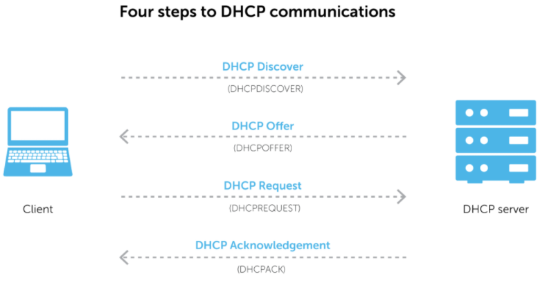

With this in mind, one final point: DHCP alongside [DNS](https://bluecatnetworks.com/glossary/what-is-dns/) and IP address management ([IPAM](https://bluecatnetworks.com/glossary/what-is-ipam/)) are together known as DDI. Want to know how to [define DDI](https://bluecatnetworks.com/glossary/what-is-ddi/) or how it works to form a complete management solution? The BlueCat platform is the place to start.

It works with DHCP client/server architecture. Packets between client/server are carried by UDP protocol. In the scenario where the client first joins the network, the client prepares a DHCP Discovery packet and sends it to the network. The purpose of this message is to find the DHCP server on the network.

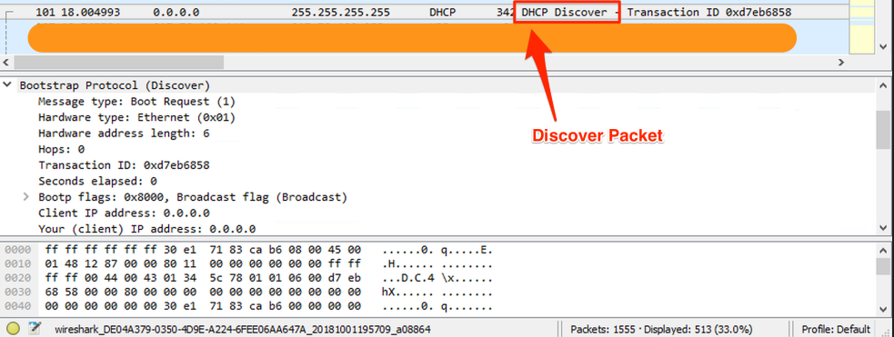

Receiving the DHCP Discovery packet, the DHCP server sends a DHCP Offer packet containing an appropriate IP address to the computer sending the packet and how long it can use this IP address (Lease Time).

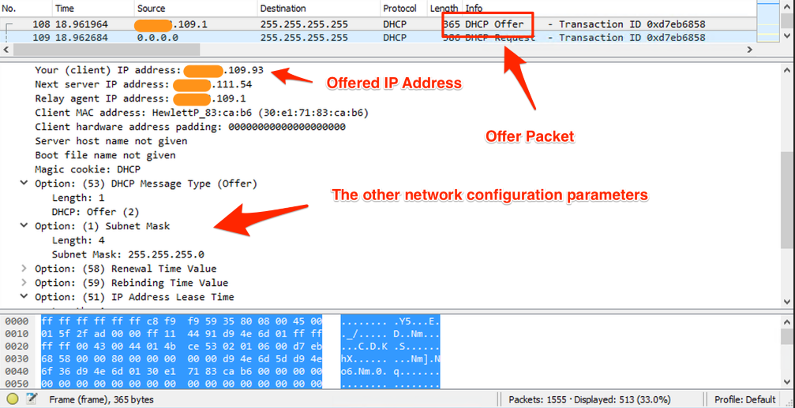

In the third step, the client -usually accepting the IP address and Lease Time specified in the DHCP Offer packet- sends the DHCP Request packet containing the request IP address and Lease Time to the DHCP server.

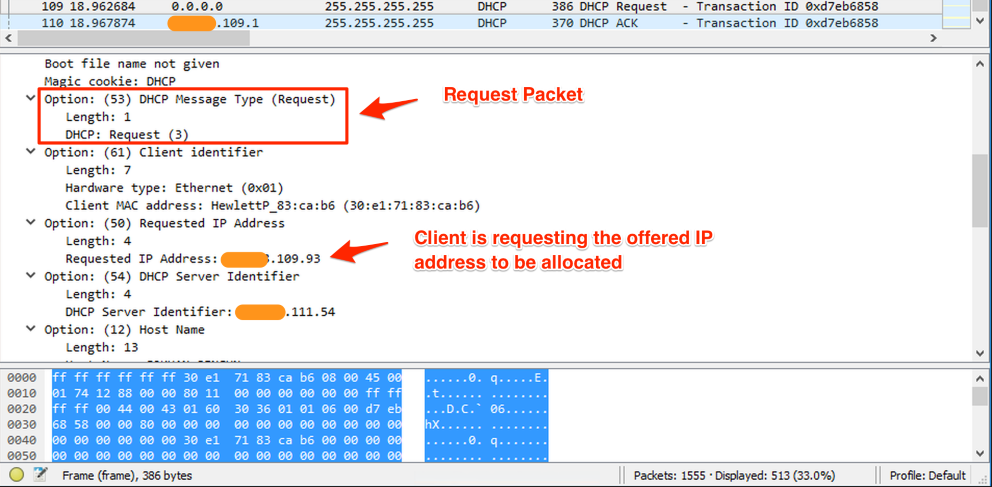

In the last step, the server allocates the IP address in the DHCP Request packet to the client, if appropriate. The allocated IP address can be allocated to another device if it is not renewed by the client at the end of the Lease Time. For this reason, the client requests the renewal of the IP address it uses by communicating with the DHCP server when half of the IP’s Lease Time expires. Unless there is a very special situation, the DHCP server accepts the request and extends the Lease Time. This process continues by being triggered by the client and the first IP received is protected.

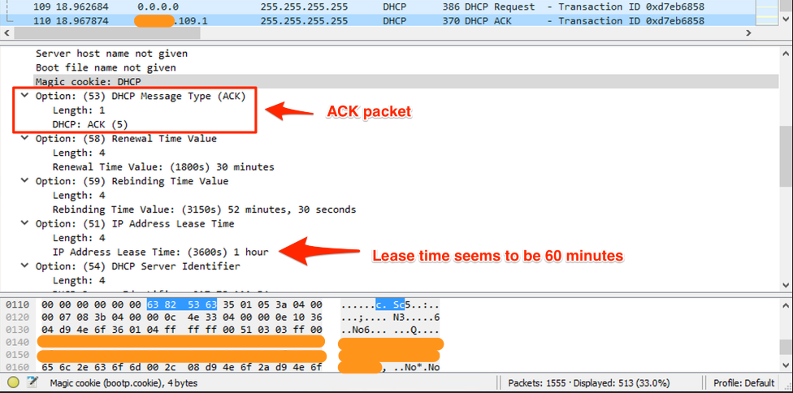

In some cases, we may want a device on the network (eg web server) to always receive the same IP address. In this case, the MAC address of the relevant device is matched with the IP address on the DHCP server, so that the selected IP address is included in the DHCP Offer packages sent from the server. The dnsmasq project, which we will examine in detail in one of the next floods, is very suitable for observing and experimentally using the DHCP protocol on Linux and macOS.

# DHCP Pentesting

** Shodan search query :**
```port:67,68```

Banner Grabbing
```
#Nmap Scripts: sudo nmap -sU -p68 --script broadcast-dhcp-discover 10.10.x.x 
```
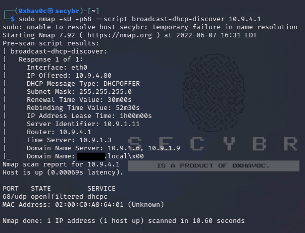

## **Common DHCP Vulnerabilities**

## **DHCP DoS Attack**

Two types of DoS can be performed against DHCP servers. The first consists of simulating enough fake hosts to use all possible IP addresses. This attack will only work if you can see the DHCP server’s responses and complete the protocol (Discover (Build) –\> Offer (server) –\> Request (Build) –\> ACK (server)). For example, this is not possible in Wifi networks.

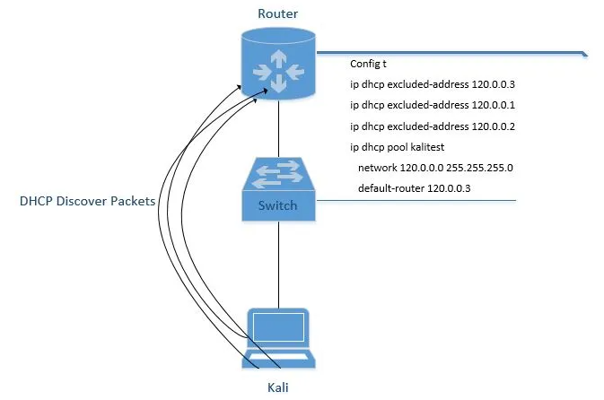

You can use yersinia for DHCP DoS Attack

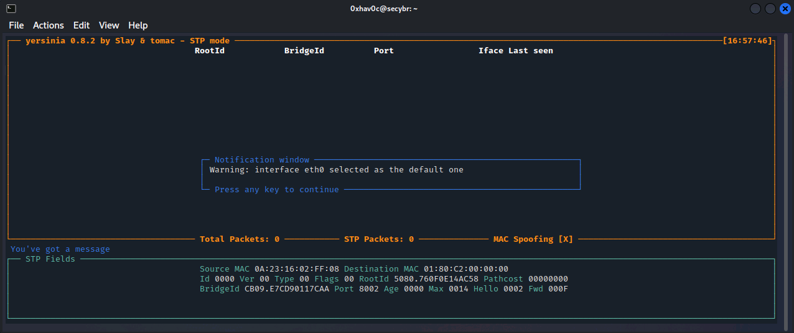

press **g** and select the DHCP.

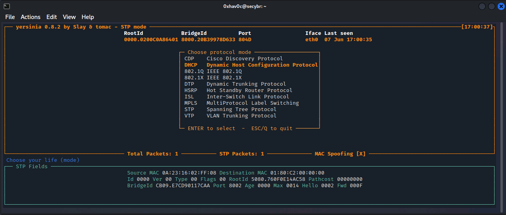

press x, to select an attack ( eXecute attack ) and select Punk 1 – Sending DISCOVER packet.

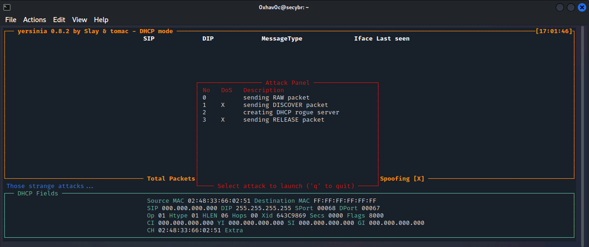

The attack started.

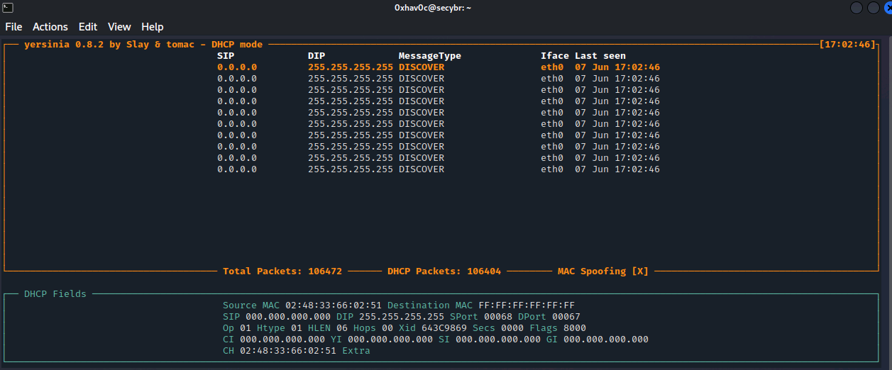

To stop the attacks press l, select the active attack and press the Enter.

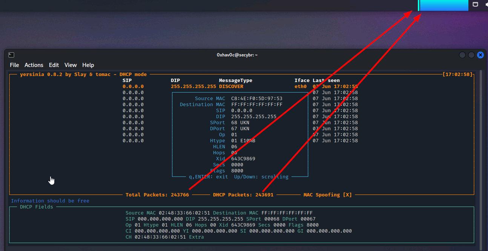

A more automated way to do this is to use the DHCPig tool.

[GitHub - kamorin/DHCPig: DHCP exhaustion script written in python using scapy network library](https://github.com/kamorin/DHCPig)

You can use the aforementioned DoS attacks to force clients to take new leases within the environment and consume legitimate servers to become unresponsive. So when the legitimate tries to reconnect, you can get the malicious values mentioned in the next attack to the server.

You can use the Responder DHCP script (/usr/share/responder/DHCP.py) to create a fake DHCP server. Setting up a malicious gateway is not ideal because the compromised connection is only half-duplex (i.e. we capture egress packets from the client, but not responses from the legitimate gateway). So I would recommend setting up a fake DNS or WPAD server specifically to capture HTTP traffic and credentials.

## **DHCP Starvation Attack**

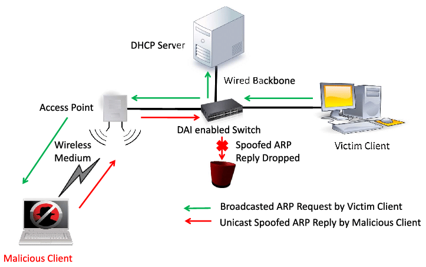

If too many DHCPRequest packets are sent to the network, the attacker can keep the addresses allocated to the DHCP Server busy for a long time. Thus, the DHCP pool resources of the clients on the targeted network become unavailable. That’s why DHCP Starvation is called DOS attack.

Fake DHCP Server: DHCP

After the Starvation attack, the attacker can set up a Fake DHCP Server and orchestrate ‘man in the middle’ attacks or set their own machine as the default gateway and monitor the traffic. A Rogue DHCP Server is a DHCP Server installed by the attacker on the target network. Fake DHCP Servers can generally be used for attacks such as MITM and sniffing on the target network.

By performing a DHCP Starvation attack with the pig.py tool, the real DHCP Server on the network can be rendered unresponsive. Thus, there is no suitable IP address to be distributed to new clients on the network. This type of attack is very effective when clients on the network are online for a long time. Otherwise, it is necessary to repeat the attack at certain intervals.

Execution

**Yersinia tool** is an inbuilt tool in kali linux, infact it is an hidden tool, we need to install it with apt install yersinia command. We have to launch yersinia graphical launcher with the command with

| 1  | sudo yersinia -G \# You need to start with sudo permissions.  |
|----|---------------------------------------------------------------|

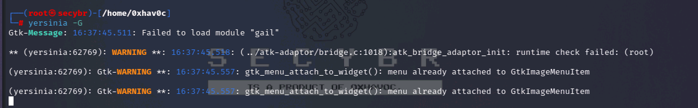

Click on the **launch attack** option in the tool bar and we have to choose **DHCP tab** in choose protocol attack dialogue box.

Next we need to choose **sending DISCOVER packet** option in DHCP tab then click **ok**

You can notice increase in packets in the left tab along the side of DHCP Protocol. I tried disconnecting mobile from the network and reconnecting again but I can’t.

At this situation an attacker can start his Rogue DHCP Server so every client will be connected to the network through his DHCP Server so he can use it for malicious activities.

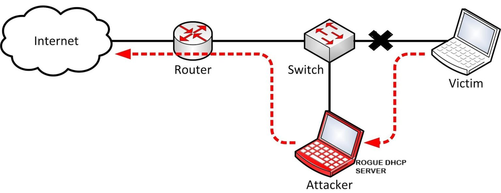

In yersinia itself we can configure our Rogue DHCP Server.

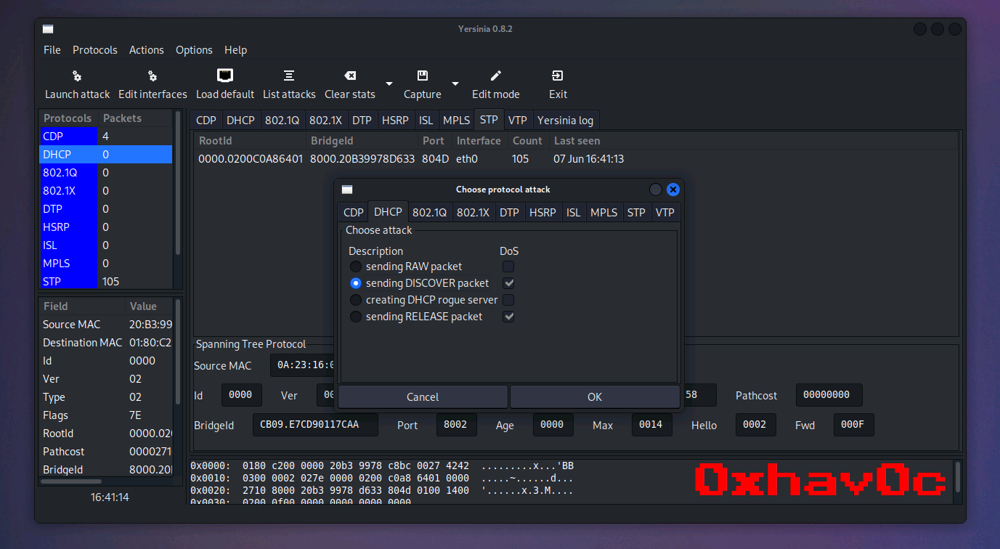

We can list the running attacks by choosing the button **List Attacks** in tool bar. we can stop the sending of packets in there.

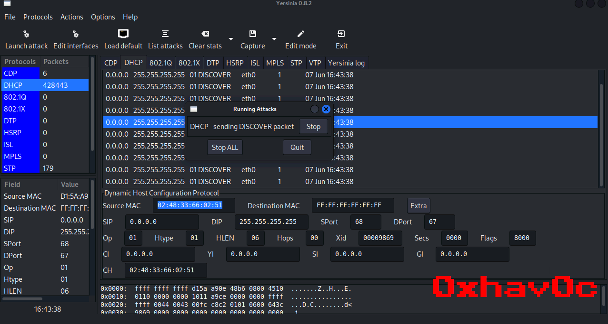

We can defend this DHCP Starvation attack by several methods such as

1.  The 802.11 association process prevents MAC address spoofing.
2.  Verify DHCP Proxy is enabled on WLCs to prevent DHCP chaddr spoofing
3.  Enabling of DHCP Snooping can avoid DHCP Starvation attacks.

We can also perform DHCP starvation attack by using another tools also using **DHCPig** als
