# DNS Overview

**DNS (Domain Name System)** allows users to connect to websites using domain names instead of IP addresses. It resolves a domain name to a fixed IP address.

## Key Points

- **Port**: DNS usually uses **port 53**.
- **Working Logic**:
  
  

### How DNS Works

-   When “secybr.com” is typed in the address bar of the browser, a DNS Query is sent to determine the IP address of the website.
-   This request is first asked to our computer’s DNS cache. If it is among the records, the remaining steps are skipped and automatically redirected to “secybr.com”.
-   If it doesn’t have a record in our DNS cache, the query is sent to our local DNS server. This is usually the servers of our internet provider and they are called resolvers.
-   If no DNS records are found in the resolver, the query is directed to another server called “Root Name Server” to find DNS records.
-   Root Name Servers are the servers responsible for the storage of DNS data worldwide and the smooth operation of the system.
-   After the DNS record is found by the root Name Server, it returns to our computer and is cached by our computer.

## Common DNS Vulnerabilities

Like every system, there are security vulnerabilities on DNS. We will now review some of the major attacks on DNS servers.

### 1. DNS Zone Transfer Vulnerability

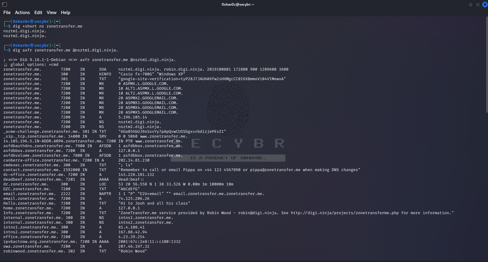zonetransfer.me zonetransfer vulnerability detection with dig

In some cases, DNS servers can share DNS records with each other over the AXFR protocol. There are two main reasons why DNS records are shared. One is load balancing and the other is what we call fault tolerance, that is, when a server becomes unserviceable, it is to ensure that the other server executes the operations. If unauthorized persons are allowed to perform DNS Zone Transfer due to lack of configuration, access to all address records entered in the DNS server may be in question. Thus, attackers can have information about systems with DNS records.

AXFR does not offer authentication, so any client can request a copy of all DNS records from a DNS server. This means that unless some form of protection is introduced, an attacker could get a list of all the servers for the domain and give them lots of potential attack vectors. To prevent this vulnerability from occurring, the DNS server must be configured to allow DNS Zone Transfer only from trusted IP addresses.

### 2. DNS Cache Poisoning

This vulnerability is a incorrect or intentional entry of information into the DNS cache. So DNS queries return an incorrect response and users are redirected to the wrong websites. E.g; If we think that an attacker has taken control of a DNS server, when he replaces the IP address of secybr.com with the IP address he created through the cache, he will direct users to the site he created instead of secybr.com. DNS servers use UDP protocol instead of TCP. These attacks can be very effective as there is no authentication method for the UDP protocol.

### 3. Windows DNS Server Remote Code Execution


Check Point security researchers have released a critical vulnerability affecting DNS servers with code [CVE-2020-1350](https://msrc.microsoft.com/update-guide/vulnerability/CVE-2020-1350). What makes this vulnerability effective is that it has existed for 17 years. The attacker can send the DNS requests he created specifically to the target DNS server and run remote commands on the system with high authority. Malware can use this vulnerability to infiltrate systems and encrypt data. Considering that an estimated 140,000 DNS servers are open to the internet, you can imagine how big the attack could be.

## DNS Pentesting Techniques

### Shodan Search Query
- **Query**: `port:53` or `port:"53" "Recursion: enabled"`

### Banner Grabbing

DNS does not have any “banners”. A query is available to detect the version. CHAOS TXT that will work on most BIND nameservers.

- Use the following command to detect the version:
  ```bash
  dig version.bind CHAOS TXT @DNS
  ```

### Zone Transfer Check

- Use **nmap** and **dig** commands:
  ```bash
  sudo nmap -Pn -sU --script=dns-check-zone -p 53 secybr.com #Port scan and trying zone transfer dig axfr @\<DNS_IP\> \
  dig axfr @<DNS_IP> <DOMAIN> #Try zone transfer without domain dig axfr
  ```
### Gathering Information with `dig`

Here’s a clearer and more structured representation of the `dig` commands for gathering DNS information:

## Using `dig` for DNS Queries

| Command | Description |
|---------|-------------|
| `dig ANY @<DNS_IP> <DOMAIN>` | Retrieve any information related to the domain. |
| `dig A @<DNS_IP> <DOMAIN>` | Perform a regular DNS request to get the IPv4 address. |
| `dig AAAA @<DNS_IP> <DOMAIN>` | Retrieve the IPv6 address of the domain. |
| `dig TXT @<DNS_IP> <DOMAIN>` | Get text records associated with the domain. |
| `dig MX @<DNS_IP> <DOMAIN>` | Retrieve mail exchange (MX) records for email routing. |
| `dig NS @<DNS_IP> <DOMAIN>` | Get the name servers that resolve the domain name. |
| `dig -x 10.10.x.x @<DNS_IP>` | Perform a reverse lookup for the specified IPv4 address. |
| `dig -x 2a00:1450:400c:c06::93 @<DNS_IP>` | Perform a reverse lookup for the specified IPv6 address. |

### Notes
- Use `[-p PORT]` to specify a port if necessary.
- Use `-6` to indicate that you want to use an IPv6 address for the DNS server.

Feel free to ask if you need more details or further assistance!

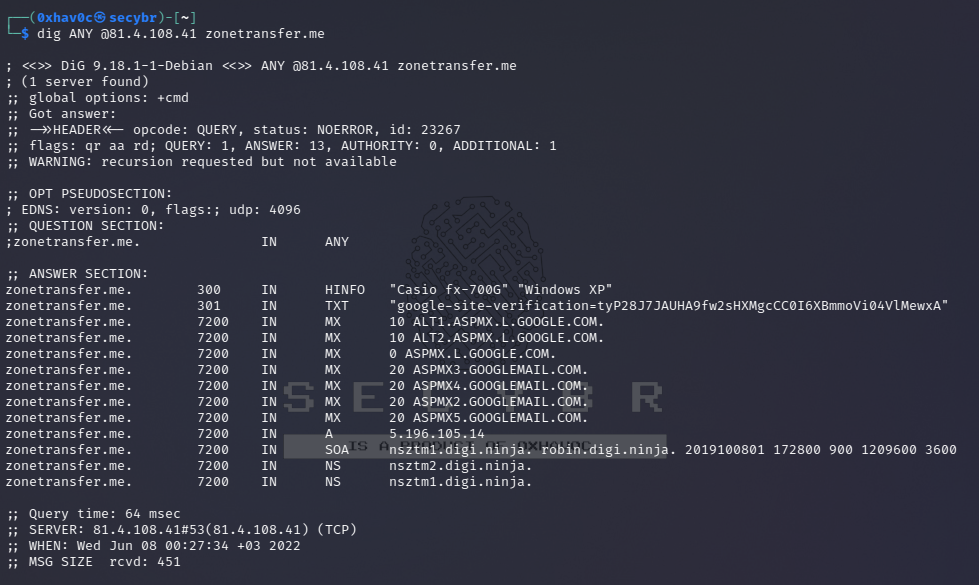

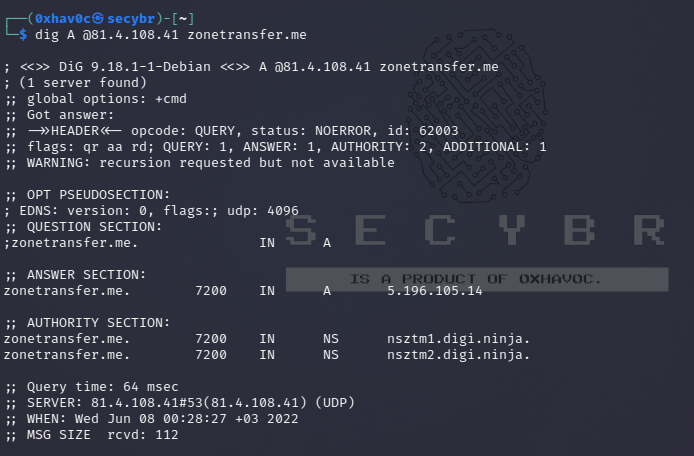

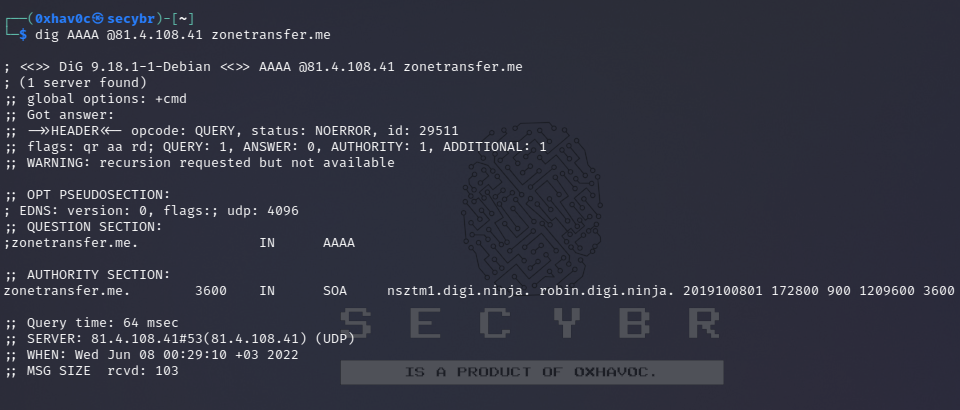

### Using `nslookup`
```
> SERVER <IP_DNS>      # Select the DNS server
> 127.0.0.1            # Reverse lookup of 127.0.0.1
> <IP_MACHINE>         # Reverse lookup of a specific machine
```

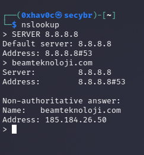

### Useful Metasploit Modules
```
msf > use auxiliary/gather/enum_dns  # Load the DNS enumeration module
```

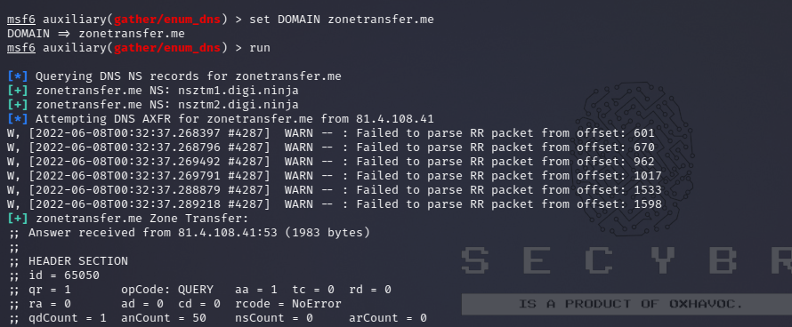

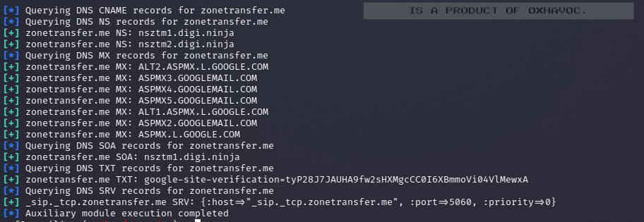

### Useful Nmap Scripts
- To run several DNS-related scripts:
  ```bash
  sudo nmap -Pn -sU -n --script "(default and *dns*) or fcrdns or dns-srv-enum or dns-random-txid or dns-random-srcport" <IP_DNS>
  ```

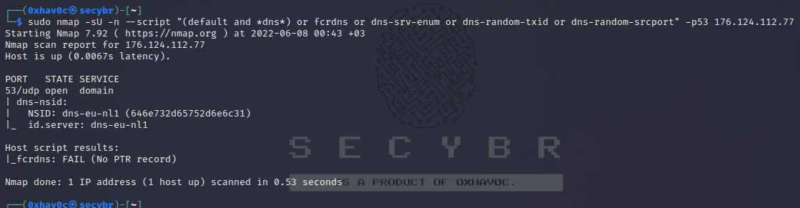

### Gathering More Information with `dnsrecon`
```bash
dnsrecon -r 192.168.x.x/24 -n <IP_DNS>  # DNS reverse lookup of all addresses
dnsrecon -r 192.168.x.x/24 -n <IP_DNS>  # DNS reverse lookup of all addresses
dnsrecon -r 192.168.x.x/24 -n <IP_DNS>  # DNS reverse lookup of all addresses
dnsrecon -d secybr.com -a -n <IP_DNS>    # Zone transfer
```

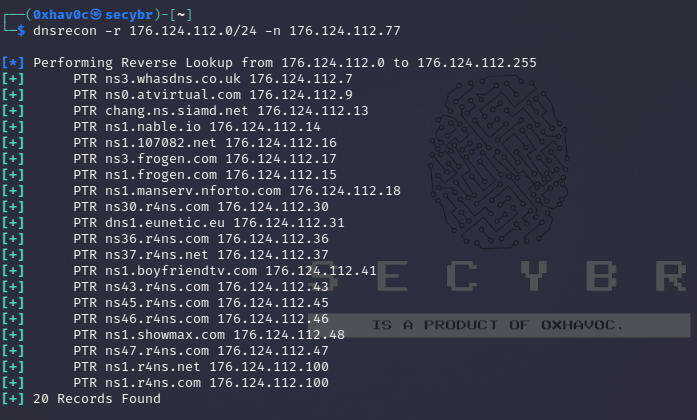

### DNS Brute Forcing

You can use this tool for DNS brute forcing : dnscan

  ```bash
  dnsrecon -D subdomains-1000.txt -d secybr.com -n <IP_DNS>
  dnscan -d secybr.com -r -w subdomains-1000.txt
  ```
## Active Directory Servers
  ```bash
dig -t _gc._tcp.lab.secybr.com  # Zone Transfer using dig # Find AD-DS through DNS (Global Catalog)
dig -t _ldap._tcp.lab.secybr.com  # LDAP servers
dig -t _kerberos._tcp.lab.secybr.com  # Kerberos KDC
dig -t _kpasswd._tcp.lab.secybr.com  # Kerberos password change server
```
'"

## Finding Subdomains with Nmap Scripts
- Example command:
  ```bash
  nmap -sSU -p53 --script dns-nsec-enum --script-args dns-nsec-enum.domains=domain.com ns3.isc-sns.info
  nmap --script dns-srv-enum --script-args "dns-srv-enum.domain='lab.secybr.com
  ```
## IPv6
Using brute force attack using “AAAA” requests to collect IPv6 of subdomains
```
dnsdict6 zonetransfer.me  # Perform a DNS dictionary attack on zonetransfer.me
dnsdict6 -s -t zonetransfer.me  # Perform a DNS dictionary attack with specific options
```
<https://github.com/vanhauser-thc/thc-ipv6>

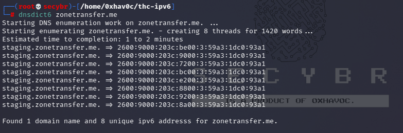

Bruteforce reverse DNS in using IPv6 addresses

| 1  | dnsrevenum6 pri.authdns.ripe.net 1301:37d:2e8::/48 \#Will use the dns pri.authdns.ripe.net  |
|----|---------------------------------------------------------------------------------------------|

## DNS Recursion DDoS

If DNS recursion is enabled, an attacker could spoof the origin on the UDP packet in order to make the DNS send the response to the victim server. An attacker could abuse ANY or DNSSEC record types as they use to have the bigger responses.
Check DNS Recursion Availability
```
sudo nmap -Pn -sU -p 53 --script=dns-recursion <IP_DNS>
```

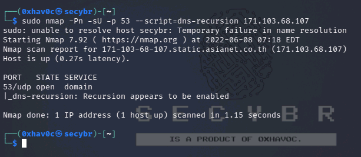

The way to check if a DNS supports recursion is to query a domain name and check if the flag “ra” (recursion available) is in the response:
```
dig secybr.com A @\<IP_DNS\>
```
Non available:

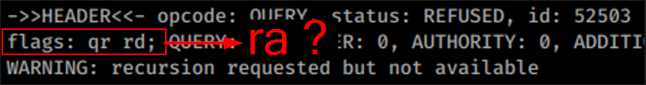there is no “ra” flag. So there isn’t vulnerabilityit says that it has already thrown the recursion request in the logs and that it is not available. WARNING: recursion requested but not available

Available:

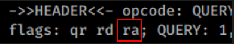

To Gather More Information with Fierce

You can take Fierce from [here](https://github.com/mschwager/fierce)

```bash
fierce --domain twitter.com --subdomains  # Find subdomains for twitter.com
fierce --domain facebook.com --subdomains admin --traverse 10  # Find subdomains for facebook.com with traversal
fierce --domain facebook.com --subdomains admin --search fb.com fb.net  # Search for specific subdomains
fierce --domain stackoverflow.com --subdomains mail --connect  # Find and connect to mail subdomains
fierce --domain facebook.com --wide  # Perform a wide search for facebook.com
fierce --domain zonetransfer.me  # Find subdomains for zonetransfer.me
fierce --domain zonetransfer.me > output.txt  # Save results to output.txt
fierce --dns-servers 10.0.0.1 --range 10.0.0.0/24  # Use specific DNS server for a range search
```
