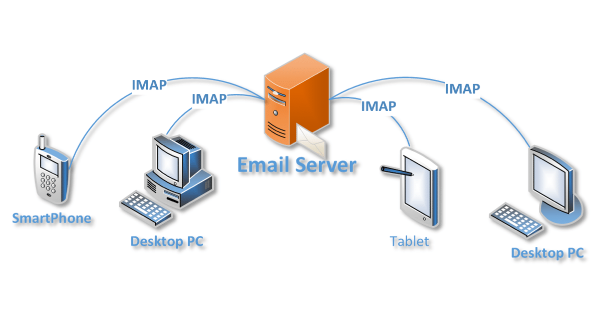
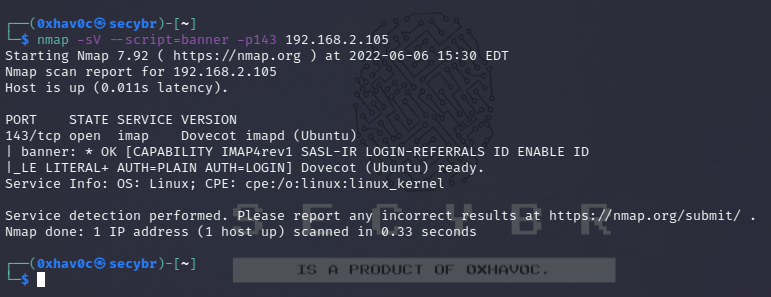
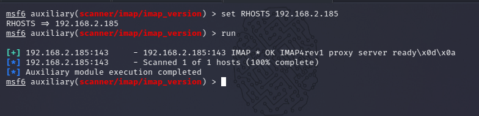
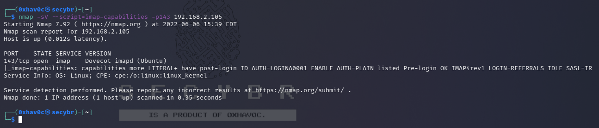
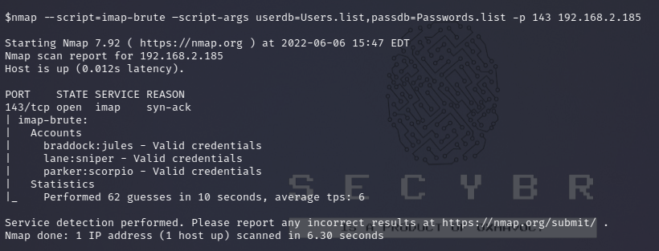
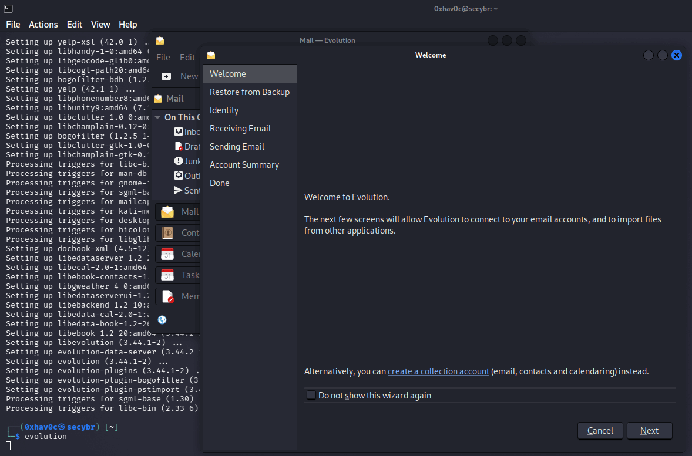
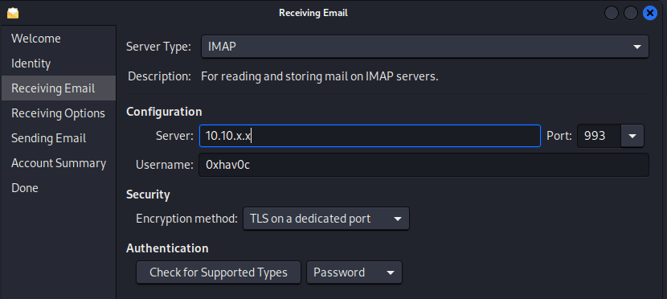

IMAP

IMAP usually uses ports 143, 993

What is IMAP?

Internet Message Access Protocol (IMAP) is then used by the recipient’s email client to fetch your message from the email server and put it in their inbox.

-   **Port 143** - this is the default IMAP non-encrypted port
-   **Port 993** - this is the port you need to use if you want to connect using IMAP securely

| 1 2  | PORT STATE SERVICE VERSION 143/tcp open imap Dovecot imapd (Ubuntu)  |
|------|----------------------------------------------------------------------|

IMAP Pentesting

| ** Shodan search query :** |
|---------------------------------------------------------------------------|
| port:143, 993                                                             |
| port:143 CAPABILITY                                                       |
| port:993 CAPABILITY                                                       |

**Banner Grabbing**

| **Command**                                          | **Description**                         |
|------------------------------------------------------|-----------------------------------------|
| **nc -nv IP 143**                                    | **Banner grabbing and test connection** |
| **A1 LOGIN “root” “”**                               | **Test login**                          |
| **A1 LOGIN root toor**                               | **Test login**                          |
| **A1 LOGIN root root**                               | **Test login**                          |
| **nmap -p143 -sV --script=banner 192.168.x.x**       | **Scan with nmap**                      |
| **nmap -p143 --script=imap-ntlm-info 192.168.x.x**   | **Scan with nmap**                      |
| **msf \> use auxiliary/scanner/imap/imap_version**   | **Metasploit scan**                     |
| **openssl s_client -connect 192.168.x.x:993 -quiet** | **OpenSSL scan**                        |
| **telnet 192.168.x.x 143**                           | **Telnet connection**                   |

According to the answers to the sent queries, the features of the POP3 implementation (commands, etc.) can be determined.

| 1  | nmap -sV --script=imap-capabilities -p143 10.10.x.x  |
|----|------------------------------------------------------|

**Capturing IMAP Traffic**

| **Command**                                  | **Description**          |
|----------------------------------------------|--------------------------|
| **msf \> use auxiliary/server/capture/imap** | **Capture IMAP traffic** |

**NTLM Auth - Information Disclosure**

**If the server supports NTLM auth (Windows), you can obtain sensitive info (versions):**

| **Command**                                                                                                                                                                                    | **Description**               |
|------------------------------------------------------------------------------------------------------------------------------------------------------------------------------------------------|-------------------------------|
| **root@kali: telnet example.com 143**                                                                                                                                                          | **Connect via Telnet**        |
| **\* OK The Microsoft Exchange IMAP4 service is ready.**                                                                                                                                       | **Service ready**             |
| **\>\> a1 AUTHENTICATE NTLM**                                                                                                                                                                  | **Start NTLM authentication** |
| **+**                                                                                                                                                                                          | **Step in NTLM auth**         |
| **\>\> TlRMTVNTUAABAAAAB4IIAAAAAAAAAAAAAAAAAAAAAAA=**                                                                                                                                          | **NTLM data**                 |
| **+ TlRMTVNTUAACAAAACgAKADgAAAAFgooCBqqVKFrKPCMAAAAAAAAAAEgASABCAAAABgOAJQAAAA9JAEkAUwAwADEAAgAKAEkASQBTADAAMQABAAoASQBJAFMAMAAxAAQACgBJAEkAUwAwADEAAwAKAEkASQBTADAAMQAHAAgAHwMI0VPy1QEAAAAA** | **NTLM data**                 |

**Or automate this with nmap plugin imap-ntlm-info.nse.**

**Brute Forcing**

| **Command**                                                                                         | **Description**              |
|-----------------------------------------------------------------------------------------------------|------------------------------|
| **hydra -l USERNAME -P /path/to/passwords.txt -f \<IP\> imap -V**                                   | **Hydra brute force**        |
| **hydra -S -v -l USERNAME -P /path/to/passwords.txt -s 993 -f 192.168.x.x imap -V**                 | **Secure Hydra brute force** |
| **nmap --script=imap-brute –script-args userdb=Users.list,passdb=Passwords.list -p143 192.168.x.x** | **Nmap brute force**         |

Evolution

sudo apt install evolution

 

**CURL**

Basic navigation is possible with [CURL](https://ec.haxx.se/usingcurl/usingcurl-reademail#imap), but the documentation is light on details so checking the [source](https://github.com/curl/curl/blob/master/lib/imap.c) is recommended for precise details.

| **Command**                                                                                                     | **Description**                                 |                       |
|-----------------------------------------------------------------------------------------------------------------|-------------------------------------------------|-----------------------|
| curl -k 'imaps://10.10.x.x/' --user user:pass                                                                   | Listing mailboxes (imap command LIST "" "\\\*") |                       |
| curl -k 'imaps://10.10.x.x/INBOX?ALL' --user user:pass                                                          | Listing messages in a mailbox                   |                       |
| curl -k 'imaps://10.10.x.x/Drafts;MAILINDEX=1' --user user:pass                                                 | Downloading a message                           |                       |
| curl -k 'imaps://10.10.x.x/INBOX' -X 'UID SEARCH ALL' --user user:pass                                          | UID search                                      |                       |
| curl -k 'imaps://10.10.x.x/INBOX;UID=1' --user user:pass                                                        | Accessing messages by UID                       |                       |
| \`curl -k 'imaps://10.10.x.x/INBOX' -X 'FETCH 1:5 BODY[HEADER.FIELDS (SUBJECT FROM)]' --user user:pass -v 2\>&1 | grep '\\\^\\\<'\`                               | Fetch message headers |

**IMAP Vulnerabilities**

| **Command**                                         | **Description**                                   |
|-----------------------------------------------------|---------------------------------------------------|
| **msf \> use exploit/windows/imap/eudora_list**     | **Eudora Qualcomm WorldMail 3.0 [CVE-2005-4267]** |
| **msf \> use auxiliary/dos/windows/imap/fuzz_imap** | **IMAP Fuzzer**                                   |
